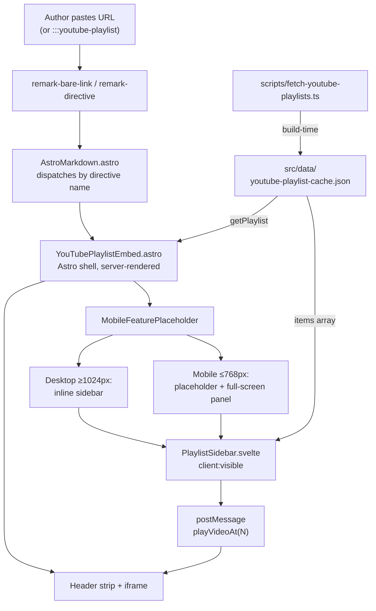

# Changelog - 2026-05-07 (#1)

## Paste a playlist link, get a real playlist component

## Why Care?

Authors paste video links. They don't extract IDs, they don't memorize directive shapes, they don't fill in registry files. So when "embed this playlist" used to mean *paste the URL and watch it render as a single-video player with no sense of bundle*, the author had two bad options: live with the wrong rendering, or learn enough about the embed system to override it. Either way, the author was doing the renderer's job.

This pass fixes that. A bare `youtube.com/playlist?list=...` URL on its own line, *or* a `:::youtube-playlist` container directive with the URL pasted inside the body, now auto-unfurls into a real playlist component — the player on the left, a server-rendered sidebar with thumbnails / titles / durations on the right, click-any-item-to-play wired through the YouTube IFrame Player API, mobile path that slides the sidebar in as a full-screen panel. The author's contract stayed at "paste the URL." The renderer absorbed every other decision.

The pattern is **not specific to mpstaton-site**. The Astro shell, the Svelte island, the build-time fetcher, and especially the cross-cutting `MobileFeaturePlaceholder` are all designed to ship in any Astro Knots site that consumes LFM. The first consumer happens to be `mpstaton-site` because that's where today's content fixture lives — but the next deck or essay site that pastes a playlist URL gets the same treatment for free.

## What's New?

- **`YouTubePlaylistEmbed` rewritten as Astro shell + Svelte island.** Server-rendered header strip (title + channel + item count + "Open on YouTube" CTA), 16:9 player, server-rendered sidebar list. The Svelte island hydrates with `client:visible` and handles click-to-play.
- **`scripts/fetch-youtube-playlists.ts` — build-time corpus walk.** Scans `src/content/` for any `youtube.com/playlist?list={id}` URL, dedupes IDs, fetches each playlist's metadata + items + per-item durations from the YouTube Data API v3, writes `src/data/youtube-playlist-cache.json`. No author manifest, no manual IDs to maintain. The cache is gitignored; `pnpm fetch-playlists` regenerates it (chained into `pnpm fetch-all` alongside the existing context-v and essays fetchers).
- **`MobileFeaturePlaceholder.astro` — cross-cutting mobile pattern (per spec §5.9).** Wraps any sidebar-positioned LFM component. Below 768px, the inline sidebar is replaced by a compact placeholder with thumbnails + a "Browse N videos" CTA. Tap or swipe-left → the sidebar slides in as a full-screen panel. Swipe-right, tap the back button, press ESC, or use the browser's back button to return. Body scroll locked while open; focus management on open/close; history API integration so iOS edge-swipe-back works naturally.
- **`PlaylistSidebar.svelte` — the only Svelte island in the system.** Loads the YouTube IFrame Player API script (idempotent — one load per page no matter how many playlists), attaches a `YT.Player` instance to the iframe by ID, sends `playVideoAt(position)` on click, listens for `onStateChange` + polls `getPlaylistIndex()` every 2s as a backstop to keep the active-item highlight in sync.
- **Item display cap of 50.** The cache stores every item (1,899 for the demo's "Lossless Toolkit"); only the first 50 ship to the Svelte island as props. A "Show all 1,899 videos on YouTube →" link sits below the sidebar when the playlist exceeds the cap.
- **`:::youtube-playlist` directive wired with the versatile dispatcher.** Same three author shapes as `:::youtube-short`: `id` attr, `url` attr, or a bare URL pasted inside the container body. New `index` attribute for "start at item N."
- **First Svelte integration in any Astro Knots site.** `@astrojs/svelte ^8.1.0` and `svelte ^5.55.5` added; `astro.config.mjs` updated. Other sites can now host Svelte islands without re-litigating the integration.
- **Spec promoted from "open questions" to architecture.** `context-v/specs/Versatile-Component-Library-for-Video-Players.md` §4.1.3 was previously four bullets of design intent; now it's a six-subsection architecture spec covering data acquisition, cache + quotas, render layout, interactivity, authoring contract, and remaining v1 implementation questions. New §5.9 codifies the `MobileFeaturePlaceholder` pattern as a cross-cutting contract every future sidebar component must follow.

### What it looks like



## The S→T→C model in production

This is the second concrete payoff of the S→T→C separation the LFM video spec is built on. The first was the Shorts-as-aside change earlier today (one Component edit, no Trigger or Syntax churn). This one is bigger but follows the same shape:

- **Syntax** — author writes `https://youtube.com/playlist?list=...` on its own line, *or* `:::youtube-playlist{...}` with the URL inside, *or* `::youtube-playlist{id="..."}` as a leaf directive. All three accepted.
- **Trigger** — `remark-bare-link`'s site-local classifier hits the `/playlist?list=` matcher and emits a `leafDirective` named `youtube-playlist`. For the directive forms, `remark-directive` (in lfm) parses the container directly. Both routes converge on the same MDAST shape.
- **Component** — `AstroMarkdown.astro` dispatches by directive name to `YouTubePlaylistEmbed`. The component is the only place that knows about iframes, sidebars, the IFrame Player API, the cache file, or anything else implementation-specific. Adding a different render strategy (a "minimal facade" mode, say) would be a Component-only change.

The fetcher is a fourth thing — call it the **D** layer (Data) — that doesn't fit cleanly into S/T/C because it runs at build time and feeds the Component asynchronously through a cache file. The spec calls it out as "build-time data acquisition" (§4.1.3.1) and describes it as parallel to the OG fetcher: same shape, different provider. Naming the layer makes the rest of the system easier to reason about.

## Cross-cutting payoff: the mobile sidebar pattern

`MobileFeaturePlaceholder` was scoped specifically because every future sidebar-positioned LFM component will need to solve the same problem. Naming the pattern, building it as a generic wrapper, and locking the contract in the spec (§5.9) means the next sidebar component — `LinkRollup__Column` with `aside="right"`, the eventual `LinkPreview__Article--Card` with `aside`, the design-system viewer's nav drawer — gets the mobile path for free.

The pattern's contract:

- **Default slot** carries the full content (used inline as sidebar on desktop)
- **`placeholder` slot** carries the compact inline preview (visible only ≤768px)
- **`label` prop** is the CTA text on the placeholder

Behaviors the pattern owns: panel slide-in animation, swipe gestures (right-to-left from placeholder to open, left-to-right inside panel to close), focus management (initial focus on back button when opening, return focus to CTA when closing), body scroll lock while open, ESC-key close, browser-back close via `history.pushState`. Reduced-motion support honored via `@media (prefers-reduced-motion: reduce)`.

A consuming component just declares its slots and trusts the wrapper. The playlist component took ~10 lines to wire its sidebar into the wrapper:

```astro
<MobileFeaturePlaceholder
  label={`Browse ${totalCount} videos`}
  panelTitle={data?.title}
>
  <Fragment slot="placeholder">
    <!-- compact thumbnail-strip preview -->
  </Fragment>

  <PlaylistSidebar client:visible items={...} />
</MobileFeaturePlaceholder>
```

## Why a Svelte island and not vanilla JS

Three things make Svelte the right size for this:

1. **State management for the active-item highlight.** The sidebar needs to track which playlist index is currently playing and reactively update the visual highlight. In vanilla JS that's classList-juggling across N buttons; in Svelte it's `class:active={activeIndex === i}` and the framework does the rest.
2. **The IFrame Player API is the smallest interactive surface that benefits from a framework.** It's also the largest one we'd want to write in vanilla — the postMessage protocol, listener registration, async-load-the-API-script-then-attach are all stateful coordination. A few dozen lines of vanilla works; a Svelte component is a few dozen lines that's easier to extend.
3. **SSR-friendly.** Astro's Svelte integration server-renders the component at build time (same HTML as the client would render after hydration), so the sidebar is fully usable as static HTML even before the JS lands. Hydration upgrades clicks from "open YouTube in a new tab" to "play in place," but the page is never empty.

For sites that don't have a richer interactive surface yet, this is the foothold. Adding a second Svelte component to the site is now a single-file change, not an integration project.

## What's intentionally NOT in this work (the "needs UI tweaks" note)

What the screenshot reveals as next-pass:

- **Player and sidebar height alignment.** The sidebar is taller than the 16:9 player at most widths, so the empty space below the player is visible until the sidebar's `overflow-y: auto` kicks in. A `min-content` height constraint on the player or a `max-height` matching the iframe on the sidebar will close the gap.
- **Active-item border accent on hover/focus.** Currently the active item shows a brand-aqua left-border accent; non-active items have only a subtle hover background. Worth a stronger affordance — maybe a small "▶ Now playing" badge next to the position number on the active row.
- **Item title two-line clamp tightness.** Some titles ("GPT-5.5 VERIFIED Opus 4.7: A Pi Coding Agent That REVIEWS Like YOU") overflow even at two lines. Either tighter clamp or a tooltip on truncation.
- **Header strip background gradient subtlety.** The brand-aqua tint on the left of the header is a bit heavy at high opacity; might dial back to a lighter wash or kill it entirely.
- **Mobile path not yet walked end-to-end on a phone viewport.** Implementation is in place; need to actually test with touch hardware and tune the swipe thresholds.
- **Facade mode.** All the Tier-A components (single-video, Shorts, Vimeo) still load their iframes immediately. Phase 1b in the spec is the facade pattern — render a thumbnail + click-to-play poster instead of the iframe until the user clicks. Reduces first-paint cost on memo pages with multiple embeds.

## Files changed (this changelog's scope)

### context-v/
- `context-v/specs/Versatile-Component-Library-for-Video-Players.md` — §4.1.3 rewritten from open questions to full architecture; new §5.9 codifies the cross-cutting mobile sidebar pattern; Phase 1a in §6 expanded to 9 task items; questions 1–2 in §7 marked resolved with new questions 6–7 about API quota and cache invalidation

### sites/mpstaton-site/ (submodule, see commit fbc1d46 in that repo)
- New: `scripts/fetch-youtube-playlists.ts`, `src/lib/youtube-playlist-types.ts`, `src/lib/youtube-playlist-cache.ts`, `src/components/markdown/MobileFeaturePlaceholder.astro`, `src/components/markdown/PlaylistSidebar.svelte`
- Modified: `src/components/markdown/YouTubePlaylistEmbed.astro` (rewritten as Astro shell), `src/components/markdown/AstroMarkdown.astro` (new directive arm), `astro.config.mjs` (Svelte integration), `package.json` + `pnpm-lock.yaml` (deps + scripts), `.gitignore` (cache file)

### Cross-repo
- The pattern is reusable; subsequent sites that adopt LFM playlist embedding will copy `MobileFeaturePlaceholder.astro` + `PlaylistSidebar.svelte` + `YouTubePlaylistEmbed.astro` + the fetcher into their own `src/`. Future work may extract these into a shared `@knots/markdown` package once a second site is consuming them.

## Next session

Three forks ahead, pick whichever feels most useful:

1. **UI tweaks** (the "needs UI tweaks" list above) — match player and sidebar heights, sharpen the active-item affordance, tune the gradient.
2. **Walk the mobile path** with a phone in hand — verify swipe thresholds, confirm focus management, test the back-button integration.
3. **Phase 1b — facade mode** — bring `YouTubeEmbed`, `YouTubeShortsEmbed`, `VimeoEmbed` under the same lazy-load contract the playlist already implies. Reduces first-paint cost on any memo with two or more embeds.
