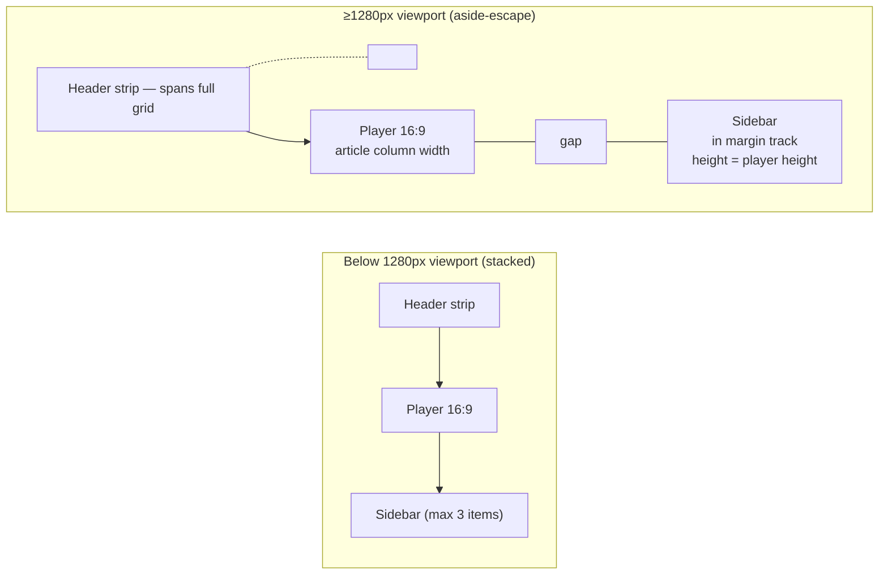

# Changelog - 2026-05-07 (#2)

## aside-escape: sidebars that pop out of the article column

## Why Care?

A reading layout with a centered, max-width article column leaves a ton of empty space on either side at any reasonable viewport. NYTimes blogs, Stripe docs, Substack — they all use that space for margin notes, "see also" cards, pull-quotes, sidebars. None of them do it from markdown. The author either accepts the default stacked-block rendering or hand-rolls custom HTML for every sidebar.

LFM has named this pattern in the spec for a while — `aside="right-escape"` in §4.23.6 of the LFM spec, restated in the video-component spec's compatibility matrix. Today it's the first time the pattern actually ships. The YouTube playlist component's sidebar uses it: at ≥1280px viewport the sidebar pops out of the article column into the right margin track, with the player still anchored in the prose flow at the article column's width.

The headline visual change is the playlist looks like a long-form article with a *sidebar*, not a player with a *stacked list of links underneath*. The deeper change is that any sibling component with a "sidebar slot" can now opt into the same behavior with a CSS recipe — the first time we've gone from "this would be nice" to "this works" on the margin-track question.

## What's New?

- **`aside-escape` pattern wired up on `YouTubePlaylistEmbed`** at viewports ≥1280px. The component's outer wrapper extends past the article column's right edge via a negative margin computed against the viewport, and CSS Grid splits the resulting wider area into "header (full width) / player (article column width) / gap / sidebar (the margin track)."
- **Player stays in the reading flow.** The video iframe sits at the article column width — the same width as the surrounding prose. The reader's eye doesn't have to retrain on a different content width when they hit the embed.
- **Sidebar height auto-matches the player.** Grid row stretch handles it; no JS measurement, no fixed pixel value, no media-query height bands. Player is 16:9 of column width; sidebar fills the same row.
- **Stacked fallback below 1280px** with a 3-item visible cap. Most narrow desktops and tablets get the player above a compact 3-item-tall sidebar that scrolls; the "Show all on YouTube" link sits below. The escape mode kicks in only when there's enough viewport-margin space to carry it.
- **Mobile path unchanged** — `MobileFeaturePlaceholder` still handles ≤768px with the placeholder + full-screen panel pattern.
- **Default sort: most recently added on top.** The fetcher now captures `addedAt` (YouTube's `snippet.publishedAt`) for every item; the Astro shell sorts by that field descending before passing to the Svelte island. Click handler still uses each item's actual playlist `position` for the iframe `playVideoAt(N)` call, so the visual order is independent of the playback path.
- **Tighter component margins** — `margin-block` on the playlist dropped from 1.5rem to 0.5rem, header padding from 0.85rem to 0.7rem. The component reads as part of the article instead of as a separate billboard.

## The CSS recipe

The whole escape mechanism is a single negative-margin trick combined with a grid declaration. At ≥1280px:

```css
.yt-playlist {
  /* Pull the right edge into the article's right margin track,
     leaving 2rem of viewport-edge padding. */
  margin-right: calc(((100vw - 100%) / -2) + 2rem);

  /* Three-column grid: article-column-width | gap | margin-track */
  display: grid;
  grid-template-columns: minmax(0, 1fr) 1.5rem minmax(280px, 340px);
  grid-template-areas:
    "header header header"
    "player gap   sidebar";
}
```

The math behind `(100vw - 100%) / -2 + 2rem`:

- `100vw` = viewport width
- `100%` = the parent column's content width (the article column, i.e., what the component naturally fills)
- `(100vw - 100%) / 2` = the unused margin space on each side of the centered article column
- Negate it and `margin-right` pulls the component's right edge into that space
- `+ 2rem` leaves a 2rem cushion from the viewport's right edge so the sidebar doesn't kiss the screen

On a 1440px viewport with a 720px article content column: the right margin space is (1440-720)/2 = 360px; subtract 32px (2rem) of viewport-edge padding = 328px of usable margin, of which 24px (gap) + ~280px (sidebar) gets used.

`display: contents` on the inner `.yt-playlist__layout` is the second half of the trick — it lets the player and sidebar (originally nested inside `__layout`) participate directly in the outer grid without restructuring the markup. So the existing component HTML didn't need to change shape; just the CSS.



## What other components inherit this

The playlist is the first consumer; the pattern is reusable. Three near-term candidates already in flight:

| Component | What `aside-escape` gives it |
|---|---|
| `LinkPreview__Article--Card` with `aside="right-escape"` | The "see also" card pops out into the margin instead of breaking the reading column |
| `LinkRollup__Column` (when authors mark it as an aside) | Vertical stacked list of related links lives in the margin track, scrollable, doesn't push prose down |
| Future design-system viewer's nav drawer | Component catalog index in the margin while the body shows the focused component |

Each of these is one wrapper edit to opt in. The wrapper that *would* be ergonomic is `MarginEscape.astro` — same shape as `MobileFeaturePlaceholder` (the cross-cutting wrapper from yesterday), but for the desktop right-margin case. Hasn't been extracted yet; will be after a second consumer needs it. Premature extraction is worse than waiting one round.

## What this resolves from the spec's open questions

- §4.1.3.6 #4 ("Sidebar at narrow widths") — the spec said "use the cross-cutting mobile-sidebar pattern (§5.9)." That's already in place. This pass adds the *desktop-wide* counterpart (`aside-escape`), which the spec's §5.5 compatibility matrix already named but didn't have an implementation for.
- The "playlist looks identical to a single-video player" gap that motivated the entire video-component-library extraction is now closed. A playlist URL renders as a clearly *bundled* artifact: the chrome, the title, the channel attribution, the click-any-item-to-play sidebar, the margin escape — every visual signal says "this is a collection."

## What's intentionally NOT in this work

- **`MarginEscape` extraction.** The CSS recipe is documented here; the Astro component wrapper that other consumers would import gets built when the second consumer needs it.
- **Left-escape** (mirror image of right-escape, sidebar in left margin). The spec describes it; no current consumer wants it. Trivial to add — flip `margin-right` to `margin-left`, swap `template-areas` columns.
- **Variable breakpoint for escape activation.** Currently hardcoded at 1280px. A more sophisticated implementation would derive it from the parent column width + minimum sidebar width — i.e., enter escape mode the moment the math says the sidebar can fit. CSS container queries would make this clean. Not blocking.
- **A `noaside` opt-out.** Authors who explicitly don't want a playlist sidebar (just the player, no list) have no way to ask for it yet. Easy directive-attribute addition (`:::youtube-playlist{noaside}`); not yet wired.
- **Persisting the active-item highlight on hard reload.** The Svelte island reads `getPlaylistIndex()` from the YouTube IFrame API on hydration, so once the iframe loads and starts playing, the highlight syncs. Before hydration, it shows the `index` prop value (default 0) as active. Acceptable; flagged as v1 limitation in §4.1.3.6 of the spec.

## Files changed (this changelog's scope)

### sites/mpstaton-site/ (submodule, see commit in that repo)
- `src/components/markdown/YouTubePlaylistEmbed.astro` — the headline change. Negative-margin escape, grid declaration, header/player/sidebar areas, height-matching, reduced margins, sort-by-addedAt-desc.
- `src/components/markdown/PlaylistSidebar.svelte` — outer chrome stripped (background, border, radius removed) so the wrapper owns visual frame in both inline and full-screen-panel contexts.
- `src/lib/youtube-playlist-types.ts` — `PlaylistItem.addedAt?: string` field added.
- `scripts/fetch-youtube-playlists.ts` — captures `snippet.publishedAt` from the API response into the cache.

## Next session

Three forks ahead, pick whichever feels most useful:

1. **Walk the mobile path on a real phone.** The `MobileFeaturePlaceholder` panel has been built and the swipe handlers are in place; verifying the gestures and focus management on real touch hardware is the responsible v1 close-out.
2. **Extract `MarginEscape.astro`** and make `LinkPreview__Article--Card` the second consumer. Closes the loop on "this is a pattern, not a one-off."
3. **Phase 1b — facade mode** for `YouTubeEmbed`, `YouTubeShortsEmbed`, `VimeoEmbed`. Reduces first-paint cost on memo pages with multiple embeds. Already scoped in spec §6.
