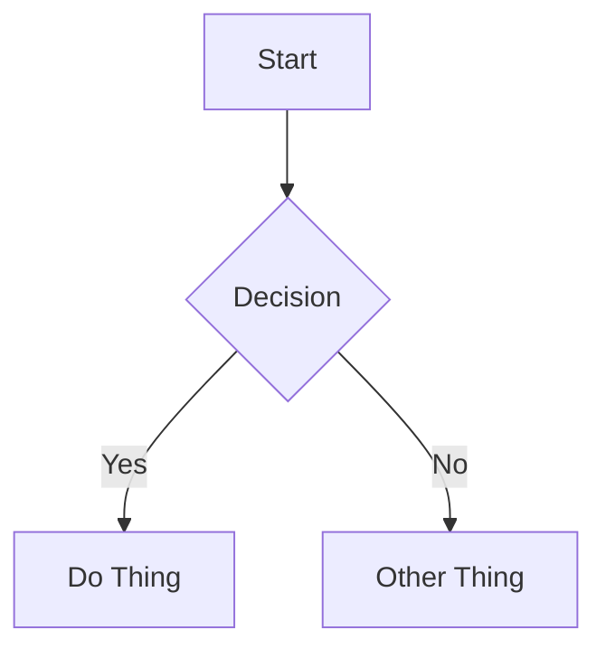
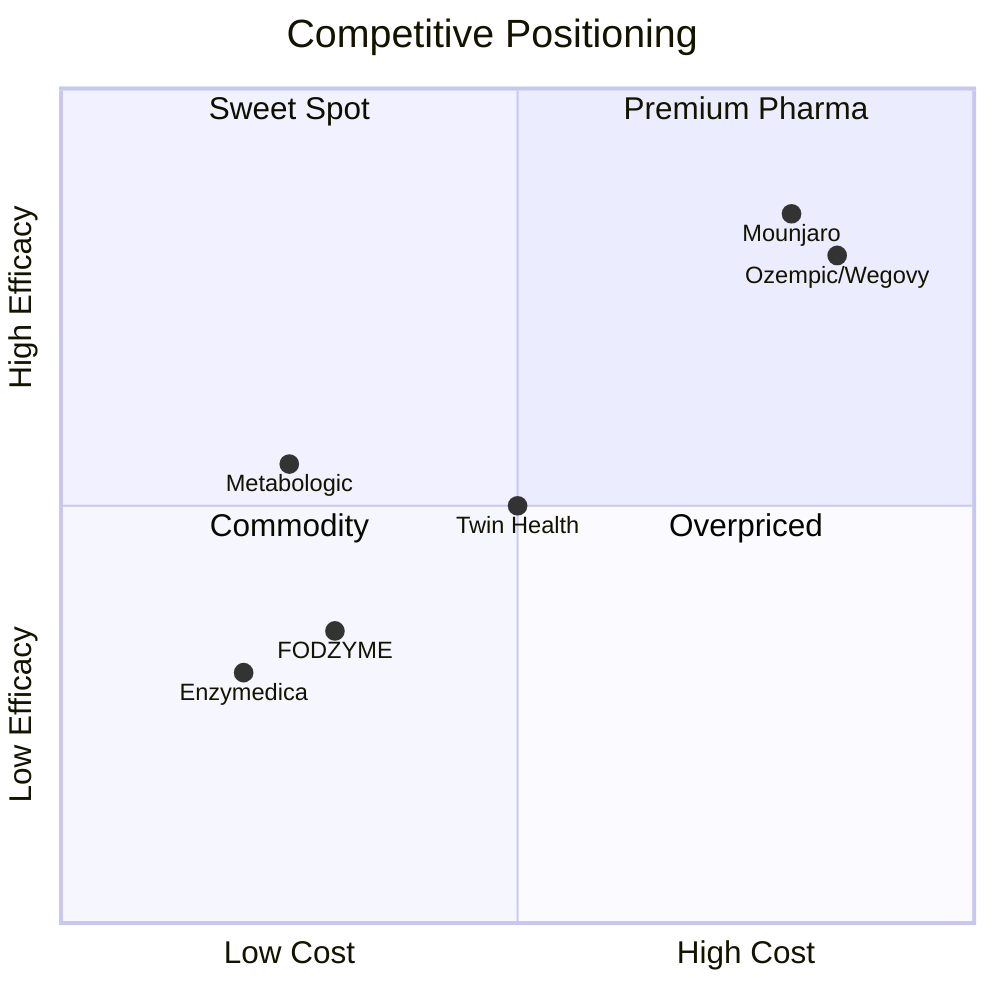

# Codifying a Comprehensive Extended Markdown Flavor and Shared Package

**Status**: Draft (v0.0.1)
**Date**: 2026-03-25
**Author**: Michael Staton

---

## 1. Problem

We have a sprawling collection of markdown content across multiple sites and content repositories — investment memos, blueprints, specs, essays, changelogs, slide decks, infographics — and our rendering capabilities have grown organically through real client work. We now support features well beyond standard CommonMark or Remark: GFM tables, directive-based callouts, hex-code citations, Mermaid diagrams, embedded slide decks, markdown-based slideshows with slide separators, syntax-highlighted code blocks with copy buttons, and more.

But none of this is codified. The "flavor" is implicit — scattered across remark plugins, Astro components, and tribal knowledge. This means:

- **No single reference** for what syntax an author can use and expect to render
- **No versioning** of the flavor itself (which features are stable? which are experimental?)
- **No shared package** — each site copies and diverges its own remark/rehype pipeline
- **No validation** — authors discover unsupported syntax only when it renders wrong
- **No wish list** — features we want but haven't built live only in people's heads

---

## 2. Goal

Define a **named, versioned extended markdown flavor** (working name: **Lossless Flavored Markdown** or **LFM**) that:

1. **Codifies what we already support** across our best rendering pipelines
2. **Borrows explicitly** from GFM, Obsidian, MDX, and remark-directive conventions
3. **Defines tiers** — Stable, Beta, and Wish List — so authors know what to rely on
4. **Backs the spec with a shared package** (`@lossless/lfm` or similar) that sites can install or copy
5. **Provides a validation mode** that warns authors about unsupported syntax at build time

---

## 3. Prior Art and Borrowed Features

This flavor is a remix. We're not inventing a new markdown standard — we're selecting from existing ones and adding our own extensions where gaps exist.

That being said, our content preferences and standards are quite high. We want:

- To handle citations more rigorously than existing libraries support — with hex-code identifiers for stability, structured reference definitions with publication dates and URLs, hover popovers with source metadata, and build-time validation that every reference has a definition
- To be able to specify CSS styles within the markdown itself — inline style overrides, scoped style blocks, and class annotations on any element — without dropping into raw HTML
- To embed content from YouTube, SoundCloud, and other media platforms with as little effort as possible — ideally a bare URL on its own line that auto-unfurls, or at most a one-line directive
- Custom components usually reserved for MDX to be automagically rendered using our directive syntax — no JSX, no imports, no build-step coupling — just `:::component-name{props}` and the renderer maps it to the right Astro/Svelte component

### 3.1 CommonMark (Baseline)

Everything in the [CommonMark spec](https://spec.commonmark.org/) is supported without modification. This is the floor.

### 3.2 GitHub Flavored Markdown (GFM)

We adopt the full [GFM spec](https://github.github.com/gfm/) including:

| Feature | Syntax | Status |
|---------|--------|--------|
| Tables | Pipe tables with alignment | **Stable** |
| Task lists | `- [x]` / `- [ ]` | **Stable** |
| Strikethrough | `~~text~~` | **Stable** |
| Autolinks | Bare URLs become links | **Stable** |
| Footnotes | `[^label]` with definitions | **Stable** (extended — see Citations) |

**Implementation**: `remarkGfm` plugin handles all of the above.

### 3.3 Obsidian / Wiki-Style Features

We selectively adopt from [Obsidian's markdown extensions](https://help.obsidian.md/Editing+and+formatting/Obsidian+Flavored+Markdown):

| Feature | Syntax | Status |
|---------|--------|--------|
| Wikilinks | `[[Page Name]]` | **Wish List** |
| Wikilink with alias | `[[Page Name\|Display Text]]` | **Wish List** |
| Embeds | `![[filename.md]]` | **Wish List** |
| Image resize | `![[image.png\|300]]` | **Wish List** |
| Callouts | `> [!info] Title` | **Beta** (we prefer directive syntax, but should parse these too) |
| Highlights | `==highlighted text==` | **Wish List** |
| Comments | `%%hidden comment%%` | **Wish List** |
| Tags in body | `#tag-name` inline | **Wish List** |

**Design Decision**: We support Obsidian callout syntax (`> [!type]`) as an **alias** for our directive-based callouts. Authors coming from Obsidian can keep using `> [!warning]` and it renders identically to `:::callout{type="warning"}`. But our canonical documentation recommends the directive syntax because it's more expressive (supports arbitrary attributes).

### 3.4 Directive Syntax (remark-directive)

The [generic directive proposal](https://talk.commonmark.org/t/generic-directives-plugins-syntax/444) is our primary extension mechanism. All custom block-level and inline features use this syntax:

| Form | Syntax | Use Case |
|------|--------|----------|
| Text directive | `:name[content]{attrs}` | Inline elements (badges, tooltips) |
| Leaf directive | `::name{attrs}` | Self-closing blocks (embeds, separators) |
| Container directive | `:::name{attrs}\ncontent\n:::` | Wrapping blocks (callouts, galleries, details) |

This is the backbone. Every new feature should be expressible as a directive before we consider alternative syntax.

### 3.5 MDX (Selective Adoption)

We do **not** adopt full MDX (JSX-in-markdown). Instead, we borrow specific ideas:

| Feature | MDX Syntax | Our Approach | Status |
|---------|-----------|--------------|--------|
| Component rendering | `<Component />` | Directives map to components at render time | **Stable** |
| Frontmatter | YAML frontmatter | Standard YAML frontmatter (already universal) | **Stable** |
| Expressions | `{variable}` | Not adopted — too much complexity for content authors | **Not Planned** |
| Import statements | `import X from Y` | Not adopted — content should be portable | **Not Planned** |

### 3.6 Other Influences

| Source | Feature | Our Adoption | Status |
|--------|---------|-------------|--------|
| Markdoc (Stripe) | Tag syntax `` | Not adopted — directives cover this | **Not Planned** |
| AsciiDoc | Admonitions, includes | Admonitions via directives; includes via embeds | **Partial** |
| Pandoc | Citation syntax `[@key]` | Extended — see hex-code citations below | **Stable** |
| reveal.js | `---` slide separators | Adopted for slide content | **Stable** |
| Mermaid | Fenced code blocks | `\`\`\`mermaid` renders as diagrams | **Stable** |
| KaTeX/MathJax | `$inline$` and `$$block$$` | Math rendering | **Wish List** |

---

## 4. The Flavor: Feature Catalog

This is the canonical list of what **Lossless Flavored Markdown** or **Astro Knots Markdown** supports, organized by tier.

### Tier 1: Stable (Ship It)

Features that are implemented, tested, and safe for authors to rely on across all sites.

#### 4.1 Standard Markdown (CommonMark + GFM)

Everything you'd expect: headings, paragraphs, bold, italic, links, images, lists, blockquotes, horizontal rules, code spans, fenced code blocks, tables, task lists, strikethrough, autolinks, footnotes.

#### 4.2 YAML Frontmatter

```markdown
---
title: My Document
date_created: 2026-03-25
tags: [Extended-Markdown, Specifications]
authors:
  - Michael Staton
---
```
Parsed by `gray-matter` or Astro's built-in frontmatter handling. Schema validation is per-collection (Zod schemas in `content.config.ts`).

##### 4.2.1 Tag Syntax

Due to our heavy reliance on Obsidian as our content development and management tool, tags cannot have spaces in them.  And due to various search and filter features, it's better to use Train-Case as opposed to snake-case. 


#### 4.3 Fenced Code Blocks with Syntax Highlighting

````markdown
```typescript
const greeting: string = "Hello, world";
console.log(greeting);
```
````

**Rendering**: Shiki with tokyo-night theme (always dark). Wrapped in a container with:
- Language label (uppercase, top-left)
- Copy button (top-right)
- Line wrapping enabled

**Meta string support** (planned stable):

````markdown
```typescript title="greeting.ts" {2-3} showLineNumbers
const greeting: string = "Hello, world";
console.log(greeting);  // highlighted
return greeting;         // highlighted
```
````

#### 4.3.1 Custom Code Blocks become Custom Components

Due to our use of Obsidian, Obsidian allows "plugins" to specify a codeblock identifier and give it custom rendering as a component. So, even though the "```identifier-string\n{content....}\n```" syntax is typically reserved for a true codeblock, there will be identifier strings that escape the codeblock render pipeline and trigger a custom component render pipeline. 

#### 4.3.2 Custom Code Blocks may Also Be Directives using the Same Custom Component

If we want a component to render INSIDE Obsidian, natively, it has to use custom identifiers within the codeblock syntax.  Enough to not be an edge case, content authors and creators may switch between using Code Block syntax and Directive syntax, when they are referring to the same Custom Component.  Therefore, in many cases both will need to be supported.  This has most frequently come up in Card Carousels, Card Grids, Image Grids, Image Carousels, and Slide Embeds. 

#### 4.4 Mermaid Diagrams

````markdown

````

**Rendering**: Extracted before Shiki processing via `rehypeMermaidPre` plugin. Rendered client-side by Mermaid.js with site-specific theme variables.

#### 4.5 Callout / Admonition Blocks

**Directive syntax (canonical)**:

```markdown
:::callout{type="warning" title="Heads Up"}
This is important information that the reader should not miss.
:::
```

**Obsidian syntax (alias, also supported)**:

```markdown
> [!warning] Heads Up
> This is important information that the reader should not miss.
```

Both render identically. Supported types:

| Type | Icon | Color | Use |
|------|------|-------|-----|
| `info` | i | Blue | General information |
| `tip` | Lightbulb | Green | Helpful suggestions |
| `warning` | Triangle | Yellow/Orange | Caution |
| `danger` | X | Red | Critical warnings |
| `note` | Pencil | Gray | Side notes |
| `success` | Check | Green | Positive outcomes |
| `quote` | Quote mark | Gray | Attributed quotes |
| `example` | List | Purple | Examples/demos |

#### 4.6 Inline Badges

```markdown
This is a :badge[New] feature released :badge[2026-03-25]{variant="date"}.
```

**Rendering**: Styled `<span>` with variant-based colors. Variants: `default`, `success`, `warning`, `danger`, `date`, `version`.

#### 4.7 Hex-Code Citations

Our custom citation system that extends standard footnote syntax:

**Inline reference**:
```markdown
Global aging is accelerating toward 2.1B people 60+ by 2050.[^1ucdcd]
```

**Definition**:
```markdown
[^1ucdcd]: 2025, Sep 21. [Population ageing](https://helpage.org/...). Published: 2024-07-11
```

**Rendering**:
- Inline: Superscript number `[1]` with hover popover showing title, source, URL
- Page bottom: Numbered "Sources" section with full references
- Hex codes converted to sequential integers in order of first appearance

See `Citation-System-Architecture.md` for the full design.

#### 4.8 Tables (Enhanced)

Standard GFM pipe tables plus:

- **Scroll wrapper** for wide tables on mobile
- **Sticky header** option (via directive attribute)
- **Sortable** option (client-side JS, via directive attribute)

```markdown
::table{scrollable sortable}

| Company | Funding | Stage |
|---------|---------|-------|
| Acme    | $10M    | Series A |
| Beta    | $5M     | Seed |

::
```

**Note**: The plain GFM table syntax always works. The directive wrapper adds progressive enhancement.

#### 4.9 Slide Separators

For presentation content processed by the slides system:

```markdown
---slide---
# Slide Title

Content for this slide.

---slide---
# Next Slide

More content.
```

The `---slide---` separator is only meaningful in content collections configured for slide rendering. In normal article rendering, it's treated as a thematic break.

#### 4.10 Details / Collapsible Sections

```markdown
:::details{title="Click to expand"}
Hidden content that the reader can reveal.

Supports **full markdown** inside.
:::
```

**Rendering**: `<details><summary>` with styled disclosure triangle.

---

### Tier 2: Beta (Works, Evolving)

Features that are implemented in at least one site but may change in syntax or behavior.

#### 4.11 Image Directives

```markdown
::image{src="/images/screenshot.png" alt="Dashboard" width="600" caption="The new dashboard design"}
```

**Rendering**: `<figure>` with `` and `<figcaption>`. Supports responsive sizing, lazy loading, optional lightbox.

Standard markdown images (``) also work but don't support captions or advanced sizing.

#### 4.12 Zero-Friction Media Embeds

Embedding media should require the absolute minimum effort. We support three tiers of embed syntax, from effortless to precise:

**Tier A — Bare URL auto-unfurl** (preferred for authors):

A recognized media URL on its own line (not inline in a paragraph) is automatically detected and rendered as an embedded player or rich card:

```markdown
Here's the pitch video:

https://www.youtube.com/watch?v=dQw4w9WgXcQ

And here's the podcast episode:

https://soundcloud.com/user/track-name
```

The renderer detects the platform from the URL and renders the appropriate embed component — no directive syntax, no IDs to extract, no ceremony. The author just pastes the URL.

**Supported auto-unfurl platforms**:

| Platform | URL Patterns | Renders As |
|----------|-------------|-----------|
| YouTube | `youtube.com/watch?v=`, `youtu.be/` | Responsive video player with privacy facade |
| SoundCloud | `soundcloud.com/` | Audio player widget |
| Vimeo | `vimeo.com/` | Responsive video player |
| Loom | `loom.com/share/` | Responsive video player |
| Twitter/X | `twitter.com/*/status/`, `x.com/*/status/` | Tweet embed card |
| Figma | `figma.com/file/`, `figma.com/design/` | Interactive Figma embed |
| Spotify | `open.spotify.com/` | Audio player widget |
| CodePen | `codepen.io/` | Interactive code demo |
| GitHub Gist | `gist.github.com/` | Rendered gist with syntax highlighting |

**Tier B — Leaf directive** (when you need control over embed behavior):

```markdown
::youtube{id="dQw4w9WgXcQ" start="42" autoplay}

::soundcloud{url="https://soundcloud.com/user/track" color="#6643e2" visual}

::figma{url="https://www.figma.com/file/abc123" height="450"}
```

Directives give access to platform-specific attributes (start time, color, height, autoplay) that bare URLs don't support.

**Tier C — Generic embed** (for unsupported platforms):

```markdown
::embed{url="https://example.com/widget" height="400" title="Custom widget"}
```

Falls back to a sandboxed `<iframe>` with the URL. Use for platforms not in the auto-unfurl list.

**Auto-unfurl opt-out**: Prefix a URL with `\` to prevent auto-unfurling and render it as a plain link:

```markdown
\https://www.youtube.com/watch?v=dQw4w9WgXcQ
```

**Implementation**: A remark plugin scans for paragraph nodes containing a single URL child (a link node with no siblings). If the URL matches a known platform pattern, the paragraph is replaced with a `leafDirective` node typed to that platform. This happens before the directive-to-component mapping, so the rendering layer sees the same MDAST regardless of whether the author used a bare URL or a directive.

#### 4.13 Image Gallery

```markdown
:::image-gallery{columns="3" gap="1rem"}


:::
```

**Rendering**: CSS Grid layout with configurable columns. Supports lightbox on click.

#### 4.14 Table of Contents (Auto-Generated)

Not authored in markdown — generated by the remark pipeline from heading structure. Configurable:

- Minimum heading depth (default: `h2`)
- Maximum heading depth (default: `h4`)
- Render position: inline (for documents/PDFs) or sidebar (for web)

#### 4.15 Backlinks

Bidirectional linking within a content collection:

```markdown
See also [[Related Document Title]]
```

**Rendering**: Resolved at build time to actual URLs. Broken links flagged as warnings. Backlink lists generated per-document showing "pages that link here."

**Status**: Implemented in the Lossless site (`remark-backlinks.ts`). Not yet ported to all Astro-Knots sites.

---

### Tier 3: Wish List (Not Yet Implemented)

Features we want but haven't built. Syntax is proposed, not final.

#### 4.16 Math / LaTeX

```markdown
The quadratic formula is $x = \frac{-b \pm \sqrt{b^2 - 4ac}}{2a}$.

$$
\int_0^\infty e^{-x^2} dx = \frac{\sqrt{\pi}}{2}
$$
```

**Proposed implementation**: `remark-math` + `rehype-katex` or `rehype-mathjax`.

#### 4.17 Highlighted Text

```markdown
This is ==critically important== to understand.
```

**Rendering**: `<mark>` tag with themed styling.

#### 4.18 Obsidian-Style Embeds

```markdown
![[other-document.md]]
![[other-document.md#specific-heading]]
```

**Rendering**: Transclusion — the referenced content is inlined at build time. Heading-specific embeds include only that section.

#### 4.19 Wikilinks with Aliases

```markdown
Read the [[Citation-System-Architecture|citation spec]] for details.
```

**Rendering**: Resolved to the correct URL at build time. Alias text used as link text.

#### 4.20 Definition Lists

```markdown
Term
: Definition of the term

Another Term
: Its definition
: A second definition
```

**Rendering**: `<dl>`, `<dt>`, `<dd>` elements.

#### 4.21 Abbreviations

```markdown
The HTML specification is maintained by the W3C.

*[HTML]: Hyper Text Markup Language
*[W3C]: World Wide Web Consortium
```

**Rendering**: `<abbr>` tags with tooltips on all occurrences of the abbreviated term.

#### 4.22 Custom Containers for Content Types

```markdown
:::investment-thesis
The core thesis is that enzyme-based metabolic interventions represent
a $50B+ market opportunity with regulatory advantages over GLP-1 drugs.
:::

:::key-risk{severity="high"}
Regulatory pathway is unproven for this specific enzyme combination.
:::

:::data-point{source="Goldman Sachs" date="2026-01"}
GLP-1 market projected to reach $100B by 2030.
:::
```

These map to domain-specific Astro components with specialized styling (e.g., investment thesis gets a distinctive border treatment; key risks get severity-colored indicators).

#### 4.23 Smart Popovers and Link Previews

This is a family of hover/focus-activated "more info" surfaces that share a rendering system but are triggered by different content types. The unifying idea: any link or reference in your content can carry rich context that appears on hover without the reader leaving the page.

**4.23.1 — OG-Enriched Link Previews (the flagship feature)**

When a wikilink or standard link points to a page that has Open Graph metadata, hovering over that link shows a rich popover card with the OG image, title, description, and site name:

```markdown
We evaluated [[Enzymedica]] as a primary competitor in the enzyme supplement space.

Our analysis builds on the [Goldman Sachs GLP-1 report](https://www.goldmansachs.com/insights/glp1-market-2030).
```

**Rendering on hover over `[[Enzymedica]]`**:

```
┌─────────────────────────────────────────┐
│ ┌─────────┐                             │
│ │  [OG    │  Enzymedica                 │
│ │  image] │  enzymedica.com             │
│ │         │                             │
│ └─────────┘  Leading enzyme supplement  │
│              brand focusing on digestive │
│              health and metabolic support│
│                                         │
│  Tags: competitor · enzyme · supplement │
│  Last updated: 2026-03-20              │
└─────────────────────────────────────────┘
```

**Rendering on hover over the Goldman Sachs link**:

```
┌─────────────────────────────────────────┐
│ ┌─────────┐                             │
│ │  [OG    │  GLP-1 Market Outlook 2030  │
│ │  image] │  goldmansachs.com           │
│ │         │                             │
│ └─────────┘  Comprehensive analysis of  │
│              the GLP-1 receptor agonist │
│              market trajectory...        │
└─────────────────────────────────────────┘
```

**Data sources for popover content** (resolved in priority order):

| Link Type | Primary Data Source | Fallback |
|-----------|-------------------|----------|
| Wikilink to internal page | Frontmatter of the linked page (`title`, `lede`, `image`, `tags`) | Page's first heading + first paragraph |
| Wikilink to content collection entry | Collection entry's frontmatter | Entry body excerpt |
| External link | OG metadata fetched at build time (`og:title`, `og:description`, `og:image`) | URL domain + page title from `<title>` tag |
| Citation reference `[^hex]` | Citation definition data (title, source, URL, date) | Already handled by citation popovers (4.7) |

**Build-time OG fetching**: External links are crawled at build time (with caching) to extract OG metadata. This data is serialized into a JSON manifest that ships with the page, so popovers are instant (no client-side fetch on hover):

```typescript
// Generated at build time: /src/data/og-cache.json
{
  "https://www.goldmansachs.com/insights/glp1-market-2030": {
    "title": "GLP-1 Market Outlook 2030",
    "description": "Comprehensive analysis of the GLP-1 receptor agonist market trajectory...",
    "image": "https://www.goldmansachs.com/images/og-glp1-2030.jpg",
    "siteName": "Goldman Sachs",
    "fetchedAt": "2026-03-25T10:00:00Z"
  }
}
```

**Cache policy**: OG data is cached per-URL with a configurable TTL (default: 7 days). Stale entries are re-fetched on the next build. Failed fetches (404, timeout, no OG tags) are cached as failures and retried after 24 hours.

**4.23.2 — Wikilink Popover Cards**

Internal wikilinks get especially rich popovers because we have full access to the linked page's content:

```markdown
The [[Citation-System-Architecture|citation system]] uses hex codes for stability.
```

**Rendering on hover**:

```
┌─────────────────────────────────────────┐
│  Citation System Architecture           │
│  ─────────────────────────────────────  │
│  A citation and reference management    │
│  system for Astro sites that need to    │
│  display research-backed infographics,  │
│  data visualizations, and content with  │
│  inline citations.                      │
│                                         │
│  Status: Stable · Updated: 2025-12-17  │
│  Tags: citations, references, markdown  │
│                                  →      │
└─────────────────────────────────────────┘
```

The popover content comes from the linked page's frontmatter:
- `title` → popover heading
- `lede` (or first paragraph) → description
- `status`, `date_modified` → metadata line
- `tags` → tag pills
- Arrow icon → click-through to the full page

**4.23.3 — Inline Tooltips (Author-Defined)**

For terms that need explanation but don't have a linked page, authors define the content inline:

```markdown
The company uses :tooltip[CRISPR]{content="Clustered Regularly Interspaced Short Palindromic Repeats — a gene editing technology that allows precise modification of DNA sequences."} for its core platform.

Their :tooltip[LTV:CAC ratio]{content="Lifetime Value to Customer Acquisition Cost. A healthy SaaS business targets 3:1 or higher. Metabologic projects 8.3:1 at scale."} is projected at 8.3:1.
```

**Rendering**: Dotted underline on the term. On hover, a compact popover with the `content` text. Visually distinct from link popovers (no image, no metadata — just the explanation).

**4.23.4 — Citation Popovers (Already Stable)**

Citation markers `[^hexcode]` already render popovers via the global popover pattern described in `Citation-System-Architecture.md`. These share the same rendering infrastructure as the other popover types.

**4.23.5 — Popover Rendering Architecture (Shared)**

All four popover types use a **single global popover system** (the same pattern proven in the citation system):

```
┌─────────────────────────────────────────────────┐
│  Single global popover element at <body> level  │
│  (escapes all overflow:hidden containers)       │
└─────────────────────┬───────────────────────────┘
                      │
         Event delegation on document
         captures hover/focus on:
                      │
    ┌─────────┬───────┼────────┬──────────────┐
    │         │       │        │              │
  .cite-    .wiki-  .ext-   .tooltip-    .og-link-
  marker    link    link    trigger      preview
    │         │       │        │              │
    ▼         ▼       ▼        ▼              ▼
  Citation  Page    OG card  Inline       OG card
  popover   card    popover  tooltip      popover
```

**Data flow**:
- **Citation popovers**: Data stored in `data-citation-*` attributes on the `<sup>` element
- **Wikilink popovers**: Data stored in `data-preview-*` attributes on the `<a>` element, populated from the linked page's frontmatter at build time
- **External link OG popovers**: Data stored in `data-og-*` attributes on the `<a>` element, populated from the OG cache at build time
- **Inline tooltips**: Data stored in `data-tooltip-content` attribute on the `<span>` element

All popover types use the same positioning logic (`getBoundingClientRect` + viewport boundary detection), the same show/hide animation, and the same keyboard accessibility pattern (`tabindex="0"`, `aria-describedby`).

**Popover opt-out**: Not every link needs a popover. Authors can suppress it:

```markdown
A plain link with no popover: [Goldman Sachs](https://gs.com){.no-preview}

A wikilink with no popover: [[Enzymedica]]{.no-preview}
```

**Configuration** (per-site):

```typescript
remarkLfm({
  popovers: {
    wikilinks: true,          // Popover cards for internal wikilinks
    externalLinks: true,      // OG popovers for external links
    citations: true,          // Citation popovers (default: always on)
    tooltips: true,           // Inline tooltip directives
    ogFetch: {
      enabled: true,          // Fetch OG data at build time
      ttl: 7 * 24 * 60 * 60, // Cache TTL in seconds (7 days)
      timeout: 5000,          // Per-URL fetch timeout (ms)
      maxConcurrent: 10,      // Concurrent fetches during build
      userAgent: 'LFM-OGBot/1.0',
    },
  },
});
```

**Print behavior**: All popovers are hidden in `@media print`. For tooltips, the content is rendered inline in parentheses. For link previews, the URL is shown after the link text. Citations print their superscript number only (the Sources section at the bottom has the full references).

#### 4.24 Timeline / Changelog Blocks

```markdown
:::timeline
- **2024 Q1**: Founded, initial research
- **2024 Q3**: Pre-seed funding ($500K)
- **2025 Q1**: First clinical results
- **2025 Q4**: Series A ($5M target)
:::
```

**Rendering**: Vertical timeline with date markers and styled entries.

#### 4.25 Multi-Column Layout

```markdown
::::columns{count="2"}
:::column
Left column content with full markdown support.
:::

:::column
Right column content.
:::
::::
```

**Rendering**: CSS Grid or Flexbox layout. Collapses to single column on mobile.

#### 4.26 Tabs

```markdown
::::tabs
:::tab{label="JavaScript"}
```js
console.log("hello");
```
:::

:::tab{label="Python"}
```python
print("hello")
```
:::
::::
```

**Rendering**: Tabbed interface with client-side switching. No page reload.

#### 4.27 Steps / Numbered Procedures

```markdown
:::steps
### Install dependencies

```bash
pnpm add @lossless/lfm
```

### Configure your pipeline

Add the plugin to your unified pipeline.

### Write content

Start using extended syntax.
:::
```

**Rendering**: Numbered step indicators with connecting lines. Each `###` heading becomes a step.

#### 4.28 Aside / Sidenote

```markdown
Main paragraph content continues here.:sidenote[This is a marginal note that appears in the margin on wide screens and inline on narrow screens.]
```

**Rendering**: Tufte-style sidenotes on desktop, inline expandable on mobile.

#### 4.29 JSON Canvas Visualization

````markdown
```jsoncanvas
{
  "nodes": [...],
  "edges": [...]
}
```
````

**Rendering**: Interactive node-and-edge canvas rendered client-side. Already prototyped in `remark-jsoncanvas-codeblocks.ts`.

#### 4.30 CSS-in-Markdown

One of our strongest differentiators from other markdown flavors: the ability to specify CSS directly in content without dropping into raw HTML. Three levels of control:

**Level 1 — Class annotations on any block** (via directive attributes):

```markdown
:::callout{type="info" .hero-callout .gradient-border}
This callout gets custom CSS classes applied to its wrapper element.
:::

## Section Heading {.accent-underline}

A paragraph with a specific class. {.lead-text}
```

The `{.classname}` syntax (borrowed from Pandoc/kramdown) applies CSS classes to the preceding block element. Multiple classes are space-separated.

**Level 2 — Inline style overrides** (via `style` attribute on directives):

```markdown
::image{src="/hero.jpg" style="border-radius: 1rem; box-shadow: 0 4px 20px rgba(0,0,0,0.3)"}

:::callout{type="info" style="background: linear-gradient(135deg, #667eea 0%, #764ba2 100%); color: white;"}
A callout with a custom gradient background.
:::
```

The `style` attribute is available on ALL directives and passes through to the rendered element's inline styles. This gives authors escape-hatch control without raw HTML.

**Level 3 — Scoped style blocks** (for complex per-document styling):

````markdown
```css scoped
.lead-text {
  font-size: 1.25rem;
  line-height: 1.8;
  color: var(--color-muted-foreground);
}

.hero-callout {
  border-image: linear-gradient(135deg, #667eea, #764ba2) 1;
  border-width: 2px;
}

.accent-underline {
  text-decoration: underline;
  text-decoration-color: var(--color-accent);
  text-underline-offset: 0.3em;
}
```
````

A fenced code block with language `css` and the `scoped` meta flag is NOT rendered as a code block. Instead, its contents are injected as a `<style>` tag scoped to the current document's container. This gives authors full CSS power for per-document customization without affecting other pages.

**Security**: The `style` attribute and `scoped` CSS blocks are sanitized at build time — `url()`, `expression()`, `javascript:`, and `@import` are stripped. This prevents content injection while allowing legitimate styling.

**Implementation**:
- Level 1: A remark plugin that parses `{.class}` annotations on blocks (similar to `remark-attr` or Pandoc's bracketed attributes)
- Level 2: The directive-to-component mapping passes `style` attributes through to rendered elements
- Level 3: A rehype plugin that detects `` ```css scoped `` blocks, extracts the CSS, removes the node from content flow, and injects it as a scoped `<style>` tag in the rendered output

#### 4.31 Auto-Component Rendering (MDX Without MDX)

The most ambitious feature in our flavor: any directive name that matches a registered component is automatically rendered as that component — no imports, no JSX, no `.mdx` file extension required. This gives us the power of MDX with the portability of plain `.md` files.

**How it works — the author's perspective**:

```markdown
:::pricing-table{tiers="3" highlight="pro"}
:::

::team-grid{layout="cards" department="engineering"}

:::feature-comparison{products="metabologic,enzymedica,fodzyme"}
| Feature | Metabologic | Enzymedica | FODZYME |
|---------|------------|------------|---------|
| Enzyme types | Proprietary blend | Generic | Digestive only |
| Clinical data | 3 peer-reviewed | None | 1 pilot study |
| Price/month | $60-120 | $30-50 | $40-60 |
:::
```

The author writes a directive. The rendering layer looks up the directive name in the component registry and renders the corresponding Astro or Svelte component, passing directive attributes as props and directive children as slot content.

**How it works — the system's perspective**:

```
Author writes:        :::pricing-table{tiers="3" highlight="pro"}

remarkDirective       → containerDirective node
parses it as:           name: "pricing-table"
                        attributes: { tiers: "3", highlight: "pro" }

AstroMarkdown.astro   → Looks up "pricing-table" in component registry
renders it as:         → Finds: PricingTable.astro
                       → Renders: <PricingTable tiers="3" highlight="pro" />
```

**Component registration** (per-site):

```typescript
// src/config/markdown-components.ts
export const markdownComponents = {
  'pricing-table': () => import('../components/PricingTable.astro'),
  'team-grid': () => import('../components/TeamGrid.astro'),
  'feature-comparison': () => import('../components/FeatureComparison.astro'),
  'logo-grid': () => import('../components/LogoGrid.astro'),
  'metric-card': () => import('../components/MetricCard.astro'),
  'before-after': () => import('../components/BeforeAfter.astro'),
  // ... any component the site wants to expose to markdown authors
};
```

**Why this is better than MDX**:

| Concern | MDX | Our Approach |
|---------|-----|-------------|
| File extension | Must be `.mdx` | Standard `.md` — no tooling changes |
| Imports | Author writes `import X from '../...'` | Automatic — component registry handles it |
| Syntax | JSX mixed with markdown (confusing for non-developers) | Directive syntax (consistent, learnable) |
| Portability | MDX files are meaningless outside MDX-aware tools | Directives degrade to readable text in any markdown viewer |
| Build coupling | Requires MDX compiler in build chain | Standard remark/rehype — no additional compiler |
| Content/code boundary | Blurred — authors can write arbitrary JS | Clean — authors write content, components are registered by developers |
| AI authoring | AI models struggle with mixed JSX/markdown | AI models handle directive syntax naturally |

**Children as content**: Container directives pass their body as slot content to the component. This is powerful — the component receives parsed markdown that it can render however it wants:

```markdown
:::hero-section{background="/images/hero.jpg" overlay="dark"}
# Welcome to Metabologic

The future of metabolic health is enzyme-based, affordable, and accessible.

:badge[Now Accepting Beta Users]{variant="success"}
:::
```

The `HeroSection.astro` component receives the inner markdown (heading, paragraph, badge) as its default slot, rendered by a nested `AstroMarkdown` call. The component provides the layout, background image, and overlay — the content comes from the markdown.

**Validation**: Unknown directive names (not in the built-in registry AND not in the site's custom registry) produce a build-time warning:

```
WARNING: Unknown directive "pricng-table" at line 42 in market-overview.md
         Did you mean "pricing-table"? (registered in markdown-components.ts)
```

The fuzzy-match suggestion helps catch typos. In production, unknown directives render as a neutral `<div>` with a `data-unknown-directive` attribute for debugging.

---

## 5. Frontmatter Schema

The flavor defines a **recommended frontmatter schema** that content collections can validate against. Not all fields are required — collections define their own Zod schemas — but the flavor recommends these fields:

```yaml
---
# Identity
title: string (required)
lede: string (1-2 sentence summary)
slug: string (URL-safe, auto-generated from title if omitted)

# Dates (ISO 8601)
date_created: YYYY-MM-DD
date_modified: YYYY-MM-DD
date_published: YYYY-MM-DD

# Authorship
authors: string[]
augmented_with: string (AI tool used, if any)

# Classification
tags: string[]
category: string
status: Draft | Review | Published | Archived

# Versioning
at_semantic_version: string (e.g., "0.0.0.1")

# Display
image: string (hero/OG image path)
image_prompt: string (AI image generation prompt, for documentation)
layout: string (override default layout)

# Behavioral
publish: boolean (default true)
toc: boolean (default true for long documents)
---
```

---

## 6. Shared Package Architecture

The flavor should be backed by a publishable (or copyable) package that sites can adopt.

### 6.1 Package: `@lossless/lfm`

**Purpose**: A unified remark/rehype preset that configures the full LFM pipeline.

```
packages/lfm/
├── src/
│   ├── index.ts              # Main preset export
│   ├── remark/
│   │   ├── gfm.ts            # remarkGfm configuration
│   │   ├── directives.ts     # remarkDirective + directive validation
│   │   ├── callouts.ts       # Obsidian callout → directive transform
│   │   ├── citations.ts      # Hex-code citation processing
│   │   ├── backlinks.ts      # Wikilink / backlink resolution
│   │   ├── toc.ts            # Table of contents generation
│   │   ├── slides.ts         # Slide separator handling
│   │   └── images.ts         # Image path resolution
│   ├── rehype/
│   │   ├── shiki.ts          # Syntax highlighting config
│   │   ├── mermaid-pre.ts    # Mermaid extraction (before Shiki)
│   │   ├── autolink.ts       # Heading anchor links
│   │   └── raw.ts            # Raw HTML passthrough
│   ├── types.ts              # TypeScript types for all node types
│   └── validate.ts           # Build-time syntax validation
├── package.json
├── tsconfig.json
└── README.md
```

### 6.2 Usage

**As a preset** (recommended):

```typescript
import { unified } from 'unified';
import remarkParse from 'remark-parse';
import { remarkLfm, rehypeLfm } from '@lossless/lfm';

const processor = unified()
  .use(remarkParse)
  .use(remarkLfm, {
    citations: true,
    backlinks: true,
    callouts: true,
    slides: false,           // opt-out per feature
    toc: { minDepth: 2, maxDepth: 4 },
  })
  .use(remarkRehype)
  .use(rehypeLfm, {
    shiki: { theme: 'tokyo-night' },
    mermaid: true,
  })
  .use(rehypeStringify);
```

**Cherry-picking** (for sites that want control):

```typescript
import { remarkCitations } from '@lossless/lfm/remark/citations';
import { remarkCallouts } from '@lossless/lfm/remark/callouts';
import { rehypeMermaidPre } from '@lossless/lfm/rehype/mermaid-pre';
```

### 6.3 MDAST Node Types

The package exports TypeScript types for all custom nodes:

```typescript
// Extended MDAST node types
interface CalloutNode extends Parent {
  type: 'containerDirective';
  name: 'callout';
  attributes: {
    type: 'info' | 'tip' | 'warning' | 'danger' | 'note' | 'success' | 'quote' | 'example';
    title?: string;
  };
}

interface CitationRefNode extends Literal {
  type: 'footnoteReference';
  identifier: string;   // hex code, e.g. "1ucdcd"
  resolvedIndex?: number; // sequential integer assigned at render time
}

interface BadgeNode extends Parent {
  type: 'textDirective';
  name: 'badge';
  attributes: {
    variant?: 'default' | 'success' | 'warning' | 'danger' | 'date' | 'version';
  };
}

interface EmbedNode extends Node {
  type: 'leafDirective';
  name: 'youtube' | 'figma' | 'loom' | 'tweet';
  attributes: Record<string, string>;
}

// ... more types for each feature
```

### 6.4 Validation Mode

```typescript
import { validateLfm } from '@lossless/lfm/validate';

const warnings = validateLfm(markdownString, {
  strictDirectives: true,   // Warn on unrecognized directive names
  checkCitations: true,     // Warn on [^hex] without definitions
  checkLinks: false,        // Skip link checking
});

// warnings: [
//   { line: 42, message: "Unknown directive ':foobar'. Did you mean ':figma'?" },
//   { line: 87, message: "Citation [^abc123] has no definition" },
// ]
```

---

## 7. Rendering Architecture

The flavor defines the pipeline, but rendering is done by Astro components. Each site owns its renderer.

### 7.1 Pipeline Flow

```
                    Content (Markdown + Frontmatter)
                                │
                    ┌───────────┴───────────┐
                    │     remarkParse        │
                    │  (CommonMark → MDAST)  │
                    └───────────┬───────────┘
                                │
                    ┌───────────┴───────────┐
                    │    remarkLfm Preset    │
                    │  ┌─────────────────┐   │
                    │  │ remarkGfm       │   │
                    │  │ remarkDirective │   │
                    │  │ remarkCallouts  │   │
                    │  │ remarkCitations │   │
                    │  │ remarkBacklinks │   │
                    │  │ remarkToc       │   │
                    │  └─────────────────┘   │
                    └───────────┬───────────┘
                                │
                         Extended MDAST
                    (standard + custom nodes)
                                │
              ┌─────────────────┼─────────────────┐
              │                 │                  │
    ┌─────────┴──────┐  ┌──────┴───────┐  ┌──────┴───────┐
    │ AstroMarkdown  │  │ rehypeLfm +  │  │  Validation  │
    │ (component     │  │ stringify    │  │  (build-time │
    │  rendering)    │  │ (HTML output)│  │   warnings)  │
    └────────────────┘  └──────────────┘  └──────────────┘
```

### 7.2 AstroMarkdown Component Mapping

The recursive `AstroMarkdown.astro` component maps MDAST nodes to Astro components:

| MDAST Node Type | Directive Name | Astro Component | Source |
|----------------|---------------|-----------------|--------|
| `heading` | — | `<h1>`..`<h6>` with `id` + anchor | Built-in |
| `code` | — | `CodeBlock.astro` | Built-in |
| `code` (css scoped) | — | `<style>` injection (not rendered as code block) | Built-in |
| `containerDirective` | `callout` | `Callout.astro` | Built-in |
| `containerDirective` | `details` | `Details.astro` | Built-in |
| `containerDirective` | `image-gallery` | `ImageGallery.astro` | Built-in |
| `containerDirective` | `columns` | `Columns.astro` | Built-in |
| `containerDirective` | `tabs` | `Tabs.astro` | Built-in |
| `containerDirective` | `steps` | `Steps.astro` | Built-in |
| `containerDirective` | `timeline` | `Timeline.astro` | Built-in |
| `containerDirective` | *(any registered name)* | *(site's component registry)* | Auto-component |
| `leafDirective` | `image` | `MarkdownImage.astro` | Built-in |
| `leafDirective` | `youtube` | `YouTubeEmbed.astro` | Built-in / auto-unfurl |
| `leafDirective` | `soundcloud` | `SoundCloudEmbed.astro` | Built-in / auto-unfurl |
| `leafDirective` | `figma` | `FigmaEmbed.astro` | Built-in / auto-unfurl |
| `leafDirective` | `loom` | `LoomEmbed.astro` | Built-in / auto-unfurl |
| `leafDirective` | `tweet` | `TweetEmbed.astro` | Built-in / auto-unfurl |
| `leafDirective` | `spotify` | `SpotifyEmbed.astro` | Built-in / auto-unfurl |
| `leafDirective` | `vimeo` | `VimeoEmbed.astro` | Built-in / auto-unfurl |
| `leafDirective` | `codepen` | `CodePenEmbed.astro` | Built-in / auto-unfurl |
| `leafDirective` | `embed` | `GenericEmbed.astro` (sandboxed iframe) | Built-in |
| `leafDirective` | `page-break` | CSS `break-before: page` | Built-in |
| `leafDirective` | *(any registered name)* | *(site's component registry)* | Auto-component |
| `textDirective` | `badge` | `Badge.astro` | Built-in |
| `textDirective` | `tooltip` | `Tooltip.astro` | Built-in |
| `textDirective` | `sidenote` | `Sidenote.astro` | Built-in |
| `footnoteReference` | — | `InlineCitation.astro` | Built-in |
| `paragraph` (single URL) | — | Platform-specific embed (auto-unfurl) | Built-in |
| Block with `{.class}` | — | Adds CSS class to rendered element | Built-in |
| Block with `{style="..."}` | — | Adds inline styles to rendered element | Built-in |

The **Source** column distinguishes between:
- **Built-in**: Ships with `@lossless/lfm`, always available
- **Auto-unfurl**: Bare URLs on their own line are automatically converted to the corresponding embed directive
- **Auto-component**: Directive names not in the built-in list are looked up in the site's component registry (see 4.31)

---

## 8. Content Authoring Guide (For Humans and AI)

This section is the "cheat sheet" that content authors (and AI assistants generating markdown) should reference.

### 8.1 Quick Reference Card

```markdown
# Heading 1
## Heading 2

**bold** *italic* ~~strikethrough~~ `inline code`

- Unordered list
1. Ordered list
- [x] Task (done)
- [ ] Task (not done)

[Link text](url)


> Blockquote

---

| Col A | Col B |
|-------|-------|
| val   | val   |

:::callout{type="info" title="Note"}
Callout content.
:::

:badge[Label]{variant="success"}

Some claim.[^abc123]

[^abc123]: 2026. [Title](url). Published: 2026-03-25

```language
code block
```


:::details{title="Expandable"}
Hidden content.
:::

::youtube{id="video-id"}
::figma{url="https://figma.com/..."}

# Or just paste the URL — auto-unfurls:
https://www.youtube.com/watch?v=dQw4w9WgXcQ
https://soundcloud.com/artist/track-name

:::image-gallery{columns="3"}


:::

# CSS: class annotations on blocks
## My Heading {.accent-underline}

A styled paragraph. {.lead-text}

:::callout{type="info" style="background: linear-gradient(135deg, #667eea, #764ba2); color: white;"}
Inline style overrides on any directive.
:::

# Auto-component rendering (any registered component):
:::pricing-table{tiers="3" highlight="pro"}
:::

::team-grid{layout="cards"}
```

### 8.2 Rules for AI-Generated Content

When an AI assistant (Claude, GPT, etc.) generates markdown content for our sites:

1. **Use directive syntax** for all extended features — not raw HTML, not MDX, not JSX
2. **Always include frontmatter** with at minimum `title`, `date_created`, `tags`
3. **Use hex-code citations** — never hardcode sequential numbers. Generate a 6-char hex code for each source and include the full `[^hexcode]: YYYY. [Title](URL). Published: YYYY-MM-DD` definition
4. **Prefer `:::callout` over `> [!type]`** — both work, but directives are canonical
5. **Fenced code blocks must have a language** — no bare triple-backticks
6. **Images should use the `::image` directive** when captions or sizing are needed
7. **For embeds, prefer bare URLs on their own line** — just paste the YouTube/SoundCloud/Vimeo URL on a blank line and the renderer handles it. Only use `::youtube{id="..."}` when you need attributes like `start` time
8. **Use `{.classname}` for styling hints** — prefer class annotations over inline `style` attributes when the site has relevant CSS classes defined
9. **For custom components, use the directive name** — `:::pricing-table{props}` not `<PricingTable props />`. The registry handles the mapping
10. **Do not use MDX syntax** — no JSX, no imports, no expressions, no `.mdx` extension

---

## 9. Compatibility Matrix

How our flavor interacts with common tools:

| Tool | Compatibility | Notes |
|------|-------------|-------|
| **VS Code** | Excellent | Standard markdown preview works; directives show as raw but don't break |
| **Obsidian** | Good | GFM + callouts render; directives show as raw text; wikilinks work natively |
| **GitHub** | Good | GFM features render; directives/citations show as raw text |
| **Notion import** | Partial | Basic markdown imports; extended features lost |
| **Astro (our sites)** | Full | Everything renders via our pipeline |
| **Pandoc** | Good | Most CommonMark/GFM works; directives need a filter |
| **AI assistants** | Good | Claude/GPT understand directive syntax when prompted |

**Graceful degradation**: The flavor is designed so that unsupported features degrade to readable text. A `:::callout{type="warning"}` in GitHub will show as a fenced block with the directive syntax visible — ugly but not broken.

---

## 10. Implementation Phases

### Phase 1: Codify and Extract (Current)

- Write this spec (you're reading it)
- Audit all existing remark plugins across the monorepo
- Identify the canonical version of each plugin (most complete, most tested)
- Create `packages/lfm/` with the extracted plugins

### Phase 2: Package and Test

- Build the preset with configurable feature flags
- Write tests for each feature (input markdown → expected MDAST)
- Add validation mode
- Document every supported syntax with examples

### Phase 3: Adopt Across Sites

- Wire `@lossless/lfm` into Hypernova, Dark-Matter, and mpstaton-site
- Replace per-site remark plugin copies with the shared package
- Verify rendering parity (no regressions)

### Phase 4: Wish List Features

- Prioritize based on author demand
- Implement one feature at a time through the full pipeline: remark plugin → MDAST type → AstroMarkdown branch → Astro component
- Each new feature starts as Beta, graduates to Stable after use across 2+ sites

---

## 11. Open Questions

1. **Naming**: Settled — **Lossless Flavored Markdown (LFM)**. Echoes the "GitHub Flavored Markdown (GFM)" convention. Package: `@lossless/lfm`. The Lossless brand is the umbrella across both Astro Knots (site patterns) and Content Farm (Obsidian plugins), so the flavor belongs at the Lossless level, not scoped to one sub-project.

2. **Obsidian callout parity**: Should we support ALL Obsidian callout types (there are ~13) or just our curated set? Obsidian has types like `abstract`, `todo`, `bug`, `failure` that we haven't needed.

3. **Wikilinks scope**: If we support `[[wikilinks]]`, what's the resolution scope? Within a single content collection? Across all collections in a site? Across sites?

4. **Math rendering**: KaTeX (faster, smaller) or MathJax (more complete, heavier)? For our use case (occasional formulas in investment memos), KaTeX is probably sufficient.

5. **Package distribution**: Copy-pattern (consistent with astro-knots philosophy) or actual npm publish? The spec supports both, but which do we recommend as default?

6. **Custom directive registration**: Should sites be able to register custom directive names that the shared package doesn't know about? If so, how does validation work?

7. **Frontmatter schema enforcement**: Should the shared package include Zod schemas for frontmatter, or is that purely a per-collection concern?

---

## 12. Related Documents

- `Maintain-Extended-Markdown-Render-Pipeline.md` — The pipeline architecture for Astro-Knots
- `Citation-System-Architecture.md` — Hex-code citation system design
- `Codeblock-Syntax-Highlighting-with-Shiki.md` — Shiki integration pattern
- `Slides-System-for-Astro-and-Markdown.md` — Presentation slides in markdown
- `Managing-Complex-Markdown-Content-at-Build-Time.md` — Content sourcing patterns

---

## 13. Directive System Deep Dive

The directive system is the heart of our extensibility. This section formalizes the grammar, nesting rules, attribute syntax, and registration model.

### 13.1 Formal Grammar

The directive syntax follows the [CommonMark Generic Directive Proposal](https://talk.commonmark.org/t/generic-directives-plugins-syntax/444) with minor conventions added:

```
TextDirective    = ":" name [ "[" content "]" ] [ "{" attributes "}" ]
LeafDirective    = "::" name [ "[" content "]" ] [ "{" attributes "}" ]
ContainerDirective = ":::" name [ "{" attributes "}" ] NEWLINE
                     body
                     ":::"
```

Where:
- `name` is a kebab-case identifier: `[a-z][a-z0-9-]*` (e.g., `callout`, `image-gallery`, `key-risk`)
- `content` is inline markdown (only meaningful for text directives)
- `attributes` is a space-separated list of `key="value"` pairs or bare flags
- `body` is arbitrary markdown (parsed recursively for container directives)

### 13.2 Attribute Syntax

Attributes follow HTML-like conventions:

```markdown
:::callout{type="warning" title="Watch Out" collapsible}
```

| Form | Example | Meaning |
|------|---------|---------|
| Key-value (quoted) | `type="warning"` | String attribute |
| Key-value (unquoted) | `columns=3` | String attribute (no spaces allowed in value) |
| Bare flag | `collapsible` | Boolean true |
| Class shorthand | `.highlight` | Adds CSS class |
| ID shorthand | `#my-section` | Sets element ID |

Multiple classes and mixed forms are allowed:

```markdown
:::callout{type="info" .custom-class #my-callout collapsible}
```

### 13.3 Nesting Rules

Container directives can nest using increasing colon counts:

```markdown
::::columns{count="2"}
:::column
Left side content.

:::callout{type="tip"}
A callout nested inside a column.
:::

:::

:::column
Right side content.
:::
::::
```

**Nesting depth limit**: 4 levels (`:::`, `::::`, `:::::`, `::::::`). Deeper nesting is a sign of overly complex content and will trigger a validation warning.

**Self-nesting**: A directive CAN nest inside itself (e.g., `:::details` inside `:::details`) as long as the colon counts are different.

### 13.4 Directive Registry

The shared package maintains a registry of known directive names. Each entry defines:

```typescript
interface DirectiveRegistryEntry {
  name: string;                      // kebab-case name
  type: 'text' | 'leaf' | 'container'; // which directive form(s) it supports
  description: string;               // human-readable description
  attributes: {
    [key: string]: {
      type: 'string' | 'number' | 'boolean' | 'enum';
      required?: boolean;
      default?: any;
      values?: string[];             // for enum type
      description: string;
    };
  };
  tier: 'stable' | 'beta' | 'wishlist';
  since?: string;                    // version when added
  component?: string;                // suggested Astro component name
}
```

**Built-in registry** (ships with `@lossless/lfm`):

```typescript
const builtinDirectives: DirectiveRegistryEntry[] = [
  {
    name: 'callout',
    type: 'container',
    description: 'Callout/admonition block with type-based styling',
    attributes: {
      type: { type: 'enum', required: true, values: ['info', 'tip', 'warning', 'danger', 'note', 'success', 'quote', 'example'], description: 'Visual style' },
      title: { type: 'string', required: false, description: 'Override default title' },
      collapsible: { type: 'boolean', required: false, default: false, description: 'Make content toggleable' },
    },
    tier: 'stable',
    component: 'Callout.astro',
  },
  {
    name: 'details',
    type: 'container',
    description: 'Collapsible content section',
    attributes: {
      title: { type: 'string', required: true, description: 'Summary text shown when collapsed' },
      open: { type: 'boolean', required: false, default: false, description: 'Start expanded' },
    },
    tier: 'stable',
    component: 'Details.astro',
  },
  {
    name: 'badge',
    type: 'text',
    description: 'Inline styled label',
    attributes: {
      variant: { type: 'enum', required: false, values: ['default', 'success', 'warning', 'danger', 'date', 'version'], default: 'default', description: 'Color variant' },
    },
    tier: 'stable',
    component: 'Badge.astro',
  },
  {
    name: 'youtube',
    type: 'leaf',
    description: 'Embedded YouTube video',
    attributes: {
      id: { type: 'string', required: true, description: 'YouTube video ID' },
      start: { type: 'number', required: false, description: 'Start time in seconds' },
    },
    tier: 'beta',
    component: 'YouTubeEmbed.astro',
  },
  // ... full registry in package source
];
```

**Custom directive registration** (per-site):

```typescript
import { remarkLfm } from '@lossless/lfm';

// Site registers domain-specific directives
const processor = unified()
  .use(remarkParse)
  .use(remarkLfm, {
    customDirectives: [
      {
        name: 'investment-thesis',
        type: 'container',
        description: 'Highlighted investment thesis block',
        attributes: {},
        tier: 'stable',
        component: 'InvestmentThesis.astro',
      },
      {
        name: 'key-risk',
        type: 'container',
        description: 'Risk callout with severity',
        attributes: {
          severity: { type: 'enum', values: ['low', 'medium', 'high', 'critical'], required: false, default: 'medium', description: 'Risk severity' },
        },
        tier: 'stable',
        component: 'KeyRisk.astro',
      },
    ],
  });
```

Validation will accept both built-in and custom-registered directive names. Unknown directives trigger a warning (not an error) to allow gradual adoption.

### 13.5 Directive-to-Component Contract

The remark layer does NOT render directives. It transforms them into well-typed MDAST nodes and passes them downstream. The rendering layer (AstroMarkdown or rehype) is responsible for mapping directive names to actual components.

**The contract**:

1. **Remark layer guarantees**: Every directive node in the MDAST has `name`, `attributes` (validated), and `children` (parsed markdown for containers) or `value` (raw text for leaves)
2. **Rendering layer guarantees**: Every registered directive name maps to exactly one component. Unknown directives render as a visible warning block in development and are silently skipped in production
3. **Neither layer assumes the other**: You can swap rendering layers (e.g., use rehype-stringify instead of AstroMarkdown) without changing the remark pipeline

---

## 14. Print / PDF Behavior

Every feature must degrade gracefully to print. Our sites use `window.print()` + CSS `@page` rules for PDF generation. This means interactive features must have print-friendly fallbacks.

### 14.1 Print Behavior Matrix

| Feature | Print Behavior | Notes |
|---------|---------------|-------|
| **Headings** | Normal | Include anchors as invisible targets for TOC links |
| **Code blocks** | Dark background preserved | Ensure `background-color` is not stripped by `@media print` |
| **Mermaid diagrams** | Rendered as static SVG | Mermaid generates SVG — print captures it as-is |
| **Callouts** | Full rendering with colored left border | Background colors may be stripped by some browsers; border-left is reliable |
| **Badges** | Inline with border instead of background | Background colors unreliable in print; switch to `border` + `color` |
| **Citations** | Superscript numbers, no hover popover | Popover JS is irrelevant in print; Sources section at bottom is critical |
| **Tables** | Full rendering with borders | Ensure `border-collapse` and cell padding are print-explicit |
| **Details/collapsible** | Forced open | All `<details>` elements set to `open` via `@media print` |
| **Embeds (YouTube, etc.)** | Link + thumbnail | Replace iframe with a linked thumbnail image and URL |
| **Image gallery** | Grid layout preserved | May need `break-inside: avoid` on gallery items |
| **TOC** | Inline rendering, no sticky sidebar | Sidebar hidden; inline TOC visible |
| **Tabs** | All tabs visible, stacked | Print shows all tab contents sequentially |
| **Columns** | Single column | Multi-column collapses to single column for narrow print |
| **Timeline** | Linear list with dates | Timeline visual simplified to a styled list |
| **Tooltips** | Content shown inline in parentheses | `The company uses CRISPR (Clustered Regularly... ) for its core platform.` |
| **Sidenotes** | Inline in parentheses | Marginal notes collapse to inline |

### 14.2 Print-Specific CSS Pattern

```css
@media print {
  /* Force all details open */
  details { display: block !important; }
  details > summary { display: none; }
  details > *:not(summary) { display: block !important; }

  /* Hide interactive-only elements */
  .copy-button, .toc-sidebar, .mobile-toc-container { display: none !important; }

  /* Force callout backgrounds (some browsers strip them) */
  .callout { border-left: 4px solid currentColor; padding-left: 1rem; }

  /* Embeds → linked thumbnails */
  .embed-container iframe { display: none; }
  .embed-container .print-fallback { display: block !important; }

  /* Tabs → all visible */
  .tab-panel { display: block !important; }
  .tab-panel::before { content: attr(data-tab-label); font-weight: 700; }

  /* Columns → single column */
  .columns-container { display: block !important; }
  .columns-container > .column { margin-bottom: 1rem; }

  /* Sidenotes → inline */
  .sidenote { display: inline; }
  .sidenote::before { content: " ("; }
  .sidenote::after { content: ") "; }

  /* Tooltips → inline content */
  .tooltip .tooltip-content { display: inline !important; }
  .tooltip .tooltip-content::before { content: " ("; }
  .tooltip .tooltip-content::after { content: ") "; }

  /* Code blocks: preserve dark background */
  pre.shiki {
    -webkit-print-color-adjust: exact;
    print-color-adjust: exact;
    background-color: #1a1b26 !important;
  }
}
```

### 14.3 Page Break Hints

Authors can suggest page breaks for print/PDF:

```markdown
::page-break
```

And prevent breaks inside a block:

```markdown
:::no-break
This content should stay together on one page.
Including this table and the paragraph above it.
:::
```

**CSS implementation**:
```css
.page-break { break-before: page; }
.no-break { break-inside: avoid; }
```

---

## 15. Accessibility Requirements

Every rendered feature must meet WCAG 2.1 AA at minimum.

### 15.1 Per-Feature Accessibility

| Feature | Requirement | Implementation |
|---------|------------|----------------|
| **Headings** | Proper hierarchy (no skipping levels) | Validation warning if H2 follows H4 |
| **Code blocks** | Accessible to screen readers | `role="code"`, `aria-label` with language, copy button labeled |
| **Callouts** | Semantic role | `role="note"` or `role="alert"` for danger/warning |
| **Citations** | Keyboard-navigable popovers | `tabindex="0"`, `role="button"`, `aria-describedby` linking to popover |
| **Tables** | Scope and headers | `<th scope="col">`, `<caption>` from directive title attribute |
| **Details** | Native `<details>/<summary>` | Built-in accessibility; ensure summary is descriptive |
| **Embeds** | Title attributes on iframes | `<iframe title="YouTube: Video Title">` |
| **Image gallery** | Alt text required | Validation error if any gallery image lacks alt text |
| **Tabs** | ARIA tabs pattern | `role="tablist"`, `role="tab"`, `role="tabpanel"`, arrow key navigation |
| **Tooltips** | ARIA tooltip pattern | `aria-describedby`, visible on focus (not just hover) |
| **Mermaid** | Alt text fallback | `aria-label` on SVG with diagram description |
| **Badges** | Color not sole indicator | Text content is the primary information; color is supplementary |

### 15.2 Validation Rules (Accessibility)

The linter/validator enforces:

```
WARNING: Image in gallery at line 42 has no alt text
WARNING: Heading skip: H2 at line 10, then H4 at line 25 (missing H3)
WARNING: Table at line 60 has no caption — consider adding {title="..."}
ERROR:   Embed at line 80 has no accessible label
```

### 15.3 Color Contrast

All callout types, badges, and themed elements must meet 4.5:1 contrast ratio in both light and dark modes. The shared package ships a contrast check utility:

```typescript
import { checkCalloutContrast } from '@lossless/lfm/a11y';

// Returns warnings for any callout type that fails contrast
const issues = checkCalloutContrast(siteThemeTokens);
```

---

## 16. Dark / Light / Vibrant Mode Behavior

Our sites support three visual modes. Every feature must work in all three.

### 16.1 Mode-Aware Rendering

| Feature | Dark Mode | Light Mode | Vibrant Mode |
|---------|-----------|------------|-------------|
| **Code blocks** | Dark (tokyo-night) | Dark (unchanged) | Dark (unchanged) |
| **Callout backgrounds** | Semi-transparent on dark surface | Semi-transparent on light surface | Semi-transparent on vibrant surface |
| **Callout borders** | Bright accent color | Darker accent color | Neon accent color |
| **Badges** | Light text on dark pill | Dark text on light pill | Light text on saturated pill |
| **Citation markers** | Lilac accent | Primary blue | Neon accent |
| **Tables** | Subtle row striping, light borders | Standard striping, darker borders | High-contrast striping |
| **Mermaid diagrams** | Dark theme variables | Light theme variables | Custom vibrant variables |
| **Blockquotes** | Dim border, muted text | Gray border, standard text | Accent border, bright text |
| **Links** | Underlined, accent color | Underlined, primary color | Underlined, neon color |

### 16.2 Implementation Pattern

Components use CSS custom properties tied to the `data-mode` attribute on `<html>`:

```css
/* Callout component */
.callout {
  border-left: 4px solid var(--callout-border-color);
  background: var(--callout-bg-color);
}

:global([data-mode="dark"]) .callout--warning {
  --callout-border-color: #f59e0b;
  --callout-bg-color: rgba(245, 158, 11, 0.08);
}

:global([data-mode="light"]) .callout--warning {
  --callout-border-color: #d97706;
  --callout-bg-color: rgba(217, 119, 6, 0.06);
}

:global([data-mode="vibrant"]) .callout--warning {
  --callout-border-color: #fbbf24;
  --callout-bg-color: rgba(251, 191, 36, 0.12);
}
```

### 16.3 Mode Detection for Non-CSS Contexts

Mermaid diagrams, JSON Canvas, and other JS-rendered features need to know the current mode:

```typescript
function getCurrentMode(): 'dark' | 'light' | 'vibrant' {
  return document.documentElement.getAttribute('data-mode') as any || 'dark';
}

// Re-render on mode change
const observer = new MutationObserver(() => {
  const mode = getCurrentMode();
  mermaid.initialize({ theme: mode === 'light' ? 'default' : 'dark' });
  mermaid.run();
});
observer.observe(document.documentElement, { attributes: true, attributeFilter: ['data-mode'] });
```

---

## 17. Edge Cases and Gotchas

### 17.1 Directive Syntax Conflicts

**Problem**: A line starting with `:::` could be confused with a container directive when the author just wants a visual separator.

**Rule**: `:::` alone on a line (no name following) is treated as a thematic break, not a directive. This matches CommonMark behavior for `---`.

**Problem**: Colon at start of list item looks like a text directive.

```markdown
- :badge[New] This is fine — the `:` is clearly a text directive
- :not-a-directive — this will be parsed as a text directive with name "not-a-directive"
```

**Rule**: Unknown directive names produce a validation warning but are rendered as plain text in production. No silent failures.

### 17.2 Code Blocks Inside Directives

Fenced code blocks inside container directives require careful fence management:

````markdown
:::callout{type="info"}
Here is some example code:

```javascript
const x = 1;
```

And here is more text after the code.
:::
````

This works because the triple-backtick fence is a different delimiter than `:::`. But if you use tildes (`~~~`) for code fences, the same rules apply.

**Gotcha**: Code blocks that contain directive-like syntax are NOT parsed as directives (they're inside a code fence). This is standard CommonMark behavior and is correct.

### 17.3 Frontmatter Edge Cases

**Multiple YAML documents**: Only the first `---`-delimited block is frontmatter. A second `---` in the body is a thematic break.

**YAML type coercion**: YAML `true`, `false`, `null`, and bare numbers are parsed as their respective types, not strings. If you want the string `"true"`, quote it:

```yaml
---
title: "true"        # String "true", not boolean
count: "42"          # String "42", not number
publish: true         # Boolean true
---
```

**Special characters in titles**: YAML special characters (`:`, `#`, `{`, `}`) in values must be quoted:

```yaml
---
title: "Markdown: A Complete Guide"     # Correct
title: Markdown: A Complete Guide        # YAML parse error
---
```

### 17.4 Citation Hex Code Collisions

With 6-character lowercase alphanumeric codes, there are ~2.18 billion possible codes. Collisions are astronomically unlikely in any real corpus. However, the validator checks for duplicates within a collection and warns if found.

**Deterministic generation**: When possible, generate hex codes from a hash of the source URL. This means the same source always gets the same hex code, even if cited in different documents:

```typescript
function generateHexCode(url: string): string {
  const hash = crypto.createHash('md5').update(url).digest('hex');
  return hash.substring(0, 6);
}
```

### 17.5 Image Paths

Images in markdown content can reference:

| Path Type | Example | Resolution |
|-----------|---------|-----------|
| Absolute (public) | `/images/hero.jpg` | Served from site's `public/` directory |
| Relative | `./assets/diagram.png` | Relative to the markdown file's location |
| Remote | `https://example.com/img.jpg` | Fetched at build time (optional) or referenced directly |
| Astro import | Not supported | Use directive or standard syntax instead |

**Gotcha**: Content that lives in a package (`node_modules/@lossless/content/...`) cannot use relative image paths that reference files outside the package. Images should be in `public/` or use absolute URLs.

### 17.6 Nested Blockquotes and Obsidian Callouts

Obsidian callout syntax uses blockquote prefix (`>`). This means you can't easily nest a regular blockquote inside an Obsidian callout:

```markdown
> [!info] Note
> This is the callout content.
> > This is a nested blockquote inside the callout — ambiguous!
```

**Rule**: We recommend using directive syntax for callouts when nesting is needed:

```markdown
:::callout{type="info" title="Note"}
This is the callout content.

> This is a blockquote inside the callout — unambiguous.
:::
```

---

## 18. Domain-Specific Extensions (Investment / VC)

Beyond general-purpose markdown features, we define domain-specific directives for the investment memo and VC use case. These are registered as custom directives per-site, not part of the core shared package.

### 18.1 Investment Content Directives

#### Investment Thesis Block

```markdown
:::investment-thesis
Enzyme-based metabolic interventions represent a $50B+ market opportunity.
The company's proprietary enzyme design platform offers 10x cost advantage
over GLP-1 drugs with no prescription requirement, creating a massive
consumer health opportunity that incumbents cannot easily replicate.
:::
```

**Rendering**: Distinctive visual treatment — colored left border, larger type, optional icon. In memos, this is the "elevator pitch" block. In PDFs, gets page-break avoidance.

#### Key Risk Block

```markdown
:::key-risk{severity="high" category="regulatory"}
The FDA pathway for this specific enzyme combination is unproven.
No directly comparable product has received clearance, which means
regulatory timeline is uncertain and could extend by 12-18 months.
:::
```

**Rendering**: Severity-colored indicator (green/yellow/orange/red for low/medium/high/critical). Category tag shown as a badge. In the one-pager, high/critical risks get flagged automatically.

**Severity levels**:

| Severity | Color | Meaning |
|----------|-------|---------|
| `low` | Green | Manageable, standard for the space |
| `medium` | Yellow | Notable, needs monitoring |
| `high` | Orange | Significant, could affect thesis |
| `critical` | Red | Deal-breaker potential, must be addressed |

**Risk categories**: `regulatory`, `market`, `technology`, `team`, `financial`, `competitive`, `legal`, `operational`

#### Data Point Block

```markdown
:::data-point{source="Goldman Sachs" date="2026-01" confidence="verified"}
The GLP-1 market is projected to reach $100B by 2030, up from $24B in 2025.
:::
```

**Rendering**: Styled attribution block with source, date, and confidence indicator. Useful for key statistics that need clear provenance.

**Confidence levels**: `verified` (human-confirmed), `ai-sourced` (AI found it, not yet verified), `estimated` (rough figure), `projected` (forward-looking)

#### Comparable Company Card

```markdown
::comparable{name="Enzymedica" funding="Private" stage="Growth" relevance="primary"}
```

**Rendering**: Compact card with company name, funding status, stage, and relevance level. Used in competitive landscape sections. Can be grouped in a `:::comparable-grid`.

#### Scorecard Item

```markdown
:::scorecard-item{dimension="Market Size" score="4" max="5"}
The addressable market exceeds $50B and is growing at 15%+ annually.
Strong demographic tailwinds (aging population, metabolic health crisis)
provide durable demand regardless of economic cycles.
:::
```

**Rendering**: Score visualization (filled/empty dots or bar), dimension label, and supporting text. Used for the 12Ps scorecard or similar evaluation frameworks.

### 18.2 Investment Memo Template Sections

These aren't directives — they're frontmatter-driven section types that influence layout:

```yaml
---
title: "Metabologic: Investment Memo"
type: investment-memo
sections:
  - overview
  - why-invest
  - market-overview
  - team
  - business-economics
  - fundraising-round
  - flags
memo_version: "v0.2.5"
firm: "Humain Ventures"
deal: "Metabologic"
---
```

The `type: investment-memo` triggers a memo-specific layout with:
- Firm branding in header/footer
- Section numbering
- One-pager summary generation
- PDF export with branded cover page

---

## 19. Content Portability

A core principle: content written in Lossless Flavored Markdown should be **maximally portable**. You should be able to move a `.md` file between sites, between repos, and between tools with predictable results.

### 19.1 Portability Tiers

| Destination | What Works | What Degrades | What Breaks |
|-------------|-----------|---------------|-------------|
| **Another LFM site** | Everything | Nothing | Nothing |
| **Obsidian** | CommonMark, GFM, callouts (Obsidian syntax), wikilinks | Directives show as raw text | Nothing breaks outright |
| **VS Code preview** | CommonMark, GFM, code blocks | Everything else shows as raw text | Nothing breaks |
| **GitHub rendering** | CommonMark, GFM, Mermaid, math (partial) | Directives, citations, callouts | Nothing breaks |
| **Notion import** | CommonMark basics | Most extended features lost | Complex tables may break |
| **Pandoc conversion** | CommonMark, GFM, math | Directives need custom filter | Nothing breaks with `--from gfm` |
| **Plain text (email, etc.)** | Readable prose | All formatting lost | Nothing breaks |

### 19.2 Export Formats

The shared package should support exporting LFM content to:

| Format | Method | Fidelity |
|--------|--------|----------|
| **HTML** | rehype-stringify (built-in) | Full |
| **PDF** | HTML → window.print() / Puppeteer | Full minus interactivity |
| **DOCX** | HTML → pandoc → docx | High (tables, headings, images, callouts as styled blocks) |
| **Plain Markdown** | Strip directives, flatten citations | Lossy but readable |
| **Obsidian-compatible** | Convert directives to Obsidian callouts, keep wikilinks | High for common features |
| **Slide deck** | Extract slide-separated content → reveal.js | Full for slide content |

### 19.3 Import from Other Formats

Content coming INTO our system:

| Source | Strategy |
|--------|----------|
| **Obsidian vault** | Callouts already compatible; wikilinks need collection-scoped resolution; embeds need path rewriting |
| **Notion export** | Markdown is basic; needs frontmatter addition; links need rewriting |
| **Google Docs** | Export as HTML → Pandoc → Markdown → add frontmatter |
| **Confluence** | Export as HTML → Pandoc → Markdown → significant cleanup needed |
| **Word documents** | Pandoc → Markdown → add frontmatter and directives |

---

## 20. Link Handling Deep Dive

Links are deceptively complex. Different link types need different handling.

### 20.1 Link Types

| Type | Example | Behavior |
|------|---------|----------|
| **External** | `[text](https://example.com)` | Opens in new tab, `rel="noopener noreferrer"`, external icon |
| **Internal (relative)** | `[text](./other-page)` | Standard navigation, same tab |
| **Internal (absolute)** | `[text](/blueprints/my-doc)` | Standard navigation, same tab |
| **Anchor** | `[text](#section-heading)` | Smooth scroll to anchor |
| **Wikilink** | `[[Page Title]]` | Resolved at build time to internal URL |
| **Auto-detected URL** | `https://example.com` | Converted to clickable link (GFM autolink) |
| **Email** | `mailto:user@example.com` | Opens mail client |

### 20.2 Smart Link Embeds (Wish List)

When a URL is on its own line (not inline in a paragraph), the renderer can optionally "unfurl" it into a rich preview card:

```markdown
Here is a relevant article:

https://www.nytimes.com/2026/03/15/health/metabolic-enzymes.html
```

**Rendering**: OpenGraph card with title, description, and thumbnail (fetched at build time). Falls back to a plain link if OG data is unavailable.

**Opt-out**: Prefix with `\` to prevent unfurling:

```markdown
\https://www.nytimes.com/2026/03/15/health/metabolic-enzymes.html
```

### 20.3 Broken Link Detection

At build time, the validator can check:

- **Internal links**: Does the target page exist in any content collection?
- **Anchor links**: Does the target heading ID exist in the current document?
- **Wikilinks**: Does the target title match any document?
- **External links** (optional, slow): Does the URL return a 200 status?

```
WARNING: Broken internal link at line 42: /blueprints/old-page (not found)
WARNING: Broken anchor at line 67: #nonexistent-heading
WARNING: Unresolved wikilink at line 89: [[Page That Does Not Exist]]
INFO:    External link check: 3/47 URLs returned non-200 status
```

---

## 21. Image Handling Deep Dive

### 21.1 Image Sources

| Source | Syntax | Build Behavior |
|--------|--------|---------------|
| `public/` directory | `` | Copied as-is to output |
| `src/assets/` | Not supported in markdown (use directive) | Would need Astro import |
| Remote URL | `` | Referenced directly (no download) |
| Content-relative | `` | Resolved relative to markdown file |

### 21.2 Responsive Images (Wish List)

The image directive should support responsive art direction:

```markdown
::image{
  src="/images/chart.png"
  srcset="/images/chart-400.png 400w, /images/chart-800.png 800w, /images/chart-1200.png 1200w"
  sizes="(max-width: 600px) 400px, (max-width: 1000px) 800px, 1200px"
  alt="Market growth chart"
  caption="Source: Goldman Sachs Research, 2026"
}
```

### 21.3 Image Optimization

When using Astro's image optimization (Sharp), images referenced from `src/assets/` get automatic optimization. But content images in `public/` or from remote URLs do not.

**Proposed solution**: A build-time image optimization pass that:
1. Scans all markdown content for image references
2. Downloads remote images to a local cache
3. Generates responsive variants (WebP, AVIF)
4. Rewrites image references to optimized versions

This is a Phase 4+ feature and should be opt-in per collection.

---

## 22. Performance Considerations

### 22.1 Plugin Cost

Not all remark/rehype plugins are equal in cost:

| Plugin | Cost | Notes |
|--------|------|-------|
| `remarkParse` | Baseline | Always needed |
| `remarkGfm` | Low | Well-optimized |
| `remarkDirective` | Low | Simple syntax extension |
| `remarkCitations` | Medium | Two-pass (collect definitions, then resolve references) |
| `remarkBacklinks` | High | Requires cross-document index; must process all docs first |
| `remarkToc` | Low | Single-pass heading extraction |
| `rehypeShiki` | High | Syntax highlighting is CPU-intensive; cache aggressively |
| `rehypeMermaidPre` | Low | Simple node transformation |
| External link checking | Very High | Network requests; must be opt-in and cached |

### 22.2 Build-Time Optimization Strategies

1. **Shiki caching**: Cache highlighted code block HTML by content hash. If the code + language hasn't changed, reuse the cached output
2. **Parallel processing**: Process independent documents in parallel (Astro does this for content collections)
3. **Lazy backlinks**: Build the cross-document index once, then look up per-document (don't re-scan all docs for each page)
4. **Skip validation in production**: Run full validation in dev/CI, skip in production builds for speed
5. **Mermaid SSR** (future): Render Mermaid diagrams at build time instead of client-side to reduce JS payload

### 22.3 Client-Side Performance

Features that add client-side JavaScript:

| Feature | JS Added | Loading Strategy |
|---------|---------|-----------------|
| Copy button on code blocks | ~1KB | Inline script, no framework |
| Mermaid diagrams | ~800KB | CDN, lazy-loaded when in viewport |
| Citation popovers | ~2KB | Inline script, event delegation |
| Tabs | ~1KB | Inline script, no framework |
| JSON Canvas | ~50KB+ | Lazy-loaded, only when canvas is in viewport |
| Table sorting | ~3KB | Lazy-loaded, only for tables with `sortable` attribute |
| Lightbox | ~15KB | Lazy-loaded, only when gallery images are clicked |

**Budget**: Total JavaScript from markdown features should not exceed 5KB eagerly loaded. Everything else must be lazy.

---

## 23. Content Linting Rules

Beyond syntax validation, the shared package defines content quality rules that can be enforced at build time or in a pre-commit hook.

### 23.1 Structural Rules

```
RULE: frontmatter-required
  Every .md file must have YAML frontmatter with at least `title` and `date_created`

RULE: heading-hierarchy
  Heading levels must not skip (H2 → H4 without H3)

RULE: single-h1
  A document should have at most one H1 heading (the title)

RULE: code-block-language
  Every fenced code block must specify a language (no bare ```)

RULE: image-alt-text
  Every image must have non-empty alt text

RULE: citation-completeness
  Every [^hexcode] reference must have a corresponding definition

RULE: no-bare-urls-in-prose
  URLs in paragraph text should be wrapped in link syntax, not bare
```

### 23.2 Style Rules (Optional)

```
RULE: max-heading-length
  Headings should be under 80 characters

RULE: no-trailing-whitespace
  Lines should not end with trailing spaces

RULE: consistent-list-markers
  Use either `-` or `*` for unordered lists, not both

RULE: blank-line-around-blocks
  Directives, code blocks, and tables should have blank lines before and after

RULE: no-html
  Prefer directives over raw HTML (warning, not error)
```

### 23.3 Domain Rules (Investment Memos)

```
RULE: citation-density
  Each section should have at least 2 citations per 500 words

RULE: risk-coverage
  A memo must include at least one :::key-risk block

RULE: thesis-required
  A memo must include an :::investment-thesis block

RULE: source-freshness
  Citation published dates should be within 2 years of the memo date
```

---

## 24. Migration Guide

For sites currently using ad-hoc remark plugin copies, here's the migration path to the shared package.

### 24.1 Audit Current Plugins

Run this across your site to find all remark/rehype usage:

```bash
# Find all remark/rehype plugin imports
grep -r "from.*remark-\|from.*rehype-\|\.use(remark\|\.use(rehype" src/ --include="*.ts" --include="*.mjs" --include="*.astro"

# Find all custom remark plugins
find src/ -name "remark-*.ts" -o -name "rehype-*.ts"
```

### 24.2 Compare Against Shared Package

For each plugin found:

| Your Plugin | Shared Package Equivalent | Action |
|------------|--------------------------|--------|
| `src/utils/remark-directives.ts` | `@lossless/lfm/remark/directives` | Replace, migrate custom directive names to `customDirectives` config |
| `src/utils/remark-citations.ts` | `@lossless/lfm/remark/citations` | Replace |
| `src/utils/remark-toc.ts` | `@lossless/lfm/remark/toc` | Replace |
| `src/utils/remark-custom-feature.ts` | (none) | Keep as site-specific plugin, load after the preset |

### 24.3 Wire Up the Preset

**Before** (ad-hoc):

```typescript
import remarkGfm from 'remark-gfm';
import remarkDirective from 'remark-directive';
import { remarkDirectiveToComponent } from '../utils/remark-directives';
import { remarkCitations } from '../utils/remark-citations';
import { remarkToc } from '../utils/remark-toc';

const processor = unified()
  .use(remarkParse)
  .use(remarkGfm)
  .use(remarkDirective)
  .use(remarkDirectiveToComponent)
  .use(remarkCitations)
  .use(remarkToc);
```

**After** (shared package):

```typescript
import { remarkLfm } from '@lossless/lfm';

const processor = unified()
  .use(remarkParse)
  .use(remarkLfm, {
    citations: true,
    toc: { minDepth: 2, maxDepth: 4 },
    customDirectives: [
      // any site-specific directives
    ],
  });
```

### 24.4 Verify Rendering Parity

After migration, compare rendered output:

1. Build the site with the old plugins, save the HTML output
2. Switch to the shared package, rebuild
3. Diff the HTML output — any differences are regressions to investigate

```bash
# Quick smoke test
diff <(curl -s http://localhost:4321/blueprints/test-page) old-output.html
```

---

## 25. VS Code Authoring Support

Authors writing Lossless Flavored Markdown in VS Code should have a good experience even without our rendering pipeline.

### 25.1 Recommended Extensions

| Extension | Purpose |
|-----------|---------|
| **Markdown All in One** | TOC generation, list editing, math preview |
| **markdownlint** | Enforce structural lint rules |
| **Markdown Preview Mermaid** | Mermaid diagrams in VS Code preview |
| **YAML** (Red Hat) | Frontmatter validation and autocomplete |

### 25.2 Snippet Library (Proposed)

A VS Code snippets file (`.vscode/lfm.code-snippets`) shipped with the shared package:

```json
{
  "LFM: Callout": {
    "prefix": "callout",
    "body": [
      ":::callout{type=\"${1|info,tip,warning,danger,note,success,quote,example|}\" title=\"${2:Title}\"}",
      "$0",
      ":::"
    ],
    "description": "Insert a callout/admonition block"
  },
  "LFM: Details": {
    "prefix": "details",
    "body": [
      ":::details{title=\"${1:Click to expand}\"}",
      "$0",
      ":::"
    ],
    "description": "Insert a collapsible details block"
  },
  "LFM: Badge": {
    "prefix": "badge",
    "body": ":badge[${1:Label}]{variant=\"${2|default,success,warning,danger,date,version|}\"}",
    "description": "Insert an inline badge"
  },
  "LFM: Citation": {
    "prefix": "cite",
    "body": [
      "[^${1:hexcode}]",
      "",
      "[^${1:hexcode}]: ${2:YYYY}. [${3:Title}](${4:URL}). Published: ${5:YYYY-MM-DD}"
    ],
    "description": "Insert a hex-code citation with definition"
  },
  "LFM: YouTube Embed": {
    "prefix": "youtube",
    "body": "::youtube{id=\"${1:video-id}\"}",
    "description": "Embed a YouTube video"
  },
  "LFM: Image Gallery": {
    "prefix": "gallery",
    "body": [
      ":::image-gallery{columns=\"${1:3}\"}",
      "",
      "",
      "",
      ":::"
    ],
    "description": "Insert an image gallery"
  },
  "LFM: Columns": {
    "prefix": "columns",
    "body": [
      "::::columns{count=\"${1:2}\"}",
      ":::column",
      "${2:Left content}",
      ":::",
      "",
      ":::column",
      "${3:Right content}",
      ":::",
      "::::"
    ],
    "description": "Insert a multi-column layout"
  },
  "LFM: Frontmatter": {
    "prefix": "front",
    "body": [
      "---",
      "title: ${1:Document Title}",
      "lede: ${2:One-line summary}",
      "date_created: ${CURRENT_YEAR}-${CURRENT_MONTH}-${CURRENT_DATE}",
      "date_modified: ${CURRENT_YEAR}-${CURRENT_MONTH}-${CURRENT_DATE}",
      "status: Draft",
      "authors:",
      "  - ${3:Michael Staton}",
      "tags: [${4:tag1, tag2}]",
      "---",
      "",
      "# ${1:Document Title}",
      "",
      "$0"
    ],
    "description": "Insert LFM frontmatter template"
  },
  "LFM: Investment Thesis": {
    "prefix": "thesis",
    "body": [
      ":::investment-thesis",
      "$0",
      ":::"
    ],
    "description": "Insert an investment thesis block"
  },
  "LFM: Key Risk": {
    "prefix": "risk",
    "body": [
      ":::key-risk{severity=\"${1|low,medium,high,critical|}\" category=\"${2|regulatory,market,technology,team,financial,competitive,legal,operational|}\"}",
      "$0",
      ":::"
    ],
    "description": "Insert a key risk block"
  },
  "LFM: Tabs": {
    "prefix": "tabs",
    "body": [
      "::::tabs",
      ":::tab{label=\"${1:Tab 1}\"}",
      "${2:Content 1}",
      ":::",
      "",
      ":::tab{label=\"${3:Tab 2}\"}",
      "${4:Content 2}",
      ":::",
      "::::"
    ],
    "description": "Insert a tabbed content block"
  },
  "LFM: Steps": {
    "prefix": "steps",
    "body": [
      ":::steps",
      "### ${1:Step 1}",
      "",
      "${2:Instructions}",
      "",
      "### ${3:Step 2}",
      "",
      "${4:Instructions}",
      ":::"
    ],
    "description": "Insert a numbered steps block"
  },
  "LFM: Data Point": {
    "prefix": "datapoint",
    "body": [
      ":::data-point{source=\"${1:Source Name}\" date=\"${2:YYYY-MM}\" confidence=\"${3|verified,ai-sourced,estimated,projected|}\"}",
      "$0",
      ":::"
    ],
    "description": "Insert a sourced data point block"
  }
}
```

### 25.3 markdownlint Configuration

A `.markdownlint.jsonc` that works with our flavor:

```jsonc
{
  // Allow multiple H1s (we use H1 in content, not just title)
  "MD025": false,
  // Allow trailing punctuation in headings (common in specs)
  "MD026": { "punctuation": ".,;:!" },
  // Allow HTML (we use it sparingly)
  "MD033": false,
  // Allow bare URLs (GFM autolinks)
  "MD034": false,
  // Disable line length (content wraps in the renderer)
  "MD013": false,
  // Allow non-blank lines around fences (needed for directive nesting)
  "MD031": false,
  // Allow emphasis as heading (we use it in timelines)
  "MD036": false
}
```

---

## 26. Worked Example: A Complete Investment Memo Section

This shows how multiple features compose in a real document:

````markdown
---
title: "Metabologic: Market Overview"
date_created: 2026-03-25
tags: [market-analysis, metabolic-health, GLP-1]
authors:
  - AI Labs Team
augmented_with: "Claude + Perplexity Sonar Pro"
status: Review
at_semantic_version: 0.2.5
---

# Market Overview

## The Metabolic Health Crisis

Global metabolic disease prevalence is accelerating. Over 2.1 billion people
worldwide will be aged 60 or older by 2050,[^1ucdcd] driving demand for
accessible, affordable metabolic health interventions.

:::callout{type="info" title="Market Size Context"}
The total addressable market for metabolic health interventions exceeds
**$150B annually** when combining pharmaceuticals, supplements, digital
therapeutics, and clinical services.
:::

:::data-point{source="Goldman Sachs" date="2026-01" confidence="verified"}
The GLP-1 receptor agonist market alone is projected to reach $100B by 2030,
up from $24B in 2025 — a 33% CAGR.[^k9m6ww]
:::

## GLP-1 Drugs vs. Enzyme-Based Approaches

The dominant pharmaceutical approach to metabolic health — GLP-1 receptor
agonists like :tooltip[Ozempic]{content="Semaglutide, manufactured by Novo
Nordisk. Approved for Type 2 diabetes and obesity."} and
:tooltip[Mounjaro]{content="Tirzepatide, manufactured by Eli Lilly. Dual
GIP/GLP-1 agonist approved for Type 2 diabetes and obesity."} — faces
critical limitations:

| Factor | GLP-1 Drugs | Enzyme Approach (Metabolic) |
|--------|------------|---------------------------|
| Cost/month | $1,000–$1,300 | $60–$120 |
| Prescription | Required | Not required |
| Delivery | Injection | Oral supplement |
| Side effects | Nausea, gastroparesis, muscle loss | Minimal (digestive) |
| Discontinuation | ~80% within 2 years[^d7f2x3] | TBD (early data promising) |
| Insurance coverage | Inconsistent | N/A (consumer product) |

:::key-risk{severity="medium" category="market"}
GLP-1 drug prices may decrease significantly as patents expire and biosimilars
enter the market (earliest: 2031). This could narrow the cost advantage of
enzyme-based approaches, though the prescription and injection barriers
would remain.
:::

## Competitive Landscape



:::details{title="Full Competitor List (19 companies analyzed)"}

The competitive evaluation spans 19 companies across four categories:

- **Primary competitors** (3): Enzymedica, FODZYME, Holozyme
- **Direct competitors** (5): Including biosimilar manufacturers
- **Indirect competitors** (7): Digital therapeutics, coaching platforms
- **Loose comparables** (4): GLP-1 manufacturers (different category, useful for market context)

See the full competitive evaluation in the deal's `competitive-curation.json`.
:::

## Investment Thesis

:::investment-thesis
Metabologic is positioned to capture a significant share of the emerging
"GLP-1 alternative" market by offering an enzyme-based oral supplement at
1/10th the cost of injectable GLP-1 drugs, with no prescription requirement.
The company's proprietary enzyme design platform — validated in 3 peer-reviewed
studies — creates a defensible moat that commodity supplement brands cannot
replicate. With the GLP-1 market projected at $100B by 2030 and
discontinuation rates exceeding 80%, there is a massive underserved population
seeking affordable, sustainable metabolic health solutions.
:::

---

## Sources

[^1ucdcd]: 2025, Sep 21. [Population ageing: Navigating the demographic shift](https://www.helpage.org/news/population-ageing-navigating-the-demographic-shift/). Published: 2024-07-11

[^k9m6ww]: 2026, Jan 15. [GLP-1 Market Outlook 2030](https://www.goldmansachs.com/insights/glp1-market-2030). Published: 2026-01-15

[^d7f2x3]: 2025, Nov 08. [Real-world GLP-1 discontinuation rates](https://www.nejm.org/doi/full/10.1056/NEJMoa2503142). Published: 2025-11-08
````

This example demonstrates: frontmatter, hex-code citations, callouts, data points, tooltips, tables, Mermaid diagrams, key risks, details blocks, investment thesis blocks, and proper source definitions — all composing naturally in a single document.

---

## 27. Glossary

| Term | Definition |
|------|-----------|
| **MDAST** | Markdown Abstract Syntax Tree — the intermediate representation produced by `remarkParse` and transformed by remark plugins |
| **Directive** | An extension syntax (`:::name{}`) that maps to a component at render time |
| **Container directive** | A directive that wraps other markdown content (`:::name ... :::`) |
| **Leaf directive** | A self-closing directive with no children (`::name{}`) |
| **Text directive** | An inline directive within paragraph text (`:name[content]{}`) |
| **Hex code** | A 6-character alphanumeric identifier for citations (e.g., `1ucdcd`) |
| **Unified** | The ecosystem of markdown/HTML processing tools (remark, rehype, etc.) |
| **Remark** | Markdown processor in the Unified ecosystem; operates on MDAST |
| **Rehype** | HTML processor in the Unified ecosystem; operates on HAST |
| **HAST** | HTML Abstract Syntax Tree — the intermediate representation for HTML |
| **Shiki** | Syntax highlighter that uses VS Code's TextMate grammars |
| **GFM** | GitHub Flavored Markdown — CommonMark superset with tables, task lists, etc. |
| **CommonMark** | The standard markdown specification that serves as our baseline |
| **LFM** | Lossless Flavored Markdown — the name for this flavor, echoing GFM (GitHub Flavored Markdown) |
| **Transclusion** | Embedding one document's content inside another at build time |
| **Frontmatter** | YAML metadata at the top of a markdown file, delimited by `---` |
| **Graceful degradation** | The principle that unsupported features should render as readable text, not errors |

---

## Changelog

| Date | Change |
|------|--------|
| 2026-03-25 | Initial draft — codifying existing capabilities and wish list |
| 2026-03-25 | Major expansion — added directive deep dive, print/PDF behavior, accessibility, dark/light/vibrant mode, edge cases, domain-specific extensions, content portability, link handling, image handling, performance considerations, content linting, migration guide, VS Code support, worked example, and glossary |
