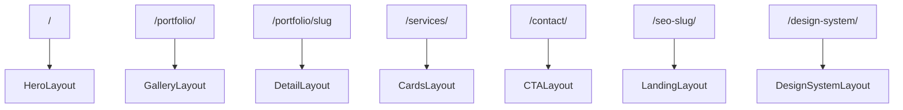
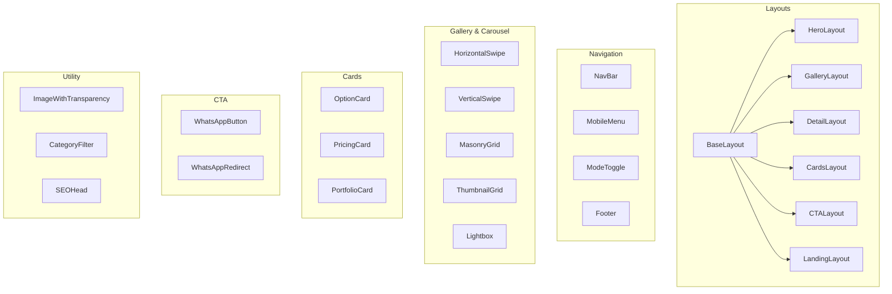

# Create an Image-Heavy Portfolio Website for Boutique E-Commerce

**Status**: Draft (v0.0.0.3)
**Date**: 2026-04-21
**Site Codename**: `arthouse-site`

---

## 1. Context

Client is a friend who does photography and art, and wants a portfolio site that showcases their work in an engaging way. Our firm will not be invoicing for this work, so we want to keep it simple and easy to maintain.

This is a straightforward portfolio site with a focus on image-heavy content and engaging user experience optimized for mobile-first UX and purchasing tiers.

### 1.1 Possible Opportunity for our Firm

A number of parties have showed interest in our Astro-Knots (Astro-based) websites, but we are only taking on certain kinds of clients right now because each client requires significant attention and care. With our Astro-Knots `pseudomonorepo` structure, we might be able to offer a more streamlined and cost-effective solution to these potential clients.

For instance, we could set up OpenClaw, Hermes, or even basic MCP servers to help clients manage their content and updates. So long as they are not asking for radically new components or features, Code Assistants such as Claude Code could manage client requests directly without our direct involvement. Anything unresolved would of course be promoted to our attention and troubleshooting.

### 1.2 Constraints

- **No invoice** — keep scope tight and maintainable
- **Client anonymity** — this spec is published as part of our build-in-public approach; no identifying details
- **Independent deployment** — `arthouse-site` must deploy from its own repo via Vercel, no `workspace:*` dependencies
- **Pseudomonorepo isolation** — Astro-Knots is a pseudomonorepo (not a true monorepo that shares packages at runtime). `arthouse-site` lives in `sites/` as a git submodule for development convenience, but it must build and deploy entirely from its own repo. This means: no `workspace:*` in `package.json`, `.npmrc` must be configured to ignore workspace protocol, and all dependencies are installed from public registries or `@lossless-group` scoped packages on GitHub Packages / JSR
- **Our stack** — Astro (SSG), Svelte (interactivity), Tailwind (styling), no React
- **Content managed through markdown** — portfolio items, galleries, SEO pages, pricing, and site copy are markdown files with YAML frontmatter

---

## 2. Goal

Build `arthouse-site` as an independently deployable Astro site that:

1. **Showcases portfolio work** through multiple gallery/carousel formats optimized for mobile
2. **Supports three display modes** — dark (default), vibrant, and light — with correct handling of transparent-background images in all modes
3. **Drives conversions** through tiered pricing/option cards with WhatsApp as the primary CTA
4. **Enables SEO** through markdown-authored landing pages that appear in the sitemap but not in navigation
5. **Remains maintainable** by a Code Assistant (Claude Code) handling routine content updates and minor feature requests without developer involvement

---

## 3. Site Identity & Workspace Setup

### 3.1 Workspace Integration

```
astro-knots/
  sites/
    arthouse-site/          <-- new submodule
      src/
        content/            <-- markdown collections
          galleries/
        components/
          basics/           <-- basic components like Header, Footer, buttons, links, tabs,  separators. 
          flare/            <-- design-oriented coded visuals
        layouts/
          galleries/
            portrait/
            landscape/
            grid/
        pages/
        config/
        styles/
      public/
        images/             <-- portfolio images (originals)
      astro.config.mjs
      tailwind.config.mjs   <-- or CSS-based TW4 config
      package.json
      .env                  <-- WHATSAPP_NUMBER, SITE_MODE, etc.
```

### 3.2 Setup Commands

```bash
# From astro-knots root
git submodule add <arthouse-site-repo-url> sites/arthouse-site
# Add to pnpm-workspace.yaml
# pnpm install
```

### 3.3 Independent Deployment Configuration

Because Astro-Knots is a pseudomonorepo — sites coexist for development convenience but deploy independently — `arthouse-site` must be fully self-contained.

**`arthouse-site/.npmrc`**:
```ini
# Ignore workspace protocol so pnpm install works outside the monorepo
link-workspace-packages=false

# If consuming @lossless-group packages (e.g., lfm)
@lossless-group:registry=https://npm.pkg.github.com
//npm.pkg.github.com/:_authToken=${GITHUB_TOKEN}
```

**`arthouse-site/package.json`** must NOT contain:
```json
// WRONG — breaks deployment outside the workspace
"dependencies": {
  "@knots/anything": "workspace:*"
}
```

All dependencies come from npm, GitHub Packages, or JSR. If the site needs patterns from `@knots/*`, those are **copied** into the site's own `src/`, not imported.

**Verification**: The site must build cleanly from its own directory:
```bash
cd sites/arthouse-site
pnpm install    # resolves from registries, not workspace
pnpm build      # produces a complete static/hybrid site
```

### 3.4 Stack Versions

| Dependency | Version | Notes |
|-----------|---------|-------|
| Astro | ^6.x | Latest stable |
| Svelte | ^5.x | For interactive components (carousels, mode toggle) |
| Tailwind | ^4.x | CSS-based config (no JS config file) |
| @lossless-group/lfm | latest | If markdown rendering needs extend beyond basic |

---

## 4. Route Architecture

```
ROUTE MAP
=========

/                           Home — hero + featured galleries carousel
/portfolio/                 All galleries — filterable by tags
/portfolio/[slug]           Gallery detail — renders images with layout-appropriate component
/services/                  Pricing tiers / option cards
/contact/                   WhatsApp CTA (secure redirect)
/[seo-slug]/                SEO landing pages (not in nav, in sitemap)
/design-system/             Component & flare browser (dev only)
```

### 4.1 Navigation Structure

```
┌─────────────────────────────────────────────────┐
│  LOGO          Portfolio  Services  Contact  ☾   │
└─────────────────────────────────────────────────┘
                                               │
                                          Mode Toggle
                                       (dark/vibrant/light)
```

**Mobile navigation**: Hamburger menu with full-screen overlay. Mode toggle always visible.

**What's NOT in navigation**:
- SEO landing pages (`/[seo-slug]/`) — these are entry points from search, not browsable destinations
- `/design-system/` — accessible via footer link only

### 4.2 Route-to-Layout Mapping



---

## 5. Content Model

All content is authored as markdown files with YAML frontmatter. **Frontmatter fields are documented here as a reference for content authors — they are not strictly enforced at build time.** Missing or extra fields should not break the build.

### 5.1 Two Content Collections: Images and Galleries

The content model uses **two collections that reference each other**:

- **Images** (`src/content/images/`) — each image is its own `.md` file with metadata
- **Galleries** (`src/content/galleries/`) — each gallery is its own `.md` file that lists which images it contains by slug reference

This separation means:
- An image can appear in **multiple galleries** without duplicating its metadata
- The client edits image details (alt text, pricing, transparent flag) in one place
- The client edits gallery composition (which images, what order) in a separate place
- Both are plain markdown files — trivially editable

```
CONTENT RELATIONSHIP MODEL
===========================

src/content/images/                       src/content/galleries/
  (flat — no subdirectories)                portrait/        ← tall/vertical images
    maria-natural-light.md  ◄──────────── studio-sessions.md
    maria-cutout.md         ◄──────────── studio-sessions.md
    headshot-corporate.md   ◄──┬───────── studio-sessions.md
                               └───────── corporate.md     (same image, two galleries)
    acme-logo-rebrand.md    ◄──────────   landscape/       ← wide/horizontal images
                                            summer-fest-work.md
                                          grid/            ← mixed aspect ratios
                                            logo-collection.md

Image .md has metadata           Gallery .md lives under a layout-
about ONE image                  oriented folder (portrait / landscape / grid)
```

**Why layout orientation, not content taxonomy?** The client doesn't think in categories like "portraits" vs. "graphics" vs. "products." They think: "here's a body of work" — a studio session, a logo collection, a product line. The natural organizing axis for galleries is **how the images display**: mostly tall (portrait), mostly wide (landscape), or mixed (grid). The content taxonomy (what the work *is*) lives in tags, not in directory structure.

#### 5.1.1 Image Files

Each image in the portfolio gets its own markdown file in `src/content/images/`. The frontmatter holds all metadata about that image. The body is optional — for captions, behind-the-scenes notes, or artist statements.

**Directory structure**:
```
src/content/images/
  maria-natural-light.md
  maria-cutout.md
  headshot-corporate-01.md
  headshot-corporate-02.md
  acme-logo-rebrand.md
  summer-fest-poster.md
  candle-set-hero.md
  candle-set-detail.md
```

Images are **flat** — no subdirectories by content type. The client's taxonomy lives in `tags`, not in folder structure. This keeps the editing experience simple: all images in one place, find by filename.

**Example — `src/content/images/maria-natural-light.md`**:
```yaml
---
title: "María, Natural Light"
src: /images/portfolio/maria-natural-light.jpg
alt: "Portrait of María in natural studio light"
transparent: false
tags: [Portraits, Studio, Natural-Light]
pricing_tier: standard
date_created: 2026-04-15
---

Behind-the-scenes: Shot with window light from the north-facing
studio windows, late afternoon. No flash, no reflector.
```

**Example — a transparent image, `src/content/images/maria-cutout.md`**:
```yaml
---
title: "María, Background Removed"
src: /images/portfolio/maria-cutout.png
alt: "Portrait of María with transparent background"
transparent: true
tags: [Portraits, Studio, Cutout]
date_created: 2026-04-15
---
```

**Example — a remote image**:
```yaml
---
title: "Summer Festival Poster"
src: https://cdn.example.com/portfolio/summer-fest-poster.jpg
alt: "Summer festival poster design"
transparent: false
tags: [Graphics, Events, Poster]
date_created: 2026-04-10
---
```

**Image frontmatter reference**:

| Field | Type | Description |
|-------|------|-------------|
| `title` | string | Display name / caption |
| `src` | string | Path to image file (local `/images/...` or remote URL) |
| `alt` | string | Accessibility alt text |
| `transparent` | boolean | If `true`, triggers mode-aware backdrop (Section 8.4) |
| `tags` | string[] | Train-Case tags — this is the taxonomy (not folders) |
| `pricing_tier` | string | Links to a pricing tier (optional — for purchasable items) |
| `date_created` | string | ISO date |

#### 5.1.2 Gallery Files

Each gallery is a markdown file in `src/content/galleries/`. The frontmatter holds gallery-level metadata. The body contains a **simple list of image slugs** — one per line.

**Directory structure** — organized by layout orientation:
```
src/content/galleries/
  portrait/                      # tall / vertical images
    studio-sessions.md
    headshots.md
  landscape/                     # wide / horizontal images
    summer-fest-work.md
    product-flatlays.md
  grid/                          # mixed aspect ratios
    logo-collection.md
    year-in-review.md
```

The subdirectory tells the build system which **layout family** to use by default. The client picks the folder based on how the images should display, not what the content is about. Content taxonomy lives in `tags`.

| Folder | Default Layout | Best For |
|--------|---------------|----------|
| `portrait/` | Vertical swipe on mobile, 2-3 column masonry on desktop | Tall images — portraits, full-body shots, posters |
| `landscape/` | Horizontal swipe carousel | Wide images — product flatlays, panoramas, banners |
| `grid/` | Uniform thumbnail grid or masonry | Mixed aspect ratios — logo sets, mixed collections |

> **Open question**: Do we need a `hybrid/` folder for galleries that intentionally mix portrait and landscape orientations? Or does `grid/` cover that case well enough? Can revisit once the client has real content to test with.

**Example — `src/content/galleries/portrait/studio-sessions.md`**:
```yaml
---
title: "Studio Sessions"
description: "Natural light portrait sessions in our downtown studio"
cover_image: maria-natural-light
featured: true
sort_order: 1
tags: [Portraits, Studio, Natural-Light]
date_created: 2026-04-15
---

images:
- maria-natural-light
- maria-cutout
- headshot-corporate-01
- headshot-corporate-02
```

**Example — `src/content/galleries/landscape/product-flatlays.md`**:
```yaml
---
title: "Product Flatlays"
description: "Overhead product photography for boutique brands"
cover_image: candle-set-hero
featured: false
sort_order: 3
tags: [Products, Flatlay, Overhead]
date_created: 2026-04-18
---

images:
- candle-set-hero
- candle-set-detail
- soap-collection-wide
```

**Example — `src/content/galleries/grid/logo-collection.md`**:
```yaml
---
title: "Logo & Branding Work"
description: "Brand identity designs and logo variations"
cover_image: acme-logo-rebrand
featured: true
sort_order: 2
tags: [Graphics, Branding, Logos]
date_created: 2026-04-12
---

images:
- acme-logo-rebrand
- summer-fest-poster
- cafe-rebrand-logo
- boutique-wordmark
```

**The client's editing experience**:
- **Add an image to a gallery**: Add a line with the image's slug (its path under `src/content/images/` without `.md`)
- **Remove an image**: Delete the line
- **Reorder**: Move lines up or down
- **The image's own metadata (alt, transparent, etc.) stays in the image's `.md` file** — no need to repeat it here

**Gallery frontmatter reference**:

| Field | Type | Description |
|-------|------|-------------|
| `title` | string | Gallery display name |
| `description` | string | Short description for cards and meta tags |
| `cover_image` | string | Image slug used as the gallery's thumbnail on index pages |
| `featured` | boolean | Appears on home page carousel |
| `sort_order` | number | Manual ordering (global or within layout type) |
| `layout_override` | string | Optional — overrides the default layout from the subdirectory |
| `tags` | string[] | Train-Case tags — this is the content taxonomy |
| `date_created` | string | ISO date |

**Note**: The gallery's default layout is derived from its subdirectory (`portrait/` → vertical layouts, `landscape/` → horizontal layouts, `grid/` → grid layouts). The `layout_override` field exists for edge cases where a gallery lives in one folder but needs a different rendering — but most galleries won't use it.

#### 5.1.3 How the Two Collections Connect at Build Time

```
BUILD-TIME RESOLUTION
======================

1. getCollection('galleries')  →  all gallery .md files
2. For each gallery, parse the image slug list from body
3. For each slug, resolve from getCollection('images')
4. Merge: gallery metadata + resolved image metadata array
5. Pass to gallery layout component for rendering

src/content/galleries/portrait/studio-sessions.md
    │
    │  subdirectory: portrait/ → default layout = vertical masonry
    │
    │  body contains:
    │    - maria-natural-light
    │    - maria-cutout
    │
    ▼
  Parse slugs from body
    │
    ├──▶ getEntry('images', 'maria-natural-light')
    │       → { src: "/images/.../maria.jpg", alt: "...", transparent: false }
    │
    ├──▶ getEntry('images', 'maria-cutout')
    │       → { src: "/images/.../cutout.png", alt: "...", transparent: true }
    │
    ▼
  Resolved gallery = {
    title: "Studio Sessions",
    layoutType: "portrait",        ← from subdirectory
    images: [
      { src, alt, transparent: false, ... },
      { src, alt, transparent: true, ... },
    ]
  }
    │
    ▼
  Layout type selects component:
    portrait/  → VerticalSwipe (mobile) + 2-col Masonry (desktop)
    landscape/ → HorizontalSwipe
    grid/      → ThumbnailGrid or MasonryGrid
```

#### 5.1.4 Route Generation from Galleries

Galleries route by layout type, then slug. The layout type subdirectory is **not a content category** — it's a display hint. Content filtering on index pages uses `tags`, not folder structure.

```
Gallery files                                    Routes
─────────────                                    ──────
(all galleries)                           ──▶    /portfolio/                    (index of all)
galleries/portrait/studio-sessions.md     ──▶    /portfolio/studio-sessions     (detail page)
galleries/landscape/product-flatlays.md   ──▶    /portfolio/product-flatlays    (detail page)
galleries/grid/logo-collection.md         ──▶    /portfolio/logo-collection     (detail page)
```

Each gallery detail page:
- Renders the gallery's images using the specified `gallery_layout` component
- Displays gallery title, description, and tags
- Shows the markdown body (if any) below the gallery as optional copy
- Includes a WhatsApp CTA linked to the gallery's `pricing_tier` (if set)
- Opens `Lightbox` on image click with prev/next across the gallery's images

### 5.2 SEO Landing Pages

Markdown files in `src/content/seo-pages/`.

```yaml
---
title: "Best Portrait Photography in [City]"
description: "SEO meta description for search results"
og_image: /images/seo/portraits-og.jpg
in_nav: false                    # excluded from navigation
in_sitemap: true                 # included in sitemap.xml
target_keywords: [portrait photography, headshots, studio portraits]
cta_text: "Book a Session"       # overrides default CTA copy
tags: [SEO, Portraits]
date_created: 2026-04-20
---

# Heading for the Landing Page

Body content authored in markdown. Can include portfolio embeds
via LFM directives if needed.
```

### 5.3 Pricing / Service Tiers

Pricing tiers are **markdown files with YAML frontmatter** in `src/content/pricing/`. This makes them trivially easy for the client (or a Code Assistant) to add, remove, reorder, or edit — no TypeScript required.

**Directory structure**:
```
src/content/pricing/
  basic.md
  standard.md
  premium.md
```

**Example — `src/content/pricing/standard.md`**:
```yaml
---
title: Standard
price: "€150"
sort_order: 2
popular: true
features:
  - "10 edited photos"
  - "Online gallery"
  - "Print-ready files"
cta_message: "Hi, I'm interested in your Standard package"
---

Our most popular option. Includes a 1-hour session with
natural lighting and 10 professionally edited photos
delivered within 5 business days.
```

**How it works**:
- **Add a tier**: Create a new `.md` file in `src/content/pricing/`
- **Remove a tier**: Delete the file
- **Reorder**: Change `sort_order` values
- **Highlight the popular tier**: Set `popular: true` on exactly one file
- **Extended description**: The markdown body renders below the card's feature list (optional — leave body empty for a compact card)

**Expected frontmatter fields**:

| Field | Type | Required | Description |
|-------|------|----------|-------------|
| `title` | string | yes | Tier name displayed on the card |
| `price` | string | yes | Display string — "€150", "Starting at €500", "Sur devis" |
| `sort_order` | number | yes | Display order (1 = leftmost/topmost) |
| `popular` | boolean | no | Highlights this tier visually (badge, glow in vibrant mode) |
| `features` | string[] | no | Bullet points listed on the card |
| `cta_message` | string | no | Pre-filled WhatsApp message for this tier |
| `category` | string | no | Groups tiers by service type if client offers distinct service lines |

**Why markdown and not pure YAML or JSON**: The frontmatter holds all the structured data the card component needs. The markdown body is a bonus — it gives the client a natural place to write longer descriptions, add notes, or include seasonal messaging without us needing to add more frontmatter fields. If the body is empty, the card just renders the frontmatter data.

**Adaptability**: The client can have 2 tiers or 10. They can group tiers by `category` to show different pricing sets on different pages (e.g., portrait photography pricing vs. graphic design pricing). The component reads whatever files exist and renders them — no hardcoded tier count.

### 5.4 Site Configuration

**`.env`**:
```bash
SITE_BRAND=arthouse
SITE_MODE=dark                   # default mode on first visit
WHATSAPP_NUMBER=+1234567890      # never exposed in client-side HTML
WHATSAPP_DEFAULT_MESSAGE="Hi, I saw your portfolio and I'm interested"
SITE_URL=https://arthouse-site.example.com
```

### 5.5 Content Pages (Marketing Pages)

The site has hardcoded marketing pages (home, contact, services, about, etc.) where the **layout and components are fixed** but the **images and copy are client-editable**. The client shouldn't need to go through us to swap a hero background image or update a tagline.

Each marketing page gets a corresponding markdown file in `src/content/pages/`. The Astro page template reads from this file at build time.

**Directory structure**:
```
src/content/pages/
  home.md
  contact.md
  about.md
  services.md
```

**Example — `src/content/pages/home.md`**:
```yaml
---
title: "Welcome"
hero_image: /images/marketing/hero-studio-wide.jpg
hero_heading: "Photography & Design"
hero_subheading: "Crafted in Paris"
featured_background: /images/marketing/texture-dark.jpg
sections:
  - id: intro
    heading: "About the Studio"
    body: "A few words about what we do and why."
    image: /images/marketing/studio-interior.jpg
  - id: cta
    heading: "Let's Work Together"
    body: "Reach out on WhatsApp to get started."
    image: /images/marketing/contact-bg.jpg
---
```

**Example — `src/content/pages/contact.md`**:
```yaml
---
title: "Contact"
hero_image: /images/marketing/contact-hero.jpg
heading: "Get in Touch"
body: "Message us on WhatsApp — we typically respond within a few hours."
---
```

**How it works**:
- The Astro page template (e.g., `src/pages/index.astro`) imports the corresponding content file and reads frontmatter fields
- Layout, components, and structure are **hardcoded in the template** — the client can't accidentally break the page layout
- The client edits **only the data**: images, headings, body text, section content
- Image paths point to files in `public/images/marketing/` (local) or remote URLs
- The `sections` array pattern (on pages like home) lets the client add/remove/reorder content blocks without touching code — each section maps to a fixed component slot

**What the client can change via CMS or markdown**:
- Hero images and background images
- Headings and body text
- Section content and ordering
- Which images appear where

**What the client cannot change** (requires developer):
- Page layout structure
- Component design
- New pages/routes
- Navigation structure

---

## 6. CMS: Sveltia CMS

### 6.1 Overview

The client manages all content through **Sveltia CMS** — a git-backed CMS that runs at `/admin` on the same domain. No separate service, no separate hosting. It's two files in `public/admin/` that deploy alongside the site.

Sveltia CMS is our fork at `lossless-group/sveltia-cms`. It's a drop-in replacement for Decap CMS with a modern UI, better media management, and Svelte internals.

```
CLIENT EDITING FLOW
====================

Client visits arthouse-site.com/admin
         │
         ▼
    Sveltia CMS UI loads (static JS, same domain)
         │
         ▼
    Logs in (simple auth — see 6.3)
         │
         ▼
    Sees content collections:
      • Images
      • Galleries (Portrait / Landscape / Grid)
      • Pricing Tiers
      • Content Pages
      • SEO Pages
         │
         ▼
    Edits via form UI (not raw YAML)
    Uploads images via media library
         │
         ▼
    Saves → CMS commits to GitHub repo
         │
         ▼
    Vercel detects push → auto-deploys
         │
         ▼
    Live site updated (typically < 1 minute)
```

### 6.2 Installation

Two static files — no npm package, no build step for the CMS itself:

```
public/
  admin/
    index.html          ← loads Sveltia CMS
    config.yml          ← content model definition
```

**`public/admin/index.html`**:
```html
<!doctype html>
<html>
<head>
  <meta charset="utf-8" />
  <meta name="viewport" content="width=device-width, initial-scale=1.0" />
  <title>Arthouse Admin</title>
</head>
<body>
  <script src="https://unpkg.com/@sveltia/cms/dist/sveltia-cms.js"></script>
</body>
</html>
```

That's the entire admin page. The CMS JS loads, reads `config.yml`, and renders the editing UI.

### 6.3 Authentication

Security is not a significant concern for this site — low traffic (~50-100 visitors/month), no financial data, transactions happen on WhatsApp. Authentication should be **as simple as possible** for one admin user (the client) and our team.

**Recommended approach: GitHub OAuth**

The simplest git-backed auth. The client gets a GitHub account (if she doesn't have one), we add her as a collaborator on the repo, and she logs in to `/admin` with GitHub.

```
Setup:
1. Create a GitHub OAuth App (in repo settings or org settings)
2. Set callback URL to arthouse-site.com/admin/
3. Add client ID + secret to Vercel env vars
4. Client clicks "Login with GitHub" at /admin

Who has access:
  - Client (GitHub collaborator on the repo)
  - Our team (already has repo access)
```

**Alternative if GitHub is too much friction**: A lightweight auth proxy or even a simple shared password via environment variable. Given the security profile ("50-100 visitors, no credentials to protect"), a basic password gate on the `/admin` route would be fine. Implementation options:

| Approach | Complexity | Security | UX |
|----------|-----------|----------|-----|
| GitHub OAuth | Low | Good | Client needs GitHub account |
| Vercel Password Protection | Trivial | Basic | Vercel Pro feature, single password |
| Env-var password + middleware | Low | Minimal | Just a password prompt, no accounts |

The spec doesn't prescribe which — pick the one with least friction for the client at implementation time.

### 6.4 CMS Content Model (`config.yml`)

The `config.yml` maps directly to the content collections defined in Section 5. Each collection becomes an editable section in the CMS sidebar.

```yaml
# public/admin/config.yml

backend:
  name: github
  repo: lossless-group/arthouse-site    # or whatever the actual repo
  branch: main

media_folder: public/images
public_folder: /images

collections:

  # ── Images ──────────────────────────────────────────────
  # Each image is its own .md file with metadata.
  # Client sees a list of all images, can add/edit/delete.
  - name: images
    label: "Images"
    label_singular: "Image"
    folder: src/content/images
    extension: md
    create: true
    delete: true
    fields:
      - { name: title, label: "Title / Caption", widget: string }
      - { name: src, label: "Image File", widget: image }
      - { name: alt, label: "Alt Text", widget: string,
          hint: "Describe the image for accessibility" }
      - { name: transparent, label: "Transparent Background?",
          widget: boolean, default: false,
          hint: "Turn on if this is a PNG with no background" }
      - { name: tags, label: "Tags", widget: list, default: [],
          hint: "Use Train-Case: Portraits, Studio, Natural-Light" }
      - { name: pricing_tier, label: "Pricing Tier", widget: string,
          required: false,
          hint: "e.g. standard, premium — leave blank if not for sale" }
      - { name: date_created, label: "Date", widget: datetime }
      - { name: body, label: "Notes / Caption (optional)",
          widget: markdown, required: false }

  # ── Galleries: Portrait ──────────────────────────────────
  # Tall / vertical image galleries
  - name: galleries-portrait
    label: "Galleries (Portrait)"
    label_singular: "Portrait Gallery"
    folder: src/content/galleries/portrait
    extension: md
    create: true
    delete: true
    fields:
      - { name: title, label: "Gallery Name", widget: string }
      - { name: description, label: "Description", widget: text }
      - { name: cover_image, label: "Cover Image Slug", widget: string,
          hint: "The image slug used as thumbnail, e.g. maria-natural-light" }
      - { name: featured, label: "Featured on Home?",
          widget: boolean, default: false }
      - { name: sort_order, label: "Sort Order", widget: number }
      - { name: tags, label: "Tags", widget: list, default: [] }
      - { name: date_created, label: "Date", widget: datetime }
      - { name: body, label: "Image List",
          widget: markdown,
          hint: "List image slugs, one per line with a dash: - maria-natural-light" }

  # ── Galleries: Landscape ─────────────────────────────────
  - name: galleries-landscape
    label: "Galleries (Landscape)"
    label_singular: "Landscape Gallery"
    folder: src/content/galleries/landscape
    extension: md
    create: true
    delete: true
    fields:
      - { name: title, label: "Gallery Name", widget: string }
      - { name: description, label: "Description", widget: text }
      - { name: cover_image, label: "Cover Image Slug", widget: string }
      - { name: featured, label: "Featured on Home?",
          widget: boolean, default: false }
      - { name: sort_order, label: "Sort Order", widget: number }
      - { name: tags, label: "Tags", widget: list, default: [] }
      - { name: date_created, label: "Date", widget: datetime }
      - { name: body, label: "Image List", widget: markdown }

  # ── Galleries: Grid ──────────────────────────────────────
  - name: galleries-grid
    label: "Galleries (Grid)"
    label_singular: "Grid Gallery"
    folder: src/content/galleries/grid
    extension: md
    create: true
    delete: true
    fields:
      - { name: title, label: "Gallery Name", widget: string }
      - { name: description, label: "Description", widget: text }
      - { name: cover_image, label: "Cover Image Slug", widget: string }
      - { name: featured, label: "Featured on Home?",
          widget: boolean, default: false }
      - { name: sort_order, label: "Sort Order", widget: number }
      - { name: tags, label: "Tags", widget: list, default: [] }
      - { name: date_created, label: "Date", widget: datetime }
      - { name: body, label: "Image List", widget: markdown }

  # ── Pricing Tiers ────────────────────────────────────────
  - name: pricing
    label: "Pricing Tiers"
    label_singular: "Pricing Tier"
    folder: src/content/pricing
    extension: md
    create: true
    delete: true
    fields:
      - { name: title, label: "Tier Name", widget: string }
      - { name: price, label: "Price", widget: string,
          hint: "Display text: €150, Starting at €500, Sur devis" }
      - { name: sort_order, label: "Sort Order", widget: number }
      - { name: popular, label: "Most Popular?",
          widget: boolean, default: false }
      - { name: features, label: "Features", widget: list }
      - { name: cta_message, label: "WhatsApp Message", widget: string,
          required: false }
      - { name: body, label: "Extended Description (optional)",
          widget: markdown, required: false }

  # ── Content Pages (Marketing) ────────────────────────────
  # Fixed set of pages — client edits images and copy, not structure.
  - name: pages
    label: "Site Pages"
    folder: src/content/pages
    extension: md
    create: false                # client can't create new pages
    delete: false                # client can't delete pages
    fields:
      - { name: title, label: "Page Title", widget: string }
      - { name: hero_image, label: "Hero / Background Image",
          widget: image, required: false }
      - { name: hero_heading, label: "Hero Heading", widget: string,
          required: false }
      - { name: hero_subheading, label: "Hero Subheading", widget: string,
          required: false }
      - { name: sections, label: "Page Sections", widget: list,
          required: false,
          fields:
            - { name: id, label: "Section ID", widget: string }
            - { name: heading, label: "Heading", widget: string }
            - { name: body, label: "Body Text", widget: text }
            - { name: image, label: "Section Image", widget: image,
                required: false } }

  # ── SEO Landing Pages ────────────────────────────────────
  - name: seo-pages
    label: "SEO Landing Pages"
    label_singular: "Landing Page"
    folder: src/content/seo-pages
    extension: md
    create: true
    delete: true
    fields:
      - { name: title, label: "Page Title", widget: string }
      - { name: description, label: "Meta Description", widget: text }
      - { name: og_image, label: "OG Image", widget: image,
          required: false }
      - { name: target_keywords, label: "Target Keywords", widget: list }
      - { name: cta_text, label: "CTA Button Text", widget: string,
          default: "Book a Session" }
      - { name: tags, label: "Tags", widget: list, default: [] }
      - { name: date_created, label: "Date", widget: datetime }
      - { name: body, label: "Page Content", widget: markdown }
```

### 6.5 What the Client Sees

```
SVELTIA CMS SIDEBAR                    MAIN PANEL
===================                    ==========

  Images              ──▶    List of all images with thumbnails
  Galleries                  Click to edit: form with title, alt, tags,
    Portrait          ──▶    image upload widget
    Landscape         ──▶    
    Grid              ──▶    Gallery editor: form fields + image slug list
  Pricing Tiers       ──▶    List of tiers, reorderable
  Site Pages          ──▶    Fixed list (home, contact, about, services)
                             Can edit images + text, cannot add/delete pages
  SEO Landing Pages   ──▶    Create/edit/delete SEO pages
  Media               ──▶    Image library — upload, browse, delete
```

**Key UX points for the client**:
- **Adding an image to the portfolio**: Go to Images → New Image → fill in title, upload the image, add tags → Save
- **Adding that image to a gallery**: Go to the gallery → add the image slug to the list in the body → Save
- **Swapping a hero background**: Go to Site Pages → Home → click the Hero Image field → pick from media library or upload new → Save
- **Updating pricing**: Go to Pricing Tiers → click the tier → change the price field → Save

### 6.6 Media Library

Sveltia CMS includes a built-in media library for uploading and browsing images. Uploaded files go to `public/images/` (configured via `media_folder` in `config.yml`).

The media library supports:
- Drag-and-drop upload (including bulk)
- Browse existing images
- Search by filename
- Delete unused images
- Automatic path insertion into content fields

This is where the client uploads new portfolio images before creating the corresponding image `.md` file.

### 6.7 Deployment Note

The CMS is just static files — it deploys with the site. No additional Vercel configuration needed beyond:
- The GitHub OAuth app credentials (if using GitHub auth)
- Or the admin password env var (if using simple auth)

The CMS itself never touches the live site directly. It commits to the GitHub repo, and Vercel's normal deploy pipeline handles the rest.

---

## 7. Component Catalog

### 7.1 Component Tree Overview



### 7.2 Navigation & Layout Components

#### `BaseLayout.astro`
- Wraps all pages
- Includes `<head>` with SEO meta, OG tags, theme CSS
- Applies `data-theme="arthouse"` and `data-mode="dark|vibrant|light"` to `<html>`
- Renders `NavBar`, page slot, `Footer`

#### `NavBar.astro`
- Logo (left), nav links (center/right), `ModeToggle` (far right)
- Collapses to hamburger on mobile with `MobileMenu.svelte`
- Sticky on scroll

#### `ModeToggle.svelte`
- Cycles through dark → vibrant → light
- Persists choice to `localStorage`
- Reads initial mode from `.env` `SITE_MODE` default, then `localStorage` override

#### `Footer.astro`
- Minimal: copyright, social links, `/design-system/` link
- WhatsApp icon link (uses secure redirect, not raw number)

### 7.3 Gallery & Carousel Components

These are **Svelte components** for touch/swipe interactivity. Each accepts a common `items` prop shape.

```typescript
// Shared type for all gallery components
interface GalleryItem {
  src: string;
  alt: string;
  transparent?: boolean;
  href?: string;        // link to detail page
  title?: string;
  category?: string;
}
```

#### `HorizontalSwipe.svelte`

```
┌──────────────────────────────────────────────────────────┐
│                                                          │
│  ┌─────────┐  ┌─────────┐  ┌─────────┐  ┌─────────┐    │
│  │         │  │         │  │         │  │         │ ···│
│  │  img 1  │  │  img 2  │  │  img 3  │  │  img 4  │    │
│  │         │  │         │  │         │  │         │    │
│  └─────────┘  └─────────┘  └─────────┘  └─────────┘    │
│                                                          │
│              ● ○ ○ ○ ○                                   │
└──────────────────────────────────────────────────────────┘
           ◄── swipe / drag ──►
```

| Prop | Type | Default | Description |
|------|------|---------|-------------|
| `items` | `GalleryItem[]` | required | Images to display |
| `visibleCount` | `number` | `1` on mobile, `3` on desktop | Cards visible at once |
| `autoAdvance` | `boolean` | `false` | Auto-scroll interval |
| `autoAdvanceMs` | `number` | `4000` | Interval if auto-advancing |
| `showDots` | `boolean` | `true` | Dot indicators below |
| `showArrows` | `boolean` | `true` on desktop | Left/right arrow buttons |
| `gap` | `string` | `"1rem"` | Gap between cards |

**Behavior**:
- Touch swipe on mobile (native feel, momentum-based)
- Click-drag on desktop
- Keyboard: left/right arrow keys when focused
- Snaps to nearest card on release
- Tapping an image opens `Lightbox` or navigates to `href`

#### `VerticalSwipe.svelte`

Same API as `HorizontalSwipe` but scrolls vertically. Primarily for mobile full-screen browsing (Instagram/TikTok-style scroll). One image fills the viewport.

```
┌─────────────────┐
│                  │
│                  │
│     image 1      │
│                  │
│                  │
├─────────────────┤  ▲
│                  │  │ swipe up
│     image 2      │  │
│                  │
└─────────────────┘
```

| Prop | Type | Default | Description |
|------|------|---------|-------------|
| `items` | `GalleryItem[]` | required | Images to display |
| `fullScreen` | `boolean` | `true` | Each item fills viewport height |
| `showCounter` | `boolean` | `true` | "3 / 12" counter overlay |

#### `MasonryGrid.svelte`

```
┌───────┐ ┌──────────┐ ┌───────┐
│       │ │          │ │       │
│  img  │ │   img    │ │  img  │
│       │ │          │ │       │
└───────┘ │          │ └───────┘
┌───────┐ └──────────┘ ┌───────┐
│       │ ┌──────────┐ │       │
│  img  │ │   img    │ │       │
│       │ │          │ │  img  │
│       │ └──────────┘ │       │
└───────┘              └───────┘
```

| Prop | Type | Default | Description |
|------|------|---------|-------------|
| `items` | `GalleryItem[]` | required | Images to display |
| `columns` | `number` | `2` mobile, `3` tablet, `4` desktop | Column count per breakpoint |
| `gap` | `string` | `"0.5rem"` | Gap between items |
| `onItemClick` | `"lightbox" \| "navigate" \| "none"` | `"lightbox"` | Click behavior |

**Behavior**:
- CSS-based masonry (CSS `columns` or CSS Grid `masonry` where supported, JS fallback)
- Images maintain natural aspect ratio
- Lazy loading with placeholder blur/skeleton
- Infinite scroll or "Load more" button for large collections

#### `ThumbnailGrid.svelte`

Uniform grid of cropped thumbnails. Simpler than masonry — all cells same size.

| Prop | Type | Default | Description |
|------|------|---------|-------------|
| `items` | `GalleryItem[]` | required | Images to display |
| `columns` | `number` | `2` mobile, `3` tablet, `4` desktop | Columns per breakpoint |
| `aspectRatio` | `string` | `"1/1"` | Thumbnail crop ratio |
| `onItemClick` | `"lightbox" \| "navigate"` | `"lightbox"` | Click behavior |

#### `Lightbox.svelte`

Full-screen overlay for viewing a single image at high resolution.

```
┌──────────────────────────────────────┐
│  ✕                            1 / 12 │
│                                      │
│                                      │
│          [ full-size image ]         │
│                                      │
│                                      │
│  ◄                              ►    │
│                                      │
│  Title / caption                     │
│  "Book this style" [WhatsApp CTA]    │
└──────────────────────────────────────┘
```

| Prop | Type | Default | Description |
|------|------|---------|-------------|
| `items` | `GalleryItem[]` | required | Full set for prev/next |
| `startIndex` | `number` | `0` | Which image to show first |
| `showCTA` | `boolean` | `true` | Show WhatsApp CTA in lightbox |

**Behavior**:
- Swipe left/right for prev/next
- Pinch-to-zoom on mobile
- Escape or ✕ to close
- Background click closes
- Keyboard: arrows, escape
- URL does NOT change (lightbox is an overlay, not a route)

### 7.4 Card Components

#### `PricingCard.astro`

Renders a single pricing tier. Receives a `PricingTier` object.

```
┌─────────────────────┐
│      STANDARD       │
│    ★ Most Popular   │    <-- only if popular: true
│                     │
│       $XXX          │
│                     │
│  ✓ Feature one      │
│  ✓ Feature two      │
│  ✓ Feature three    │
│                     │
│  ┌───────────────┐  │
│  │  Book on       │  │
│  │  WhatsApp      │  │
│  └───────────────┘  │
└─────────────────────┘
```

**Visual treatment by mode**:
- **Dark**: Card has subtle border, dark surface background
- **Vibrant**: Popular card gets accent glow/gradient border
- **Light**: Standard card shadows

#### `PortfolioCard.astro`

Used in carousels and grids. Shows image thumbnail + title + category badge.

```
┌─────────────────────┐
│                     │
│      [ image ]      │
│                     │
├─────────────────────┤
│  Title              │
│  Category ·  Tier   │
└─────────────────────┘
```

#### `OptionCard.astro`

Generic card for presenting choices (e.g., "Choose your style", "Select a package"). Used on services page or as an upsell component.

### 7.5 WhatsApp CTA Components

#### `WhatsAppButton.svelte`

A button that initiates a WhatsApp conversation. **The phone number is never in the HTML source.**

**Implementation approach — server-side redirect**:

```
User clicks button
       │
       ▼
  /api/contact?tier=standard&ref=portfolio-item-slug
       │
       ▼
  Server reads WHATSAPP_NUMBER from env
  Constructs wa.me URL with pre-filled message
       │
       ▼
  302 redirect to https://wa.me/NUMBER?text=MESSAGE
```

| Prop | Type | Default | Description |
|------|------|---------|-------------|
| `tier` | `string` | `undefined` | Pre-fills message with tier info |
| `ref` | `string` | `undefined` | Portfolio item slug for tracking |
| `label` | `string` | `"Contact on WhatsApp"` | Button text |
| `variant` | `"primary" \| "ghost" \| "icon-only"` | `"primary"` | Visual style |

#### `/api/contact.ts` (Astro API route)

```typescript
// src/pages/api/contact.ts
export const GET: APIRoute = ({ url }) => {
  const number = import.meta.env.WHATSAPP_NUMBER;
  const tier = url.searchParams.get('tier') || '';
  const ref = url.searchParams.get('ref') || '';
  const defaultMsg = import.meta.env.WHATSAPP_DEFAULT_MESSAGE || '';
  
  let message = defaultMsg;
  if (tier) message += ` (${tier} package)`;
  if (ref) message += ` — regarding: ${ref}`;
  
  const waUrl = `https://wa.me/${number}?text=${encodeURIComponent(message)}`;
  return new Response(null, {
    status: 302,
    headers: { Location: waUrl },
  });
};
```

**Trade-off**: This requires `output: 'hybrid'` or `output: 'server'` in Astro config for the API route. If pure static is preferred, the alternative is a client-side Svelte component that fetches the number from a serverless function at click time — but the redirect approach is simpler and works with Vercel's serverless.

### 7.6 Utility Components

#### `ImageWithTransparency.astro`

Wraps `` (or Astro's `<Image>`) with mode-aware background handling for transparent PNGs.

See Section 8.3 for rendering rules per mode.

| Prop | Type | Default | Description |
|------|------|---------|-------------|
| `src` | `string` | required | Image path |
| `alt` | `string` | required | Alt text |
| `transparent` | `boolean` | `false` | If true, applies mode-aware background |
| `width` | `number` | `undefined` | Explicit width |
| `height` | `number` | `undefined` | Explicit height |

#### `CategoryFilter.svelte`

Horizontal pill/tag bar for filtering gallery views by category.

```
  [ All ]  [ Portraits ]  [ Graphics ]  [ Products ]
```

- Updates URL query param (`?category=portraits`) for shareable filtered views
- Smooth transition when filter changes (items fade/reflow)

#### `SEOHead.astro`

Renders `<title>`, `<meta description>`, `<meta og:*>`, `<link rel="canonical">`, and structured data (JSON-LD) for portfolio items.

---

## 8. Theme & Mode System

### 8.1 Architecture

Following the Astro-Knots color hierarchy (see `context-v/reminders/Improvising-within-Design-System-Color-Palettes.md`):

```
src/content/theme/colors.md    Client-editable named colors (via CMS color picker)
src/content/theme/modes.md     Client-editable mode assignments (via CMS dropdowns)
           │
           ▼
    Build-time CSS generation
           │
           ▼
:root                          Named colors as CSS custom properties
    │
    ▼
[data-theme="arthouse"]
[data-mode="dark"]             Semantic tokens → var(--color-{named-color})
[data-mode="vibrant"]          Semantic tokens → var(--color-{named-color})
[data-mode="light"]            Semantic tokens → var(--color-{named-color})
    │
    ▼
Components                     Use ONLY semantic tokens (var(--color-*))
```

### 8.2 Client-Managed Color System

The client is a visual artist — opinionated about color, not technical. Rather than going back and forth over hex values in CSS files, **the entire color palette and mode assignments are data-driven through the CMS**.

The client sees color pickers and dropdowns. The build generates CSS. She never touches code.

```
WHAT THE CLIENT SEES IN CMS              WHAT THE BUILD GENERATES
===============================          =========================

"My Colors" collection:

  ink         [■ #0A0A0A]                :root {
  deep-night  [■ #141531]                  --color-ink: #0A0A0A;
  slate       [■ #2D2D44]                  --color-deep-night: #141531;
  ash         [■ #6B7280]                  --color-slate: #2D2D44;
  silver      [■ #D1D5DB]                  --color-ash: #6B7280;
  cloud       [■ #F3F4F6]                  --color-silver: #D1D5DB;
  snow        [■ #FFFFFF]                  --color-cloud: #F3F4F6;
  brand-blue  [■ #0052E6]                  --color-snow: #FFFFFF;
  electric    [■ #60A5FA]                  --color-brand-blue: #0052E6;
  warm-coral  [■ #F97066]                  --color-electric: #60A5FA;
                                           --color-warm-coral: #F97066;
         ▼ color picker widget             }

"Dark Mode" assignments:

  Surface:     deep-night  ▼             [data-mode="dark"] {
  Surface Alt: slate       ▼               --color-surface: var(--color-deep-night);
  Text:        snow        ▼               --color-surface-raised: var(--color-slate);
  Text Muted:  ash         ▼               --color-text: var(--color-snow);
  Primary:     brand-blue  ▼               --color-text-muted: var(--color-ash);
  Accent:      electric    ▼               --color-primary: var(--color-brand-blue);
  Border %:    10          ▼               --color-accent: var(--color-electric);
                                           --color-border: color-mix(in srgb,
         ▼ dropdown of her named colors        var(--color-snow) 10%, transparent);
                                         }
```

#### 8.2.1 Color Palette Data File

**`src/content/theme/colors.md`**:
```yaml
---
colors:
  # Neutrals
  - name: ink
    hex: "#0A0A0A"
    description: "Deepest black"
  - name: deep-night
    hex: "#141531"
    description: "Dark blue-black, main dark background"
  - name: slate
    hex: "#2D2D44"
    description: "Raised surfaces in dark mode"
  - name: ash
    hex: "#6B7280"
    description: "Muted text, subtle elements"
  - name: silver
    hex: "#D1D5DB"
    description: "Light borders, muted text in dark modes"
  - name: cloud
    hex: "#F3F4F6"
    description: "Light mode surfaces"
  - name: snow
    hex: "#FFFFFF"
    description: "Pure white — text on dark, backgrounds in light"

  # Brand — the client picks these
  - name: brand-blue
    hex: "#0052E6"
    description: "Primary brand color"
  - name: electric
    hex: "#60A5FA"
    description: "Bright accent, links, highlights"
  - name: warm-coral
    hex: "#F97066"
    description: "Warm accent for vibrant mode"

  # Functional (client can change but probably shouldn't)
  - name: success
    hex: "#10B981"
    description: "Success states"
  - name: warning
    hex: "#F59E0B"
    description: "Warning states"
  - name: error
    hex: "#EF4444"
    description: "Error states"
---
```

The client can:
- **Change any hex value** via the color picker — instant palette update across all modes
- **Add new named colors** — they become available in mode assignment dropdowns
- **Remove colors** — but only if no mode references them (build warns if orphaned)
- **Rename colors** — the `name` is the key; the `description` is just a hint for the CMS

#### 8.2.2 Mode Assignment Data File

**`src/content/theme/modes.md`**:
```yaml
---
dark:
  surface: deep-night
  surface_raised: slate
  text: snow
  text_muted: ash
  primary: brand-blue
  accent: electric
  border_color: snow
  border_opacity: 10
  transparent_bg: slate
  transparent_checker: ash

vibrant:
  surface: deep-night
  surface_raised: slate
  text: snow
  text_muted: silver
  primary: brand-blue
  accent: warm-coral
  border_color: electric
  border_opacity: 30
  transparent_bg: deep-night
  transparent_checker: none

light:
  surface: snow
  surface_raised: cloud
  text: ink
  text_muted: ash
  primary: brand-blue
  accent: warm-coral
  border_color: ink
  border_opacity: 10
  transparent_bg: cloud
  transparent_checker: silver
---
```

Each value is a **named color reference** (matching a `name` from `colors.md`), not a hex value. The client assigns colors to roles using dropdown menus populated from her named color list.

#### 8.2.3 Semantic Roles (Fixed by Developer)

The client can change *which color fills each role*, but the roles themselves are fixed. This is the developer boundary — adding a new semantic role requires a code change.

| Role | CSS Variable | Description |
|------|-------------|-------------|
| `surface` | `--color-surface` | Page background |
| `surface_raised` | `--color-surface-raised` | Cards, nav, elevated surfaces |
| `text` | `--color-text` | Primary text |
| `text_muted` | `--color-text-muted` | Secondary text, captions |
| `primary` | `--color-primary` | Primary brand color, CTA buttons |
| `accent` | `--color-accent` | Links, highlights, hover states |
| `border_color` | `--color-border` | Border base color (combined with `border_opacity`) |
| `border_opacity` | (percentage) | How opaque borders are (via `color-mix()`) |
| `transparent_bg` | `--color-transparent-bg` | Backdrop for transparent images |
| `transparent_checker` | `--color-transparent-checker` | Secondary backdrop pattern (or `none`) |

#### 8.2.4 Build-Time CSS Generation

An Astro component (or a build-time utility) reads both data files and generates the CSS:

```
src/content/theme/colors.md  ─┐
                               ├──▶  ThemeGenerator (build time)  ──▶  <style> in BaseLayout
src/content/theme/modes.md   ─┘

ThemeGenerator pseudo-logic:

1. Read colors.md → for each color, emit:
     :root { --color-{name}: {hex}; }

2. Read modes.md → for each mode, for each role, emit:
     [data-theme="arthouse"][data-mode="{mode}"] {
       --color-{role}: var(--color-{referenced-name});
     }

3. For border: emit color-mix():
     --color-border: color-mix(in srgb,
       var(--color-{border_color}) {border_opacity}%, transparent);

4. For transparent_checker = "none": emit --color-transparent-checker: none;
   Otherwise: emit as var(--color-{name})
```

The generated CSS follows the same hierarchy as hardcoded CSS would — the only difference is the values come from data files instead of being written by hand.

#### 8.2.5 CMS Configuration for Theme

Added to `public/admin/config.yml`:

```yaml
  # ── Theme: Named Colors ──────────────────────────────────
  - name: theme-colors
    label: "My Colors"
    file: src/content/theme/colors.md
    fields:
      - name: colors
        label: "Color Palette"
        widget: list
        fields:
          - { name: name, label: "Color Name", widget: string,
              hint: "Lowercase with dashes: brand-blue, warm-coral" }
          - { name: hex, label: "Color", widget: color }
          - { name: description, label: "Description", widget: string,
              required: false,
              hint: "What is this color for? Helps you remember." }

  # ── Theme: Mode Assignments ──────────────────────────────
  - name: theme-modes
    label: "Color Modes"
    file: src/content/theme/modes.md
    fields:
      - name: dark
        label: "Dark Mode"
        widget: object
        fields:
          - { name: surface, label: "Background", widget: string,
              hint: "Named color for page background" }
          - { name: surface_raised, label: "Card / Nav Background",
              widget: string }
          - { name: text, label: "Text", widget: string }
          - { name: text_muted, label: "Muted Text", widget: string }
          - { name: primary, label: "Primary / CTA", widget: string }
          - { name: accent, label: "Accent / Links", widget: string }
          - { name: border_color, label: "Border Color", widget: string }
          - { name: border_opacity, label: "Border Opacity %",
              widget: number, min: 0, max: 100, default: 10 }
          - { name: transparent_bg, label: "Transparent Image Backdrop",
              widget: string }
          - { name: transparent_checker, label: "Transparent Checker",
              widget: string,
              hint: "Named color, or 'none' to disable" }
      - name: vibrant
        label: "Vibrant Mode"
        widget: object
        fields:
          - { name: surface, label: "Background", widget: string }
          - { name: surface_raised, label: "Card / Nav Background",
              widget: string }
          - { name: text, label: "Text", widget: string }
          - { name: text_muted, label: "Muted Text", widget: string }
          - { name: primary, label: "Primary / CTA", widget: string }
          - { name: accent, label: "Accent / Links", widget: string }
          - { name: border_color, label: "Border Color", widget: string }
          - { name: border_opacity, label: "Border Opacity %",
              widget: number, min: 0, max: 100, default: 30 }
          - { name: transparent_bg, label: "Transparent Image Backdrop",
              widget: string }
          - { name: transparent_checker, label: "Transparent Checker",
              widget: string }
      - name: light
        label: "Light Mode"
        widget: object
        fields:
          - { name: surface, label: "Background", widget: string }
          - { name: surface_raised, label: "Card / Nav Background",
              widget: string }
          - { name: text, label: "Text", widget: string }
          - { name: text_muted, label: "Muted Text", widget: string }
          - { name: primary, label: "Primary / CTA", widget: string }
          - { name: accent, label: "Accent / Links", widget: string }
          - { name: border_color, label: "Border Color", widget: string }
          - { name: border_opacity, label: "Border Opacity %",
              widget: number, min: 0, max: 100, default: 10 }
          - { name: transparent_bg, label: "Transparent Image Backdrop",
              widget: string }
          - { name: transparent_checker, label: "Transparent Checker",
              widget: string }
```

> **Future improvement**: The mode assignment fields currently use `string` widgets where the client types a named color. Ideally these would be `select` widgets dynamically populated from the color palette. Sveltia CMS may support this via variable references or a custom widget — worth investigating at implementation time. Even without dynamic dropdowns, the client can reference her color names listed in the "My Colors" section next door in the CMS sidebar.

### 8.3 What the Client Can and Cannot Change

| Can Change (via CMS) | Cannot Change (requires developer) |
|----------------------|-----------------------------------|
| Any hex value in the palette | Adding new semantic roles |
| Add / remove / rename colors | The CSS generation logic |
| Which color fills each role per mode | Component-level color usage |
| Border opacity per mode | How `color-mix()` is applied |
| Transparent image backdrop per mode | New modes beyond dark/vibrant/light |

This gives the client full creative control over the visual palette while keeping the structural integrity of the theme system. She can experiment with colors endlessly — every save triggers a Vercel deploy and she sees the result in about a minute.

### 8.4 Transparent Image Rendering

This is a critical feature — the client frequently uses images with transparent backgrounds (logos, portraits with removed backgrounds, graphic shapes).

**The problem**: A transparent PNG on a dark background looks different than on a light background. A portrait cutout that looks dramatic on dark can look muddy on vibrant. A logo designed for white backgrounds becomes invisible on light mode.

**The solution**: `ImageWithTransparency` applies a mode-aware backdrop behind transparent images. The backdrop colors are **client-configurable** via the `transparent_bg` and `transparent_checker` mode assignments (see Section 8.2.2).

```
┌─ ImageWithTransparency ─────────────────────┐
│                                              │
│  ┌─ backdrop container ──────────────────┐   │
│  │  background: var(--color-transparent-bg) │ │
│  │  border-radius: token                 │   │
│  │  ┌──────────────────────────────────┐ │   │
│  │  │                                  │ │   │
│  │  │          │ │   │
│  │  │                                  │ │   │
│  │  └──────────────────────────────────┘ │   │
│  └───────────────────────────────────────┘   │
│                                              │
└──────────────────────────────────────────────┘
```

**Default rendering rules per mode** (client can change these via CMS):

| Mode | Background | Checker | Effect |
|------|-----------|---------|--------|
| Dark | `slate` | `ash` | Clean contrast, subtle depth |
| Vibrant | `deep-night` | `none` | Clean, lets vibrant accent colors shine |
| Light | `cloud` | `silver` | Neutral, soft |

**For non-transparent images**: The backdrop container is not rendered. The image displays normally edge-to-edge.

**How `transparent` is determined**:
1. Explicitly: `transparent: true` in image frontmatter
2. By file extension heuristic: `.png` files get a subtle fallback treatment; `.jpg`/`.webp` do not
3. The author can always override with `transparent: false` on a PNG that doesn't need it

---

## 9. Image Pipeline

### 9.1 Source Formats

| Format | Use Case | Notes |
|--------|----------|-------|
| PNG | Transparent backgrounds, logos, cutouts | Largest files — optimize aggressively |
| JPEG | Full-frame photography | Primary format for photos |
| WebP | Build-time optimization target | Astro generates WebP from JPEG/PNG |
| AVIF | Progressive enhancement | Serve where browser supports |

### 9.2 Build-Time Optimization

Using Astro's built-in `<Image>` component (backed by Sharp):

```
Source image (public/images/portrait.jpg, 4000x6000, 8MB)
    │
    ▼
Astro <Image> at build time
    │
    ├── WebP @ 400w  (thumbnail for grid/carousel)
    ├── WebP @ 800w  (mobile full-width)
    ├── WebP @ 1200w (tablet)
    ├── WebP @ 1920w (desktop)
    └── AVIF variants (same widths, where supported)
    │
    ▼
<picture> element with srcset + sizes
```

### 9.3 Loading Strategy

| Context | Strategy | Details |
|---------|----------|---------|
| Above-the-fold hero | Eager load | `loading="eager"`, preload in `<head>` |
| First 3-4 carousel items | Eager load | Visible on initial render |
| Everything else | Lazy load | `loading="lazy"` with blur placeholder |
| Lightbox images | On-demand | Fetch full-res only when lightbox opens |
| Thumbnails | Lazy + tiny placeholder | 20px blurred placeholder inline, swap on load |

### 9.4 Image Storage

Portfolio images live in `public/images/portfolio/[category]/` for simplicity. For larger collections in the future, a CDN (Cloudinary, Vercel Image Optimization) could replace local storage without changing the component API — just swap `src` paths.

---

## 10. Mobile-First Responsive Strategy

### 10.1 Breakpoints

```
Mobile:   0 — 639px    (default / base styles)
Tablet:   640 — 1023px
Desktop:  1024px+
```

### 10.2 Layout Behavior by Breakpoint

| Component | Mobile | Tablet | Desktop |
|-----------|--------|--------|---------|
| NavBar | Hamburger + mode toggle | Full nav bar | Full nav bar |
| HorizontalSwipe | 1 visible, full swipe | 2 visible | 3 visible |
| MasonryGrid | 2 columns | 3 columns | 4 columns |
| ThumbnailGrid | 2 columns | 3 columns | 4 columns |
| PricingCards | Stacked vertical, popular first | 3-column row | 3-column row |
| Lightbox | Full screen, swipe nav | Full screen, arrow nav | Centered modal, arrow nav |
| VerticalSwipe | Full viewport scroll | Not used | Not used |
| Footer | Stacked | 2-column | 3-column |

### 10.3 Touch Interactions

| Gesture | Component | Action |
|---------|-----------|--------|
| Swipe left/right | HorizontalSwipe, Lightbox | Next/previous |
| Swipe up/down | VerticalSwipe | Next/previous |
| Pinch | Lightbox | Zoom |
| Long press | Gallery items | Quick preview (optional, future) |
| Tap | Gallery items | Open lightbox or navigate |

---

## 11. SEO Strategy

### 11.1 Sitemap Generation

Using Astro's `@astrojs/sitemap` integration. All pages included except `/design-system/`.

### 11.2 Structured Data (JSON-LD)

Portfolio items emit `ImageObject` or `Product` schema depending on whether they have pricing info:

```json
{
  "@context": "https://schema.org",
  "@type": "ImageGallery",
  "name": "Studio Portraits",
  "image": [
    {
      "@type": "ImageObject",
      "contentUrl": "https://...",
      "description": "..."
    }
  ]
}
```

### 11.3 SEO Landing Pages

- Authored as markdown in `src/content/seo-pages/`
- `in_nav: false` excludes from navigation component
- Standard sitemap inclusion
- Can embed portfolio carousels via LFM directives (e.g., `::portfolio-carousel{category="portraits" limit="6"}`)
- Each has unique OG image and meta description

---

## 12. Deployment & Client Management

### 12.1 Deployment

```
arthouse-site repo (GitHub)
       │
       ▼
  Vercel watches main branch
       │
       ▼
  Astro builds (SSG + hybrid for /api/contact)
       │
       ▼
  Deployed to production URL
```

**Astro config**:
```javascript
export default defineConfig({
  output: 'hybrid',        // SSG default, server for /api routes
  adapter: vercel(),
  integrations: [svelte(), tailwind(), sitemap()],
});
```

### 12.2 AI-Managed Content Updates

Routine client requests that a Code Assistant can handle without developer involvement:

| Request Type | What the AI Does |
|-------------|-----------------|
| "Add these photos to my portfolio" | Creates image `.md` files in `src/content/images/`, adds image slugs to the target gallery `.md`, commits and pushes |
| "Change the price for Standard tier" | Edits `src/content/pricing/standard.md` frontmatter, commits and pushes |
| "Create a landing page for [keyword]" | Creates new markdown file in `src/content/seo-pages/`, commits and pushes |
| "Remove this photo" | Removes the image slug from the gallery `.md` body (optionally deletes the image `.md` file if unused elsewhere), commits and pushes |
| "Reorder my featured items" | Updates `sort_order` in gallery/image frontmatter, commits and pushes |
| "Create a new gallery for [event]" | Creates a gallery `.md` in `src/content/galleries/`, adds referenced image `.md` files, commits and pushes |

**Escalate to developer**:
- New component types or layouts
- Theme/mode changes
- Build failures
- Structural changes to the site

---

## 13. Future: Chat-to-Portfolio Interface

> **Status**: Idea — not in scope for v1

A WhatsApp-style chat interface where the client can:
- Send images directly into a portfolio collection
- Add, remove, or reorder photos with natural language commands
- Edit captions and pricing from the chat
- Preview changes before publishing

**Potential implementation**: An MCP server or Hermes agent that:
1. Receives messages via WhatsApp Business API webhook
2. Parses intent (add photo, remove photo, edit copy)
3. Makes the corresponding git commit to the site repo
4. Vercel auto-deploys
5. Sends confirmation back via WhatsApp

This would make the site fully self-service for the client without them ever touching a code editor or CMS.

---

## Appendix A: Component File Map

```
public/
  admin/
    index.html                    # Sveltia CMS loader
    config.yml                    # CMS content model definition
  images/
    portfolio/                    # Portfolio images (uploaded via CMS or manually)
    marketing/                    # Marketing page backgrounds and heroes
src/
  components/
    flare/                        # Design-oriented coded visuals
      (TBD — developed via creative brief workflow)
    gallery/
      HorizontalSwipe.svelte
      VerticalSwipe.svelte
      MasonryGrid.svelte
      ThumbnailGrid.svelte
      Lightbox.svelte
    cards/
      PricingCard.astro
      PortfolioCard.astro
      OptionCard.astro
    cta/
      WhatsAppButton.svelte
    ui/
      ImageWithTransparency.astro
      CategoryFilter.svelte
      ModeToggle.svelte
      NavBar.astro
      MobileMenu.svelte
      Footer.astro
      SEOHead.astro
  layouts/
    BaseLayout.astro
    HeroLayout.astro
    GalleryLayout.astro
    DetailLayout.astro
    CardsLayout.astro
    CTALayout.astro
    LandingLayout.astro
  config/
    brand.ts
    nav.ts
  pages/
    index.astro
    portfolio/
      index.astro
      [slug].astro
    services/
      index.astro
    contact/
      index.astro
    api/
      contact.ts
    design-system/
      index.astro
      (subsections as needed)
    [...slug].astro               # Catches SEO landing pages
  content/
    images/                           # One .md per image (metadata + optional caption)
      maria-natural-light.md          # Flat — no subdirectories. Taxonomy via tags.
      maria-cutout.md
      ...
    galleries/                        # One .md per gallery (references image slugs)
      portrait/                       # Layout: tall/vertical images
      landscape/                      # Layout: wide/horizontal images
      grid/                           # Layout: mixed aspect ratios
    pricing/                          # One .md per pricing tier
      basic.md
      standard.md
      premium.md
    seo-pages/
    pages/                            # Marketing page content (home, contact, about, etc.)
      home.md
      contact.md
      about.md
      services.md
    theme/                            # Client-managed color system
      colors.md                       # Named color palette (CMS color picker)
      modes.md                        # Mode assignments (CMS dropdowns)
  styles/
    theme.css                     # GENERATED from theme/colors.md + modes.md at build time
    global.css                    # Base styles, typography, resets
```

---

## Appendix B: Open Questions

1. **Client brand colors** — need hex values for `--color-brand-primary`, `--color-brand-accent`, `--color-brand-warm`
2. **Portfolio categories** — what are the actual categories? (portraits, graphics, products are placeholders)
3. **Pricing tier details** — actual tier names, prices, feature lists
4. **Domain name** — needed for Vercel deployment and OG meta
5. **Existing content** — does the client have images ready to import, or will they be added over time?
6. **Flare components** — any specific visual ideas for hero sections, transitions, or decorative elements? (Will be developed via creative brief workflow)
