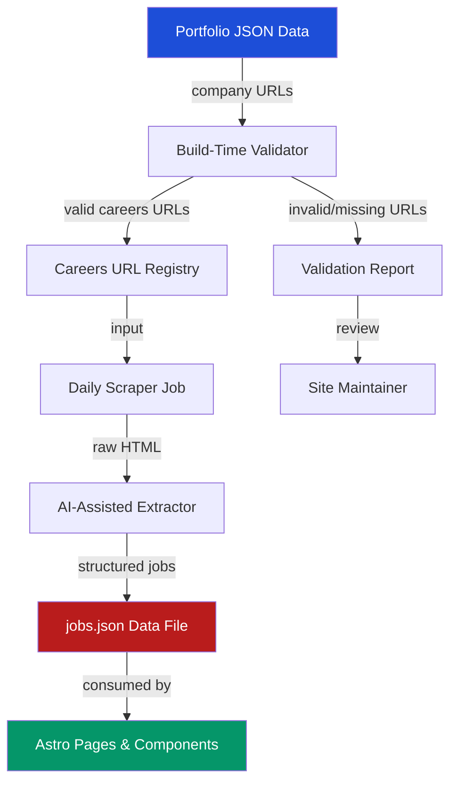
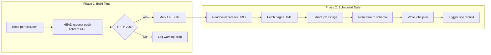
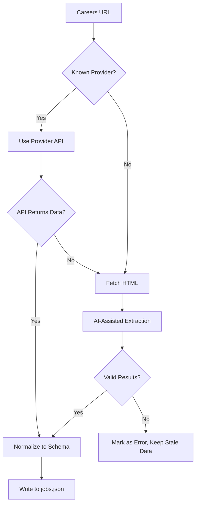
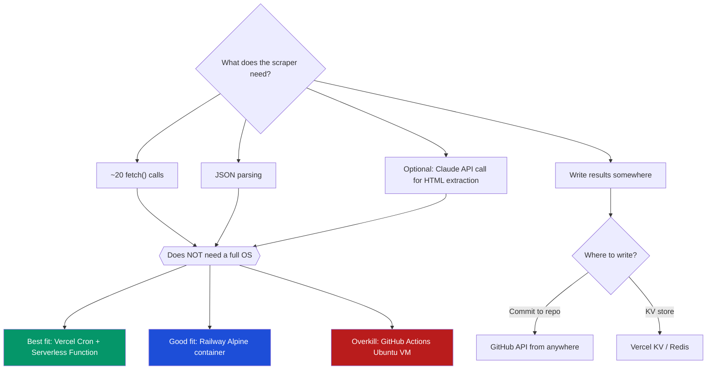
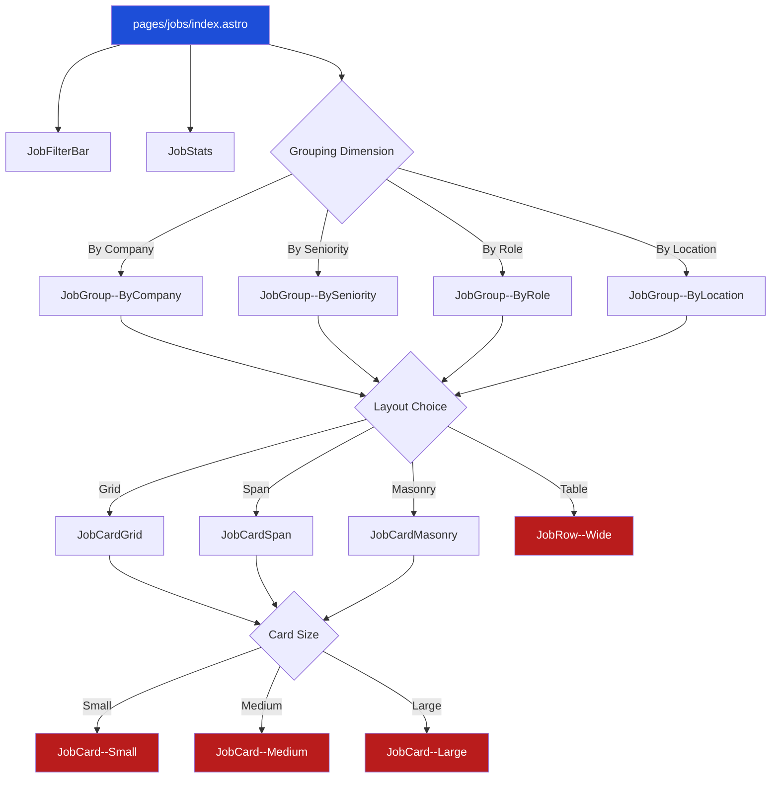
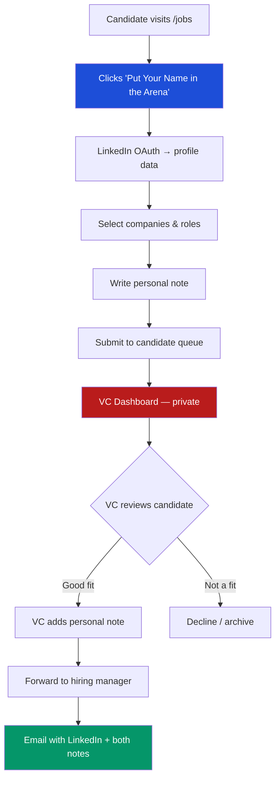

# Portfolio-Wide Job Aggregator

## 1. Overview

### 1.1 Problem

Venture capital firms want to showcase career opportunities across their entire portfolio as a value-add for job seekers and a talent pipeline for portfolio companies. Paid aggregation services exist (Getro, Portfolio Jobs, etc.) but they charge per-portfolio-company fees, require manual onboarding, and give the VC firm little control over presentation or data freshness. Given advances in tooling and tool use, we can build a self-hosted job aggregator.

### 1.2 Opportunity

Given advances in AI-assisted scraping and our ability to write custom build-time and scheduled scripts, we can build a self-hosted job aggregator that:

- Costs nothing beyond compute (runs at build time + daily cron)
- Gives the VC firm full control over presentation and filtering
- Works with any portfolio company website — no vendor integration required
  - Out-of-the-box works with our Astro-Knots series of VC portfolio sites.
- Degrades gracefully when a company's careers page changes or goes offline

### 1.3 First Client

**Banner.vc** (`sites/banner-site`) has requested this feature. The site already has placeholder nav links for `/portfolio` and `/careers` but no data or pages behind them. This spec covers both the portfolio data model and the job aggregation pipeline. Banner.vc has three portfolio companies they want this to work on. 

### 1.4 Cross-Site Applicability

Multiple VC clients have expressed interest. The implementation should be extractable as a pattern (copy-and-adapt per the astro-knots philosophy) or, if the scraping/aggregation logic proves truly identical across sites, a candidate for a published `@lossless-group/*` package.

## 2. Architecture

### 2.1 High-Level Data Flow



### 2.2 Two-Phase Pipeline

The system separates **validation** (build-time, fast, blocking) from **scraping** (scheduled, slow, non-blocking).


> ![NOTE] Build time is unnecessary if performed within 24 hrs
> 
> While production builds should have updated data, local development does not need to run the operation at every build. It could add a while to build time or cost API tokens. 

### 2.3 Why Not Real-Time?

VC portfolio sites are static (Astro SSG deployed on Vercel). Job listings change infrequently — daily scraping with a rebuild trigger is the right cadence. This avoids:

- Runtime server costs
- Rate limiting / IP blocking from portfolio company sites
- Complexity of SSR or edge functions

## 3. Data Models

### 3.1 Portfolio Company Record

Extends the existing Hypernova pattern (`src/content/portfolio/directs-portfolio.json`). Each company already has:

```json
{
  "conventionalName": "Acme Corp",
  "officialName": "Acme Corporation Inc.",
  "urlToPortfolioSite": "https://acme.com",
  "blurbShortTxt": "...",
  "logoLightMode": "/trademarks/trademark__Acme--Light-Mode.svg",
  "logoDarkMode": "/trademarks/trademark__Acme--Dark-Mode.svg",
  "openGraphImage": "https://acme.com/og.png",
  "linkedInProfile": "https://linkedin.com/company/acme",
  "listOfPeopleData": [...]
}
```

**New fields for job aggregation:**

```json
{
  "og_image": "https://acme.com/og-banner.png",
  "careersUrl": "https://acme.com/careers",
  "careersUrlValidated": true,
  "careersUrlLastChecked": "2026-04-16T00:00:00Z",
  "jobBoardProvider": "lever",
  "scrapeStrategy": "auto"
}
```

| Field | Type | Description |
|-------|------|-------------|
| `og_image` | `string` | The company's Open Graph banner image URL. Used on cards instead of logos — gives a richer, more recognizable visual per company. Typically 1200x630. |
| `careersUrl` | `string` | URL to the company's careers/jobs page. Manually curated. |
| `careersUrlValidated` | `boolean` | Set by build-time validator. `false` if last HEAD request failed. |
| `careersUrlLastChecked` | `string` (ISO date) | Timestamp of last validation check. |
| `jobBoardProvider` | `string \| null` | Detected or manually set: `greenhouse`, `ashby`, `pinpoint`, `lever`, `workable`, `bamboohr`, `custom`, `null`. Informs scrape strategy. |
| `scrapeStrategy` | `string` | `auto` (AI-assisted), `api` (known provider API), `manual` (hand-maintained), `skip`. |

### 3.2 Job Listing Record

The normalized output written to `src/data/jobs.json`:

```typescript
interface JobListing {
  /** Unique ID: slugified company + title + location + count/index */
  id: string;
  /** Portfolio company conventional name */
  company: string;
  /** Job title as scraped */
  title: string;
  /** Normalized department/team */
  department: string | null;
  /** Location string (remote, city, hybrid) */
  location: string;
  /** Is this explicitly remote-friendly? */
  isRemote: boolean;
  /** Employment type */
  type: "full-time" | "part-time" | "contract" | "internship" | "unknown";
  /** Inferred seniority level — extracted from title keywords or AI-inferred */
  seniority: "intern" | "junior" | "mid" | "senior" | "lead" | "executive" | "unknown";
  /** Direct URL to the job posting */
  applyUrl: string;
  /** Short description (first ~200 chars of posting) */
  snippet: string | null;
  /** ISO date when this listing was first seen */
  firstSeen: string;
  /** ISO date of most recent scrape that found this listing */
  lastSeen: string;
  /** Salary range if disclosed */
  salaryRange: string | null;
}
```

### 3.3 Aggregation Metadata

Written alongside `jobs.json` to `src/data/jobs-meta.json`:

```typescript
interface JobsAggregationMeta {
  /** When the scraper last ran */
  lastRun: string;
  /** Per-company scrape status */
  companies: {
    [companyName: string]: {
      status: "success" | "error" | "skipped";
      jobCount: number;
      lastScrapedAt: string;
      errorMessage?: string;
    };
  };
  /** Total jobs across all companies */
  totalJobs: number;
}
```

## 4. Scraping Strategy

### 4.1 Known Job Board Providers

Many startups use hosted job boards with predictable DOM structures or public APIs:

| Provider | Detection Signal | Strategy | Status |
|----------|-----------------|----------|--------|
| **Greenhouse** | `boards.greenhouse.io/{company}` | JSON API at `https://boards-api.greenhouse.io/v1/boards/{company}/jobs` | **Implemented** |
| **Ashby** | `jobs.ashbyhq.com/{company}` | JSON API at `https://api.ashbyhq.com/posting-api/job-board/{company}` | **Implemented** |
| **Pinpoint** | `{company}.pinpointhq.com` | JSON API at `https://{company}.pinpointhq.com/en/postings.json` — includes structured salary data | **Implemented** |
| **Lever** | `jobs.lever.co/{company}` or embedded Lever iframe | JSON API at `https://api.lever.co/v0/postings/{company}` | Planned |
| **Workable** | `apply.workable.com/{company}` | JSON at page `__NEXT_DATA__` or API | Planned |
| **BambooHR** | `{company}.bamboohr.com/careers` | Structured HTML with consistent classes | Planned |
| **Rippling** | `{company}.rippling.com/careers` | Structured HTML | Planned |
| **Custom** | Anything else | AI-assisted HTML extraction |

### 4.2 Provider Detection

At build time, after validating the careers URL responds with 200, the validator should:

1. Check the URL hostname against known provider patterns
2. If a known provider is detected, set `jobBoardProvider` accordingly
3. For known providers with JSON APIs, prefer the API over HTML scraping
4. For unknown providers, set `jobBoardProvider: "custom"` and use AI-assisted extraction

### 4.3 AI-Assisted Extraction (Custom Sites)

For companies with custom careers pages, the scraper should:

1. Fetch the page HTML
2. Strip navigation, footer, scripts, and non-content elements
3. Pass the cleaned HTML to an LLM with a structured extraction prompt
4. Request output matching the `JobListing` schema
5. Validate the LLM output against the schema before accepting

**Extraction prompt pattern:**

```
Given this HTML from a company careers page, extract all job listings.
For each job, return: title, department, location, type, applyUrl.
Return as JSON array. If no jobs are found, return an empty array.
Do not hallucinate jobs that aren't in the HTML.
```

### 4.4 Fallback Chain



## 5. Build-Time Validator Script

### 5.1 Purpose

Runs during `astro build` (or as a pre-build script) to ensure careers URLs are reachable before the scraper depends on them.

### 5.2 Behavior

```
scripts/validate-careers-urls.ts
```

1. Read portfolio JSON data
2. For each company with a `careersUrl`:
   a. Send an HTTP HEAD request (timeout: 5s)
   b. Follow redirects (up to 3)
   c. If 200: set `careersUrlValidated: true`, update `careersUrlLastChecked`
   d. If non-200 or timeout: set `careersUrlValidated: false`, log warning
   e. Attempt provider detection from final URL
3. Write updated portfolio data back
4. Output summary: `✓ 12/15 careers URLs validated, 2 failed, 1 skipped (no URL)`

### 5.3 Integration

Add to `package.json`:

```json
{
  "scripts": {
    "validate:careers": "tsx scripts/validate-careers-urls.ts",
    "prebuild": "pnpm validate:careers",
    "build": "astro build"
  }
}
```

## 6. Runtime Options Explained

Before specifying the scraper, it helps to understand the runtime environments available to us and when each makes sense. These terms get thrown around a lot — here's what they actually are.

### 6.0.1 GitHub Actions

**What it is:** GitHub's built-in CI/CD system. When something happens in your repo (a push, a PR, a schedule), GitHub spins up a fresh virtual machine, runs your commands, and throws the VM away.

**The machine:** By default, `runs-on: ubuntu-latest` gives you a full Ubuntu Linux VM with 2 CPUs, 7GB RAM, and a 14GB disk. It has Node, Python, Docker, and hundreds of tools pre-installed. This is why it takes 30-60 seconds just to start — it's booting an entire operating system.

**When to use it:**
- Running tests on every PR (the bread-and-butter use case)
- Building and deploying your site on push
- Complex multi-step workflows that need a full OS (installing system packages, running Docker builds, etc.)

**When it's overkill:**
- Making 20 HTTP fetch calls once a day — you don't need a 7GB VM for that
- Anything that finishes in under a minute

**Cost:** Free for public repos. Private repos get 2,000 minutes/month free, then ~$0.008/minute.

**Popular examples:** Run `pnpm test` on every PR. Build Docker images and push to a registry. Generate release notes on git tag.

### 6.0.2 Serverless Functions (Vercel Functions, AWS Lambda, Cloudflare Workers)

**What it is:** A single function that runs in response to an HTTP request. No server to manage — the platform handles scaling, and you only pay for actual execution time.

**The machine:** There is no persistent machine. Your function code sits dormant until a request arrives. The platform spins up a tiny container (or V8 isolate for edge functions), runs your code, returns the response, and may keep the container warm for a few minutes in case another request comes.

**When to use it:**
- API endpoints that your site needs (form submission handlers, data fetches)
- Webhook receivers (Stripe payment events, GitHub webhooks)
- Scheduled tasks via Vercel Cron — Vercel hits your function URL on a schedule

**Limitations:**
- Execution time limits (Vercel: 60s on Pro, 10s on Hobby; AWS Lambda: 15 min max)
- No persistent filesystem — you can't write a file and expect it to be there next time
- Cold starts: first request after idle period is slower

**Cost:** Vercel Pro includes 1M invocations/month. AWS Lambda free tier is 1M requests/month.

**Popular examples:** Contact form handler. Image resize on upload. Cron job that fetches external data daily.

### 6.0.3 Edge Functions

**What it is:** A special type of serverless function that runs at the CDN edge — meaning on servers geographically close to the user, not in a single data center. Built on V8 isolates (the JavaScript engine from Chrome), not full containers.

**The machine:** No machine at all in the traditional sense. Your code runs in a lightweight V8 isolate (same as a browser tab) on Cloudflare's/Vercel's global network. Starts in <1ms, but has stricter limits than regular serverless functions.

**When to use it:**
- Personalizing responses based on user location (show different content by country)
- Authentication checks before serving a page
- A/B testing at the edge
- Rewriting URLs or adding headers

**When NOT to use it:**
- Anything that needs Node.js APIs (`fs`, `child_process`, etc.) — edge functions run in V8, not Node
- Long-running tasks — edge functions typically have 30s max execution
- Tasks that don't benefit from geographic proximity (like our job scraper — it doesn't matter where the scraper runs)

**Cost:** Usually cheaper than regular serverless. Cloudflare Workers: 100K requests/day free.

**Popular examples:** Geolocation-based redirects. Auth middleware. A/B testing routing.

### 6.0.4 Lightweight Containers (Railway, Render, Fly.io)

**What it is:** A Docker container running on someone else's server. You define the environment (Alpine Linux, Node, your script), and the platform runs it. Can be always-on or cron-scheduled.

**The machine:** A tiny container with only what you put in it. An Alpine + Node image is ~50MB. It starts in seconds, runs your code, and stops.

**When to use it:**
- Cron jobs that need more control than serverless allows
- Services that need persistent connections (websockets, long-polling)
- When you want a simple "run this script on a schedule" without CI/CD complexity

**Cost:** Railway: $5/month minimum, usage-based after that. A container that runs 30 seconds daily costs essentially nothing. Render: free tier for cron jobs.

**Popular examples:** Daily data sync scripts. Discord/Slack bots. Background job processors.

### 6.0.5 What's Right for Our Job Scraper

Our scraper makes ~20 `fetch()` calls, processes JSON/HTML responses, and writes a file. It takes ~30 seconds. Here's how the options stack up:



## 7. Daily Scraper Script

### 7.1 Purpose

Runs on a schedule (daily via Vercel Cron or lightweight container) to fetch current job listings from all validated portfolio company careers pages.

### 7.2 Behavior

```
scripts/scrape-portfolio-jobs.ts
```

1. Read portfolio JSON — filter to companies where `careersUrlValidated: true` and `scrapeStrategy !== "skip"`
2. For each company:
   a. If `jobBoardProvider` is a known API provider → call the API
   b. Else → fetch HTML, run AI-assisted extraction
   c. Normalize results to `JobListing[]`
   d. Deduplicate against existing `jobs.json` (match on `company` + `title` + `location`)
   e. Update `firstSeen` / `lastSeen` timestamps
   f. Remove listings not seen in 7+ days (likely filled or removed)
3. Write `src/data/jobs.json` and `src/data/jobs-meta.json`
4. If any changes detected, trigger a site rebuild (Vercel Deploy Hook)

### 7.3 Runtime Requirements

The scraper is intentionally lightweight. For ~20 portfolio companies:

- **~60-70% use Lever/Greenhouse/Ashby** → plain `fetch()` to their public JSON API. No browser, no parsing.
- **~20-30% have custom HTML pages** → plain `fetch()` + pass HTML string to Claude API for structured extraction. Still just HTTP calls.
- **~0-10% might be JS-rendered SPAs** → only these would need a headless browser, and we can flag them as `scrapeStrategy: "manual"` until volume justifies it.

**The entire script is ~30 seconds of `fetch()` calls.** No OS, no Docker, no headless browser needed for the default path.

### 7.4 Scheduling Options

| Method | Pros | Cons |
|--------|------|------|
| **Vercel Cron + Serverless Function** | Zero infra, native to deploy platform, triggers rebuild automatically | Pro plan for daily cron; function must complete in 60s (plenty for ~20 fetches) |
| **Railway cron container** | Alpine Docker (~5MB), $0-1/month, flexible schedule, full control | Another service to manage |
| **GitHub Actions cron** | Free, version-controlled, logs | Spins up full Ubuntu VM for 30s of fetch calls — wasteful |
| **Claude Code scheduled task** | AI-native, can self-heal | Newer capability, depends on availability |

**Recommended (in order of preference):**

1. **Vercel Cron** if the site is on Vercel Pro — simplest, no extra infra
2. **Railway** if we need more control or the site is on Vercel Hobby — tiny Alpine container, dirt cheap
3. **GitHub Actions** as fallback — works but heavy for the job

### 7.5 Vercel Cron Implementation (Preferred)

Add a serverless API route to the Astro site:

```typescript
// src/pages/api/scrape-jobs.ts
// Vercel Cron hits this endpoint daily
export const GET: APIRoute = async () => {
  const jobs = await scrapeAllPortfolioJobs();
  // Write to Vercel KV or commit via GitHub API
  return new Response(JSON.stringify({ ok: true, count: jobs.length }));
};
```

```json
// vercel.json
{
  "crons": [
    { "path": "/api/scrape-jobs", "schedule": "0 8 * * *" }
  ]
}
```

### 7.6 Railway Container Alternative

For maximum control at minimal cost:

```dockerfile
# Dockerfile — ~5MB image
FROM node:22-alpine
WORKDIR /app
COPY package.json pnpm-lock.yaml ./
RUN corepack enable && pnpm install --frozen-lockfile --prod
COPY scripts/scrape-portfolio-jobs.ts ./
CMD ["node", "--loader", "tsx", "scrape-portfolio-jobs.ts"]
```

Railway runs this on a cron schedule. The script fetches jobs, writes results via GitHub API (commit to repo), and Vercel auto-deploys on the new commit. Total cost: ~$0-1/month for a container that runs 30 seconds daily.

### 7.7 Why Not Crawl4AI or Headless Browsers?

Crawl4AI, Puppeteer, and Playwright are designed for JavaScript-rendered pages that require a real browser environment. For this use case:

- Job board providers (Lever, Greenhouse, Ashby) serve JSON APIs — no browser needed
- Most custom careers pages are server-rendered HTML — `fetch()` gets the full content
- AI extraction works on raw HTML strings — no need to execute JavaScript
- Headless browsers add ~200MB+ to the container, 10x startup time, and fragile dependencies

**Only add headless browser support** if we discover multiple portfolio companies with SPA-only careers pages. Until then, flag those as `scrapeStrategy: "manual"` and curate their listings by hand — it's 1-2 companies, not worth the infra complexity.

## 8. Pages and Components

### 8.1 Page Structure

```
src/pages/
├── jobs/
│   └── index.astro          # Main jobs listing page
├── portfolio/
│   ├── index.astro           # Portfolio grid
│   └── [slug].astro          # Company detail (with jobs sidebar)
```

### 8.2 Rendering Dimensions

The jobs page should support rendering by four primary dimensions. The client picks which dimension is the default grouping; users can switch between them via tabs or a dropdown.

| Dimension | Grouping | Use Case |
|-----------|----------|----------|
| **By Company** | Jobs grouped under each portfolio company, with OG image banner | "What's open at our portfolio companies?" |
| **By Seniority** | Intern → Junior → Mid → Senior → Lead → Executive → Unknown | "I'm a senior engineer, what's available?" |
| **By Role / Department** | Engineering, Design, Product, Marketing, Operations, Sales, etc. | "I'm a designer, show me design roles" |
| **By Location** | Grouped by city or Remote, sorted by job count per location | "What's available in NYC?" or "Show me remote roles" |

### 8.3 Component Naming Convention

We follow a `ComponentName--Variant.astro` naming pattern. The idea is that each client site picks its preferred card size and layout — they're all available, and the page template just swaps in whichever the client likes.

```
src/components/jobs/
├── cards/
│   ├── JobCard--Small.astro       # Compact: title, company, location, type pill. One line.
│   ├── JobCard--Medium.astro      # Default: OG image thumbnail, title, company, location, dept, apply CTA
│   └── JobCard--Large.astro       # Featured: full-width OG image banner, snippet, salary, all metadata
├── rows/
│   └── JobRow--Wide.astro         # Table-like row: company logo | title | dept | location | type | apply
├── layouts/
│   ├── JobCardGrid.astro          # CSS Grid of cards (2-3 columns depending on card size)
│   ├── JobCardSpan.astro          # Full-width stacked cards (one per row, good for Large cards)
│   └── JobCardMasonry.astro       # Masonry layout for mixed-height cards (Pinterest-style)
├── grouping/
│   ├── JobGroup--ByCompany.astro  # Groups jobs under company header with OG image
│   ├── JobGroup--BySeniority.astro
│   ├── JobGroup--ByRole.astro
│   └── JobGroup--ByLocation.astro
├── filters/
│   ├── JobFilterBar.astro         # Horizontal filter controls (search, company, location, dept, type)
│   └── JobFilterPanel.astro       # Vertical sidebar filter variant
└── meta/
    └── JobStats.astro             # Summary: total jobs, companies hiring, last updated
```

### 8.4 Component Hierarchy



### 8.5 Card Specifications

All cards receive the same props. The variant determines what gets shown and how much space it takes.

```typescript
interface JobCardProps {
  title: string;
  company: string;
  location: string;
  isRemote: boolean;
  type: "full-time" | "part-time" | "contract" | "internship" | "unknown";
  seniority: string | null;
  department: string | null;
  applyUrl: string;
  snippet: string | null;
  salaryRange: string | null;
  companyLogo?: string;
  companyOgImage?: string;
}
```

#### JobCard--Small.astro

Compact, information-dense. Good for high job counts or sidebar lists.

- Single line or two lines max
- Company name (text only, no image) + job title (linked)
- Location + remote badge inline
- Type as small pill
- No snippet, no salary, no OG image

#### JobCard--Medium.astro

The default. Balanced information and visual weight.

- Company OG image as thumbnail (120px wide, cropped) on the left, or above on narrow screens
- Falls back to company logo if no `og_image`
- Job title (prominent, linked to `applyUrl`)
- Company name, location + remote badge, department tag
- Employment type pill, salary range if disclosed
- "Apply" CTA button → opens `applyUrl` in new tab

#### JobCard--Large.astro

Featured/hero card. Good for highlighting top roles or when there are few listings.

- Full-width company OG image banner across the top of the card
- Falls back to a branded gradient + logo if no `og_image`
- Job title large
- Full metadata row: company, location, department, type, salary
- Snippet text (first ~200 chars of job description)
- Prominent "Apply" CTA

#### JobRow--Wide.astro

Table-row format. One job per row, horizontally laid out.

- `[logo] | Title | Department | Location | Type | Seniority | [Apply →]`
- Best used inside `JobCardSpan` layout for a clean tabular look
- Compact — fits 15-20 jobs visible without scrolling

### 8.6 Layout Specifications

#### JobCardGrid.astro

Standard CSS Grid. Column count adapts to card size:

| Card Size | Desktop Columns | Tablet | Mobile |
|-----------|----------------|--------|--------|
| Small | 3-4 | 2 | 1 |
| Medium | 2-3 | 2 | 1 |
| Large | 1-2 | 1 | 1 |

#### JobCardSpan.astro

Full-width stacked layout. Each card or row takes the full container width. Best paired with `JobCard--Large` or `JobRow--Wide`.

#### JobCardMasonry.astro

Pinterest-style masonry for mixed-height cards. Works well when cards have variable snippet lengths or some have OG images and others don't. Uses CSS `columns` or `masonry` (with fallback to columnar layout).

### 8.7 Group Specifications

Each group component receives a filtered/sorted array of jobs and renders a section header + the chosen layout.

#### JobGroup--ByCompany.astro

- Company OG image as a wide banner header for the group
- Company name + "N open positions" count badge
- Collapsible: expanded if ≤5 jobs, collapsed if >5

#### JobGroup--BySeniority.astro

- Section headers: Intern, Junior, Mid-Level, Senior, Lead/Staff, Executive, Other
- Skip empty sections
- Icon or color per seniority level for visual scanning

#### JobGroup--ByRole.astro

- Section headers derived from `department` field: Engineering, Design, Product, Marketing, Operations, Sales, Finance, Legal, Other
- Skip empty sections
- Count badge per section

#### JobGroup--ByLocation.astro

- Section headers from `location` field, with "Remote" always first if present
- Sections sorted by job count descending
- Map visualization is a future nice-to-have, not in scope for v1

### 8.8 Filter Specifications

#### JobFilterBar.astro

Horizontal filter controls above the grid.

**Filters:**
- **Search** — text input, filters by title and company name
- **Company** — multi-select dropdown of portfolio companies
- **Location** — text input with common suggestions (Remote, New York, San Francisco, etc.)
- **Department** — multi-select from available departments
- **Seniority** — pills or dropdown: All, Intern, Junior, Mid, Senior, Lead, Executive
- **Type** — pills: All, Full-Time, Part-Time, Contract, Internship

**Behavior:** Client-side filtering via vanilla JS or lightweight Svelte island. No page reload.

#### JobFilterPanel.astro

Vertical sidebar variant. Same filters as `JobFilterBar` but stacked vertically. Good for desktop layouts with a persistent sidebar.

### 8.9 JobStats.astro

Summary statistics displayed above the listing.

- Total open positions across portfolio
- Number of portfolio companies hiring
- Breakdown by seniority level (e.g., "23 senior roles, 15 mid-level, 8 junior")
- Last updated timestamp (from `jobs-meta.json`)

### 8.10 Responsive Behavior

| Breakpoint | Layout |
|-----------|--------|
| Mobile (<640px) | Single column, filters collapse to drawer, cards stack full-width |
| Tablet (640-1024px) | Two-column card grid, filter bar horizontal |
| Desktop (>1024px) | Optional sidebar filters + grid/span/masonry layout |

### 8.11 Client Picks Their Favorite

The jobs page template is configurable. Banner.vc (or any client) chooses their preferred combination in the page frontmatter or a config file:

```typescript
// src/config/jobs.ts — per-site configuration
export const jobsConfig = {
  defaultGrouping: "by-company",      // by-company | by-seniority | by-role | by-location
  cardVariant: "medium",              // small | medium | large | row
  layoutVariant: "grid",              // grid | span | masonry
  showFilters: true,
  showStats: true,
  filtersPosition: "bar",             // bar (horizontal top) | sidebar (vertical left)
};
```

The page template reads this config and renders the matching components. Clients swap one line to change the entire look.

## 9. Portfolio Page Integration

The `/portfolio` page (which Banner also needs) should link to jobs. Each company card on the portfolio grid should show a "Hiring" badge if that company has active listings, linking to the jobs page filtered to that company.

On the portfolio detail page (`/portfolio/[slug]`), include a "Current Openings" section at the bottom pulling from `jobs.json`. Use the same card components — typically `JobCard--Small` or `JobRow--Wide` in a `JobCardSpan` layout for the detail page context.

## 10. Error Handling and Graceful Degradation

| Scenario | Behavior |
|----------|----------|
| Company has no `careersUrl` | Skip entirely, no card shown |
| `careersUrl` returns non-200 | Log warning, keep stale data if available, show "last updated X days ago" |
| Scraper returns 0 jobs for a company | Show company in portfolio but not in jobs page |
| AI extraction returns garbage | Validate against schema, reject and keep stale data |
| All scraping fails | Show stale `jobs.json` with prominent "last updated" notice |
| `jobs.json` doesn't exist yet | Show empty state: "Job listings coming soon" |

## 11. Privacy and Rate Limiting

- **Respect `robots.txt`**: Before scraping, check if the careers page path is disallowed. Skip if so.
- **Rate limiting**: Max 1 request per second per domain. Portfolio sizes are small (10-30 companies), so total scrape time is manageable.
- **User-Agent**: Identify as `BannerVC-JobAggregator/1.0 (contact: team@banner.vc)` — be transparent.
- **No credential scraping**: Only extract publicly visible job listing metadata. Never attempt to access authenticated content.
- **Caching**: Store raw HTML responses for 24h to avoid redundant fetches during development/debugging.

## 12. Implementation Phases

### Phase 1: Data Foundation
- [ ] Define portfolio JSON schema for Banner (extend Hypernova pattern with careers fields)
- [ ] Manually populate `careersUrl` for each portfolio company
- [ ] Build `validate-careers-urls.ts` script
- [ ] Create `src/data/jobs.json` with manually curated seed data (5-10 listings)

### Phase 2: Static Pages
- [ ] Build `pages/jobs/index.astro` with `JobListingGrid`, `JobCard`, `JobFilterBar`
- [ ] Build `JobCompanyGroup` and `JobStats` components
- [ ] Implement client-side filtering (search, company, location, department, type)
- [ ] Build `pages/portfolio/index.astro` and `pages/portfolio/[slug].astro`
- [ ] Add "Hiring" badge to portfolio cards
- [ ] Responsive layout across breakpoints

### Phase 3: Automated Scraping
- [x] Build `scrape-portfolio-jobs.ts` with known-provider API integrations (Greenhouse, Ashby, Pinpoint)
- [x] Implement deduplication and stale-listing cleanup logic
- [x] Write `jobs-meta.json` with per-company status
- [x] Universal snippet sanitization (decode entities, preserve HTML, skip boilerplate)
- [x] Structured salary data from Pinpoint API
- [ ] Add Lever API integration
- [ ] Set up Vercel Cron (or Railway container) for daily scrape + deploy trigger

### Phase 4: Polish and Hardening
- [x] Build provider auto-detection during validation (Greenhouse, Ashby, Pinpoint)
- [ ] Add `robots.txt` respect check
- [ ] Add monitoring/alerting for scrape failures (>50% companies failing)
- [ ] Performance: paginate or virtualize if job count exceeds ~200
- [ ] SEO: structured data (JobPosting schema.org) on individual listings
- [ ] Analytics: track click-throughs to `applyUrl`

## 13. Cross-Site Extraction Notes

For other VC client sites that want this feature:

**What to copy:**
- Component files (`JobCard.astro`, `JobCompanyGroup.astro`, `JobFilterBar.astro`, etc.)
- Page templates (`pages/jobs/index.astro`)
- Scripts (`scripts/validate-careers-urls.ts`, `scripts/scrape-portfolio-jobs.ts`)
- GitHub Actions workflow

**What to adapt per site:**
- Portfolio JSON data (different companies per fund)
- Visual styling (brand colors, card design, typography)
- Filter defaults (maybe some firms care about sectors, others about geography)
- Scrape schedule and deploy hook URLs

**Candidate for `@lossless-group/*` package:**
- The scraping + normalization logic (provider detection, API clients, AI extraction, schema validation) is truly identical across sites. If 3+ clients adopt this, extract to `@lossless-group/portfolio-jobs` as a shared package.

## 14. Acceptance Criteria

### Data Model
- [x] Portfolio JSON includes `careersUrl`, `jobBoardProvider`, `scrapeStrategy` fields
- [x] `JobListing` type is defined with all specified fields
- [x] `jobs.json` and `jobs-meta.json` are valid, schema-conformant files

### Build-Time Validation
- [x] `validate-careers-urls.ts` runs as prebuild step
- [x] HEAD requests have 5s timeout and follow up to 3 redirects
- [x] Invalid URLs are logged as warnings, not build failures
- [x] Provider auto-detection works for Greenhouse, Ashby, and Pinpoint URLs

### Scraping Pipeline
- [x] Known provider APIs return structured data for Greenhouse, Ashby, Pinpoint
- [x] Deduplication prevents duplicate listings
- [x] Listings not seen in 7+ days are removed
- [x] HTML snippets decoded and preserved with `set:html` rendering
- [x] Smart boilerplate detection skips repeated company intros
- [x] Structured salary data extracted from Pinpoint
- [ ] Lever API integration
- [ ] Scraper respects `robots.txt` and rate limits (1 req/sec)

### Pages and Components
- [x] `/jobs` page renders all listings grouped by company
- [x] `JobCard` displays title, company, location, remote badge, type, department, and apply CTA
- [x] Company tabs with mode-aware logos and job count badges
- [x] HTML-rich snippets render formatted descriptions
- [ ] `JobFilterBar` filters by search text, company, location, department, and type
- [ ] Filtering is client-side with no page reload
- [ ] `/portfolio/[slug]` shows company's current openings
- [ ] Portfolio grid shows "Hiring" badge on companies with active listings
- [ ] Responsive across mobile, tablet, and desktop breakpoints

### Operations
- [ ] Vercel Cron or Railway container runs daily and triggers rebuild
- [x] Stale data gracefully preserved when a scrape fails
- [x] Empty state displays "Job listings coming soon" when no data exists

## 15. Future Plans

### 15.1 "Put Your Name in the Arena"

The job aggregator is passive — it shows openings and links out. The next evolution is making it active: let candidates raise their hand directly through the VC firm's site, and give the VC a lightweight tool to curate and forward those candidates to portfolio company hiring managers.

This turns the VC firm into a talent concierge. Instead of just listing jobs, they're brokering warm introductions — which is exactly what small VC firms do best. A personal note from your investor carries weight that a cold application never will.

#### The Candidate Experience

A "Put Your Name in the Arena" CTA appears on the jobs page (and optionally on individual job cards). Clicking it opens an interactive flow — likely a **Svelte island** embedded in the Astro page, since it requires multi-step state management, form handling, and API calls that go beyond what static Astro can do.

**Step 1: Connect via LinkedIn**

The candidate authenticates with LinkedIn OAuth (using the [Sign In with LinkedIn](https://learn.microsoft.com/en-us/linkedin/consumer/integrations/self-serve/sign-in-with-linkedin-v2) API). This pulls:

- Full name, headline, profile photo
- Current company and title
- Location
- Profile URL (for the VC to review the full profile)
- Optionally: work history, education, skills (requires additional LinkedIn API scopes)

This eliminates resume uploads and manual form-filling. One click and the candidate's professional identity is attached.

**Step 2: Select Companies and Roles**

The candidate sees the same job listing data from the aggregator, filtered into a selectable interface:

- Browse or search portfolio companies
- Select specific roles they're interested in, or express general interest in a company
- Can select multiple companies/roles in one session

**Step 3: Add a Personal Note**

A free-text field where the candidate writes a brief note to the VC — not a cover letter, more like "why I'm reaching out through you":

> "I've been following Acme's work in climate tech since their Series A. I led the data platform team at my last company and think there's a strong fit for the Senior Data Engineer role. Would love an intro if you think so too."

This note is key. It gives the VC context for whether and how to make the introduction.

**Step 4: Submit**

The candidate's profile, selected roles, and personal note are saved to a queue. The candidate sees a confirmation: "You're in the arena. [VC firm name] will review your profile and reach out if there's a fit."

#### The VC Experience

The VC team accesses a **private dashboard** behind a simple login (email/password or magic link — this is for 1-3 people, not a full user management system).

**The Queue**

A list of candidates who've put their name in, showing:

- LinkedIn profile summary (photo, name, headline, current role)
- Which companies/roles they selected
- Their personal note
- Timestamp
- Status: New → Reviewed → Forwarded → Declined

**VC Actions per Candidate:**

1. **Review** — Read the candidate's LinkedIn profile (linked out) and their note
2. **Add VC Note** — The VC writes their own note to attach when forwarding:
   > "Met Sarah at our portfolio dinner last month. Strong technical background, culture fit for your team. Worth a conversation."
3. **Forward to Hiring Manager** — Sends an email (or generates a shareable link) to the portfolio company's hiring contact, containing:
   - Candidate's LinkedIn profile
   - The role(s) they expressed interest in
   - The candidate's personal note
   - The VC's personal note
4. **Decline** — Mark as not a fit. Optionally send a polite "not right now" to the candidate.

#### Data Flow



#### Technical Considerations

| Concern | Approach |
|---------|----------|
| **Interactive UI** | Svelte island in the Astro page. The jobs page stays static; the "arena" flow is a client-side Svelte component that mounts on interaction. |
| **LinkedIn OAuth** | Requires a LinkedIn app registration. The OAuth flow redirects to a serverless callback endpoint (Vercel Function) that exchanges the code for an access token and fetches profile data. |
| **Candidate data storage** | Needs a lightweight backend — candidates, their selections, and notes must persist. Options: Vercel KV, Supabase (Postgres + auth), or even a private GitHub repo as a JSON store for tiny volumes. |
| **VC authentication** | Simple auth for 1-3 users. Magic link email (via Resend or similar) is the lightest option. No need for a full auth system. |
| **Email forwarding** | Transactional email (Resend, Postmark, or SendGrid) to send the curated introduction to the hiring manager. Template includes candidate profile, role interest, and both notes. |
| **Privacy** | Candidate data is only shared with the VC and, upon VC action, with the specific hiring manager. No public display of candidate information. LinkedIn data usage must comply with their API terms. |
| **Volume** | Small VC firms will see low candidate volume (maybe 5-20/month). This is a feature, not a bug — it means the VC can give each candidate genuine attention. No need to over-engineer for scale. |

#### Why This Matters for VC Firms

Most job aggregators stop at listing. This feature turns the VC's website into a **talent pipeline** — which is one of the most valuable services a VC can offer portfolio companies. It:

- Gives the VC **visibility into who's interested** in their portfolio
- Creates **warm introductions** that portfolio companies actually respond to
- Differentiates the VC's site from a generic job board
- Builds a **candidate relationship** with the VC firm itself, not just individual companies
- At low volume (1-3 person firms), this is manageable without dedicated recruiting staff

#### Implementation Phases (Future)

This is explicitly out of scope for the initial job aggregator build. When the time comes:

1. **Phase A: Static Queue** — Simple form (no LinkedIn yet). Name, email, LinkedIn URL (pasted manually), company/role selections, personal note. Stored in Supabase or similar. VC reviews via a private `/admin/arena` page.
2. **Phase B: LinkedIn Connect** — Add OAuth flow so candidates connect with one click instead of pasting URLs. Pull profile data automatically.
3. **Phase C: VC Dashboard** — Proper review interface with status tracking, VC notes, and one-click forwarding via email.
4. **Phase D: Feedback Loop** — Hiring managers can mark candidates as "interviewed," "hired," or "passed" — giving the VC data on which introductions land.
